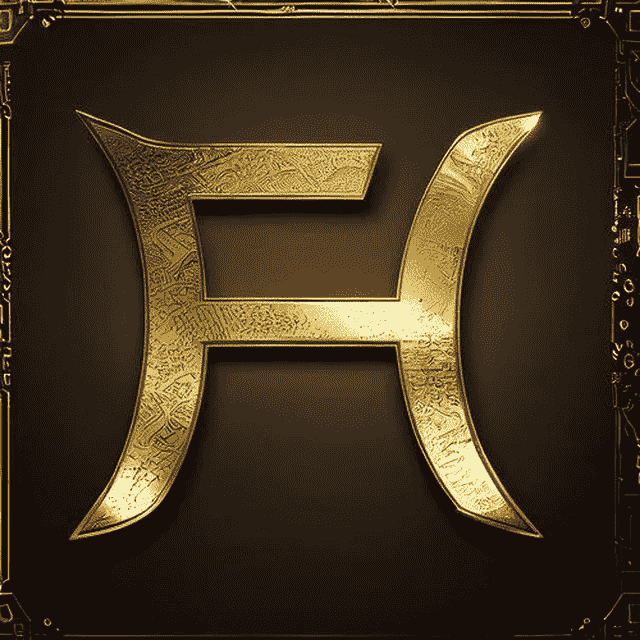
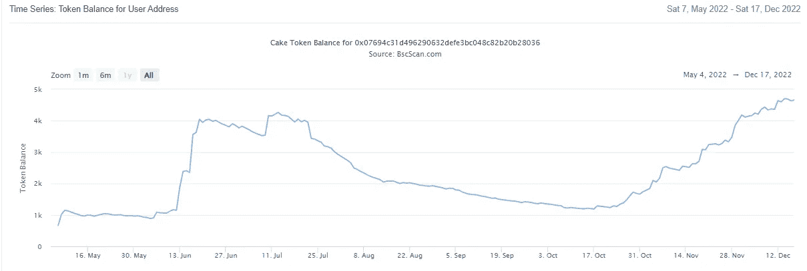
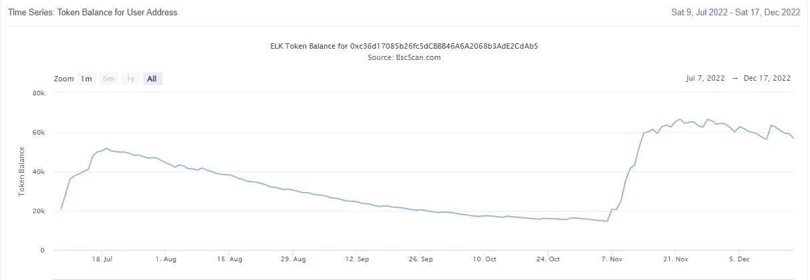
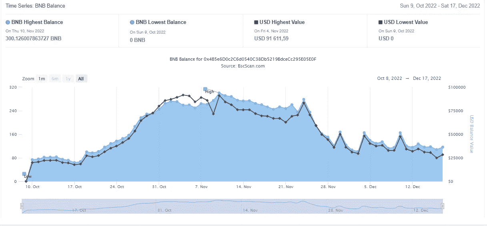
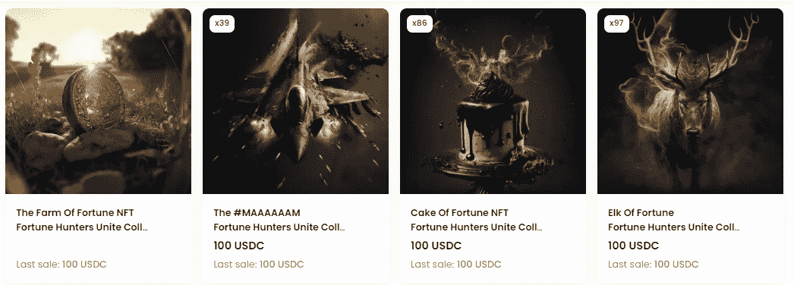
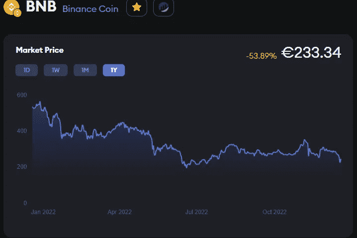

# 财富猎人 DNA 中的被动收入。

> 原文：<https://medium.com/coinmonks/fortune-hunters-passive-income-in-the-dna-8c08f3b261bd?source=collection_archive---------2----------------------->

大家好，我是 Nelson，今天和我一起看看 FH NFTs。

首先，如果你不知道财富猎人生态，请阅读我以前的文章。
> > [*财富猎人生态*](/@Nelson_Crypto_Journey/list/fortune-huntes-ecosystem-ba538a789f96) < <

在 FH，项目不是短期的。目的是创造所有人都能获得的长期被动收入流。听起来好得难以置信？
-COF——Cake of Fortune，一家于 5 月 7 日上市的标准蛋糕挖掘公司，成立近 8 个月，目前位于其 ATH。

COF TVL analytics from BSC Scan

*   EOF——麋鹿命运号，一只麋鹿矿工，于 7 月 9 日发射，接近 6 个月大，目前在 ATH 附近。

EOF TVL analytics from BSC Scan

是什么让这些矿工与众不同？
-减少或 0%庞氏。
-没有后期进入点。
如何？当两家矿商成立时，开发费被设定为用于联营企业，在联营企业中，开发费不断复利，每周股息被注入各自的 TVL 合同。
这是什么意思？
最重要的是，这将产生一个持久的项目，确保每个人都能获得长期投资回报。
是的，即使是那些在第一天加入的人仍将获得每日股息，但取决于每个人选择的方式，他们的通货膨胀率现在达到了他们的回报现在极度减少的程度。

TVL 仍然在我们如何扮演这些矿工以及我们选择增加新资本或加入他们时发挥着重要作用，但我们现在在 DeFi 有两个项目，它们肯定会在 1 年、2 年甚至 5 年内出现，更重要的是，为所有用户支付费用。

FH 团队的下一个项目，它目前的皇冠上的宝石是 FOF。

*   FOF——财富农场，是农民 ROI dapp 在 BNB 每天支付固定的 2%的组合。
    10 月 10 日发布，近 3 个月大，它向用户展示了不同于目前 DeFi 中所见的任何机制。通过从池中向合同中不断注入适当的资金，TVL 得以保持，并且每天保持稳定的 100 BNB 范围，以允许用户要求他们的股息，而 TVL 的其余部分则用于产生额外的股息，这将有望使该项目成为 FH 名单上另一个非常持久的项目。

FOF TVL analytics from BSC Scan

*   FH 系列 NFTs。
    NFT 独一无二的作品系列从未超过 1000 件。
    -终身分红。
    -提前访问即将在 FH 中推出的新层(从明年年初推出的 FH 令牌 wl 开始)。
    ——治理。
    -如此之多，将使这一收藏价值在 2023 年持续上升。

FH NFTs on opensea

只有 222 个 NFT 留下来，直到收集销售一空，底价开始上升…

接下来…

BNB price chart

尽管目前 FUD 遍布全球，但 BNB 是最安全、构建最完善的协议之一，但像所有其他硬币/代币一样，价格总是会大幅波动。
当它上涨时，我们都很欣赏它，我们在 BNB 每天获得 2%的收益，但当它下跌时，就不那么令人愉快了，我们也不确定它需要多长时间才能再次上涨……
我喜欢 BNB，它是我持有的为数不多的几枚硬币/代币之一，我希望它能迎来一次大牛市，价格最终会达到数千美元大关，但等待牛市并不能支付账单……

介绍 MOF…
MOF——命运的恶作剧，旨在 12 月下旬至 1 月第一周之间推出，MOF 将是一个混合农场 ROI dapp，在 USDC 每天支付固定的 1%。
当人们问 FOF 如此成功，USDC 项目还有什么意义时，我想请他们记住上面的话……

财政部将允许 FH 生态用户设定并逐步建立一个可持续的被动收入流，并有 100%可预测的有保证的结果……**最后，一个我们可以创造一个被动收入的地方，我们可以以一种持续稳定的方式依靠它来拥有支出资金。**

虽然波动性对获得或多或少的更高利润(BNB)很重要，但稳定(USDC)是通往财务自由的道路，也是月底支付账单的原因。

时不时地，我们会遇到一些团队，他们真正寻求在 hart 获得他们社区的最大利益，并寻求与他们一起建立一些将改变所有人生活的东西，而不仅仅是少数幸运者…
我在 DeFi…
中有一个规则:“投资于团队，赌上其余的”

是的，现在有，将来也总会有一些人会投资一些非常花哨的项目，试图把它做大，结果却变成了现实，被碾碎在地下。
是的，有些人永远不会相信任何事情，只会坚持到底(对于那些目前在 FOF 计划只做主张的人来说，这将是一个多么大的惊喜…我们将在这里看到他们在 TG 聊天中说，他们多么希望他们相信并遵循了团队的建议，毕竟，我们现在距离第 200 天只有 130 天了，人们将最终理解 FOF 机械师是多么独特…)

**有用链接**:
>>[*FH Eco TG*](https://t.me/FortuneHunters_Eco_System)<< *>>*[*FOF 站点*](https://farmoffortune.fortunehunters.space/index.html?ref=0x5D9E96068f42943e7e9e6e9468Ff8Bd933d5cf3A)<<
>>[*NFT 销售页面*](https://opensea.io/Fortune-Hunters-Eco-System?tab=created)<>>[*EOF 站点*](https://elkoffortune.fortunehunters.space?ref=0xfc49434836bfe183a0042b097f993fbe2c46275e)

如果你喜欢我的文章，请考虑一些掌声，因为它有助于达到更多的人，如果你想知道更多关于我的加密之旅考虑订阅。

*本文无意构成投资建议。作者和出版物均不对您可能因这些信息而招致的任何投资、利润或损失承担任何责任或义务。我们鼓励读者在做出任何和所有投资决定之前，进行尽职调查和研究，或咨询持牌金融顾问或经纪人。此内容仅用于一般信息和教育目的。尽管作者力求准确，但文章中的数据并不可靠。作者可能拥有文中讨论的加密货币和代币。文章可能包含附属链接。*

> 交易新手？尝试[加密交易机器人](/coinmonks/crypto-trading-bot-c2ffce8acb2a)或[复制交易](/coinmonks/top-10-crypto-copy-trading-platforms-for-beginners-d0c37c7d698c)