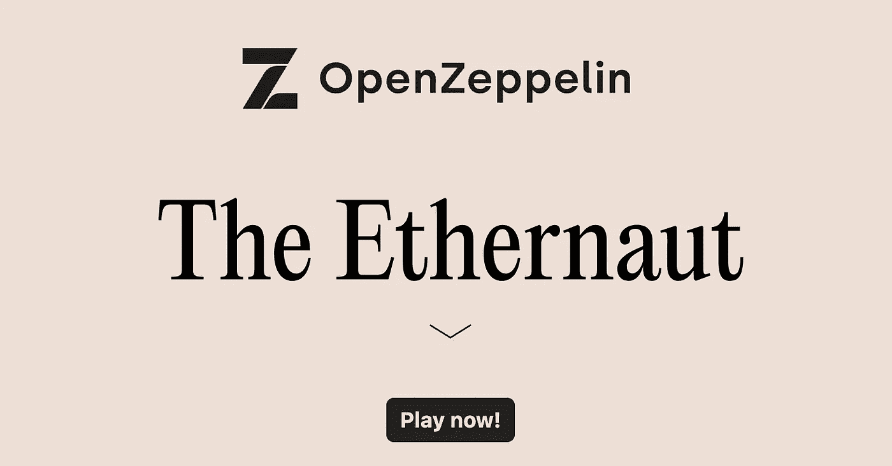

# 铸造—以太水平全面解决方案

> 原文：<https://medium.com/coinmonks/foundry-ethernaut-levels-full-solutions-73026c4bd04b?source=collection_archive---------5----------------------->

# 什么是以太挑战？

以太挑战是一系列不同的可靠性挑战。你可以在这里找到它们:[https://ethernaut.openzeppelin.com/](https://ethernaut.openzeppelin.com/)

注意:对于这些级别，我决定升级可靠性版本。你可以在这里找到所有的基础水平…