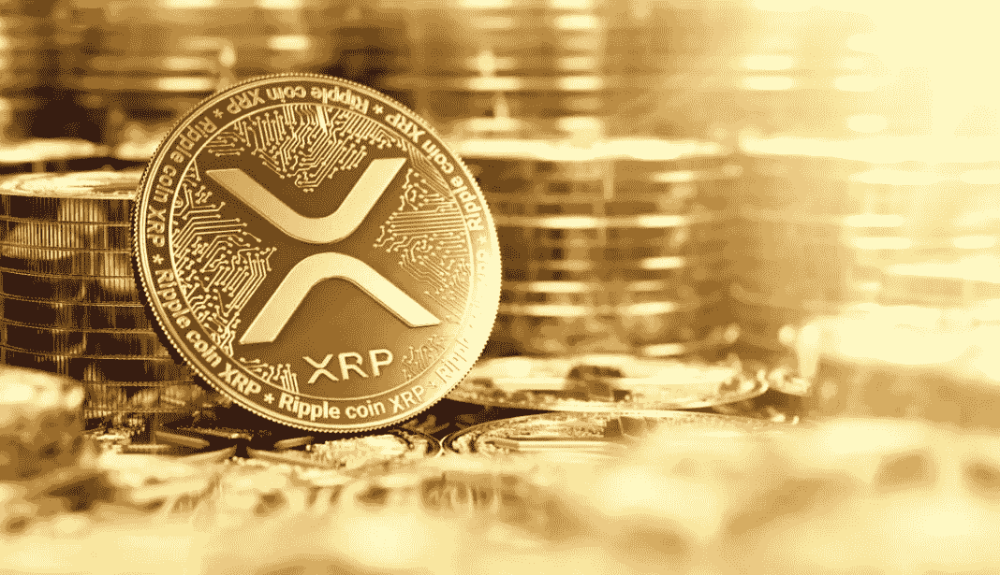
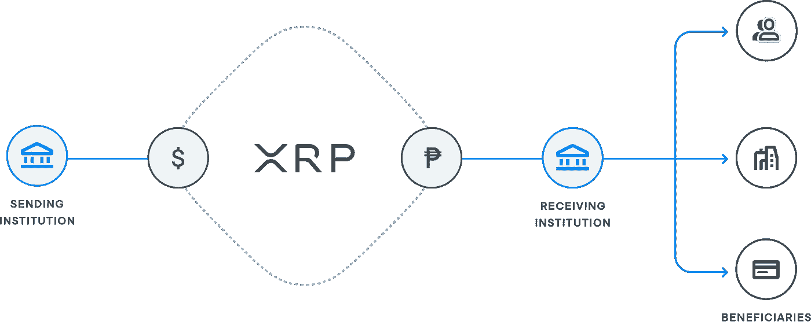
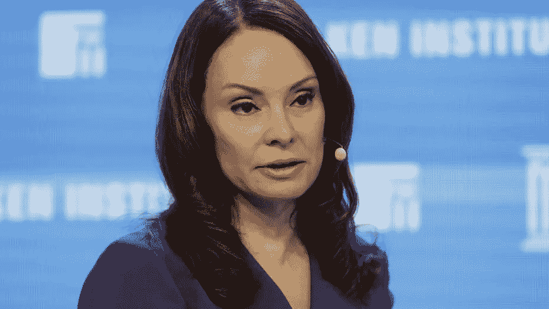
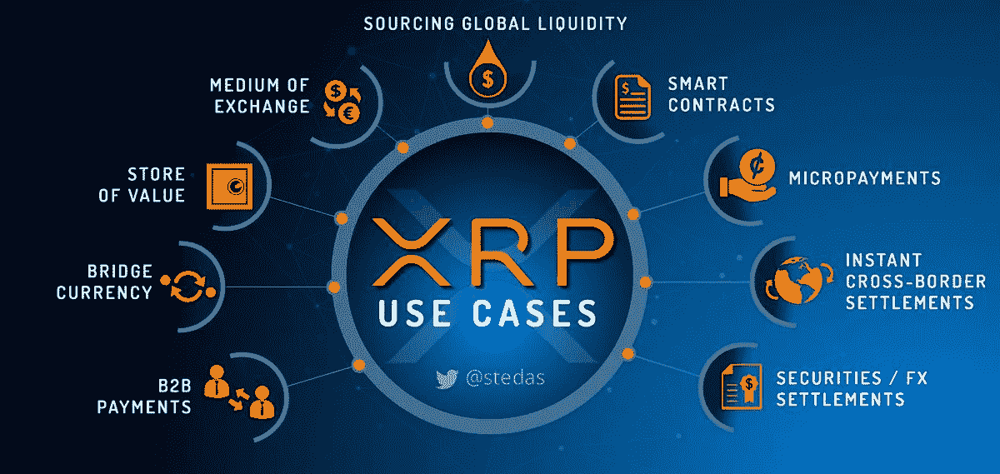

# Ripple 最终将成功对抗 SEC 的四个原因

> 原文：<https://medium.com/coinmonks/four-reasons-why-ripple-will-ultimately-be-successful-against-the-sec-2473c6e331db?source=collection_archive---------15----------------------->

加密货币 XRP 的主要利益相关者 Ripple 目前卷入了与美国证券交易委员会(SEC)的法律纠纷。

SEC 指控 Ripple 及其高管将 XRP 作为未注册证券出售，违反了联邦证券法。Ripple 及其高管否认了这些指控，并正在法庭上打官司。

尽管这场法律战仍在继续，但从长远来看，Ripple 和 XRP 仍有可能成功，这有几个原因。

一个原因是 Ripple 拥有与主要金融机构合作的良好记录。 Ripple 的支付网络 RippleNet 已被全球 300 多家金融机构采用，包括银行、支付提供商和汇款公司。这些合作伙伴关系使 Ripple 能够接触到庞大的客户群，并有助于增加 XRP 的采用和使用。

另一个原因是，与其他加密货币相比， **XRP 具有独特的价值主张。**虽然比特币和以太坊主要用作价值储存手段或交换手段，但 Ripple 是专门为金融行业设计的，作为一种促进跨境支付和减少这些交易所需成本和时间的手段。这种对特定用例的关注可能会使 XRP 对希望改善支付流程的金融机构更具吸引力。

XRP’s initial use case is as a “bridge-asset” allowing fiat and cryptocurrencies alike to be traded without the need for nostro / vostro accounts

此外， **Ripple 拥有一支强大的高管和顾问团队，他们在金融和科技行业拥有丰富的经验。**这些经验和专业知识已经帮助 Ripple 应对了许多其他司法管辖区的复杂监管环境

Former SEC Officials Mary Jo White and Andrew Cerensey both now at Debevoise are part of Ripple Labs’ legal counsel team.

Rosey Rios former US Treasury Secretary is Ripple Labs board member

最后，值得注意的是**加密货币市场仍然相对年轻，发展迅速。**尽管 SEC 对 Ripple 的指控确实令人担忧，但加密货币的法律和监管格局未来可能会发生变化，这可能会给 Ripple 和 XRP 带来不同的结果。

总体而言，尽管与美国证券交易委员会的法律纠纷对 Ripple 来说是一个重大挑战，**最终 XRP 有几个用例**将帮助它克服这一障碍，并取得长期成功。

The use-cases for XRP is being expanded beyond Ripple it’s initial use-case of acting as a “bridge currency”

它与金融机构的合作伙伴关系、独特的价值主张、强大的团队和监管变革的潜力都有助于 Ripple 和 XRP 的成功。

你怎么想呢?Ripple 最终会在与 SEC 的持续法律战中获胜吗？

请在下面的评论中告诉我。

> 交易新手？尝试[加密交易机器人](/coinmonks/crypto-trading-bot-c2ffce8acb2a)或[复制交易](/coinmonks/top-10-crypto-copy-trading-platforms-for-beginners-d0c37c7d698c)