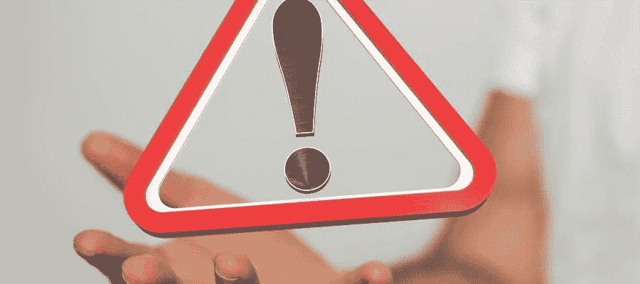

# 密码中需要避免的十四个错误

> 原文：<https://medium.com/coinmonks/fourteen-mistakes-to-avoid-in-crypto-bec4198d87e0?source=collection_archive---------36----------------------->

> **1。你没有阿尔法**

你最喜欢的 YouTuber 在一个项目上给了你阿尔法，几个小时后，令牌的价格暴跌。抱歉，但你处于食物链的最底层。建设者、风险投资者、专家、鲸鱼、影响者……然后是你。

⚫，调整你的风险。

> **2 .不计算 VC 转储:**

风险资本家得到的代币比我们便宜得多。如果他们决定展期，代币的价格就会暴跌。

⚫了解代币分配和分配时间表。

> **3 .追逐高 APR 的通胀表征**

25000% APY 看起来很性感，对吗？如果没有足够的公用事业或美元流入，通货膨胀令牌往往会失去价值。

具有讽刺意味的是，⚫15%的稳定通货膨胀率已经超过了许多高通货膨胀的象征。

> **4 .Ponzinomics**

有些项目是纯经济学的，你知道这个令牌有什么用吗？如果不是，它可能是基于庞氏经济学。您仍然可以通过它赚钱。

⚫确保您知道现在是多早，并在此过程中获取利润。

> **5。不牟利**

很容易陷入牛市的歇斯底里。“如果这种情况再持续几个月，我就可以安心生活了”当你开始认为自己是天才时，获利吧。

⚫用系统和公式来控制你的情绪。

> **6。不要错过下一个叙述**

➖迪菲 1.0 >迪菲 2.0
➖多戈金>施巴因努
➖ ETH >索罗纳瓦克斯
➖隐朋克>无聊猿游艇俱乐部

⚫新一代错过了从原版中获得的所有收益。他们将追逐下一件大事。

> **7 .不计算 IL**

您想增加一对流动性头寸。两个令牌的比例应该始终是 50:50。如果一个硬币价值飙升，而另一个下跌，会发生什么？现在不均衡，AMM 不得不出售代币来平衡。

⚫选择的硬币往往相互关联在一起，在大多数情况下，一个好的 APR 将能够克服一个可能的 IL

> **8。把周期打好**

了解我们在市场周期中的位置。在熊市环境中，你应该多吃点稳定的食物。

⚫:一旦市场变得更加看涨，你就可以进入风险更高的游戏，以获得更高的回报。

> **8。自动充值风险**

为了获得最大回报，您需要收获农田，并在一天内存款数次。自动组合网站可以自动完成这一操作。问题在于，它增加了一层可以利用的额外风险。

⚫:如果你想使用一个，使用成熟和稳健的协议。

> **9 .小盘股货币**

使用小盘股货币的过度激进的投资组合有可能达到 10 倍甚至 100 倍。但是一定要用蓝筹股和一些稳定的货币来对冲你的赌注。一个急剧的下降可以抹去你所有的收获。

将您的投资组合转化为投资和交易。

> 10。过于多样化

我见过有人在网上发布超过 25 枚硬币的投资组合。你不可能跟上那么多项目。如果一枚硬币创造了一个月亮，你将不会收获同样多的回报。

⚫:我发现最佳时机是 7 到 12 个项目。

> **11。不够多样化**

你还必须小心另一个风险:不够多元化。一个好的经验法则可能是为投资组合的每项投资设定一个最大权重。

以⚫为例，每种货币最多 15%，如果超过这个比例，就卖掉一部分，重新平衡。

> **12。未削减损失**

HODL 是一种危险的心态。如果代币价格下跌，你应该调查并了解原因。

⚫:如果下跌了-50%，在下跌-95%之前砍掉它可能是个好主意。你的资产可以用在其他地方。

> 13。小心影响者

一些有影响力的人会吹捧一枚硬币是最好的东西，但不会透露他们这样做是有报酬的。你需要开发一个测谎仪，自己做研究。

⚫，你和你自己要对你的资金负责。

> **14。不要小看营销**

有些协议是 100%专注于产品，而没有投入任何精力在营销上。如果团队不关心营销，资金就很难开始流动。

⚫耐克+苹果之所以能登顶，是因为产品+营销非常出色。

> 交易新手？尝试[加密交易机器人](/coinmonks/crypto-trading-bot-c2ffce8acb2a)或[复制交易](/coinmonks/top-10-crypto-copy-trading-platforms-for-beginners-d0c37c7d698c)