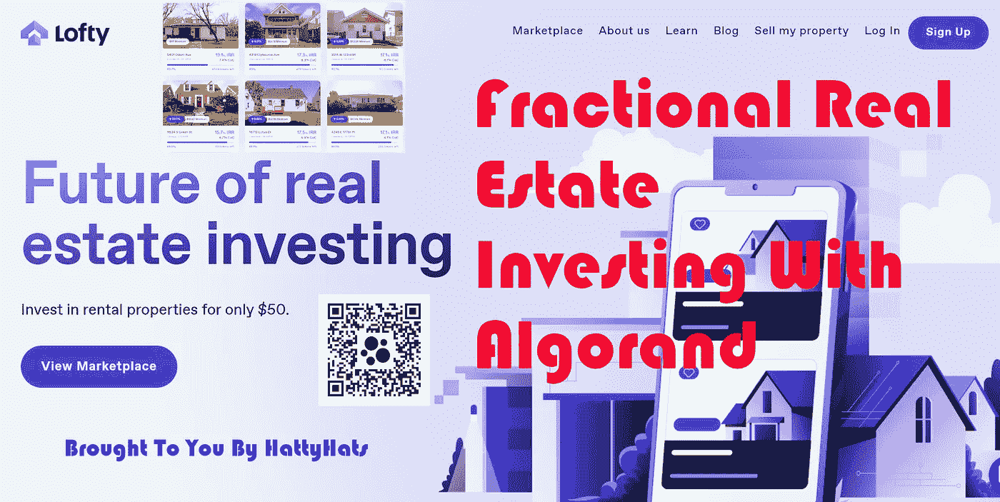
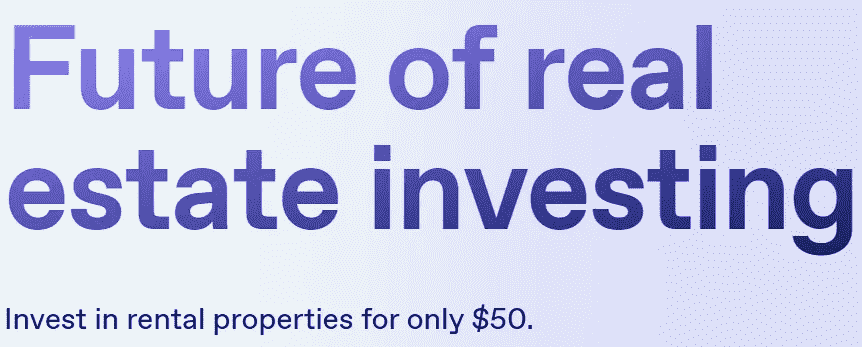
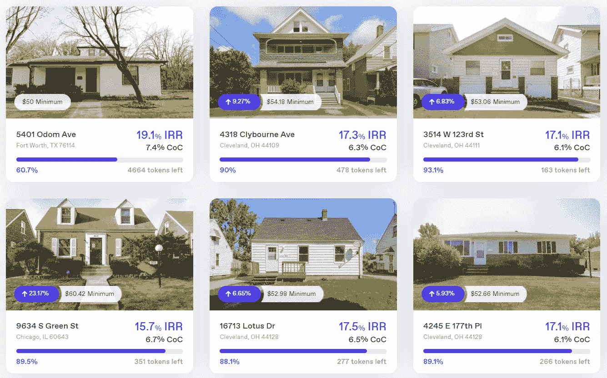
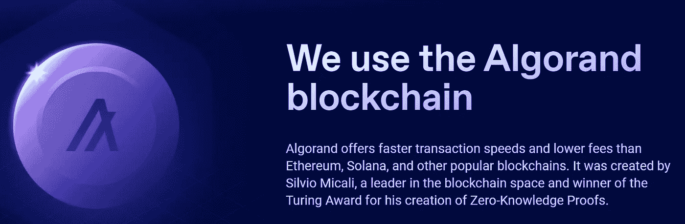
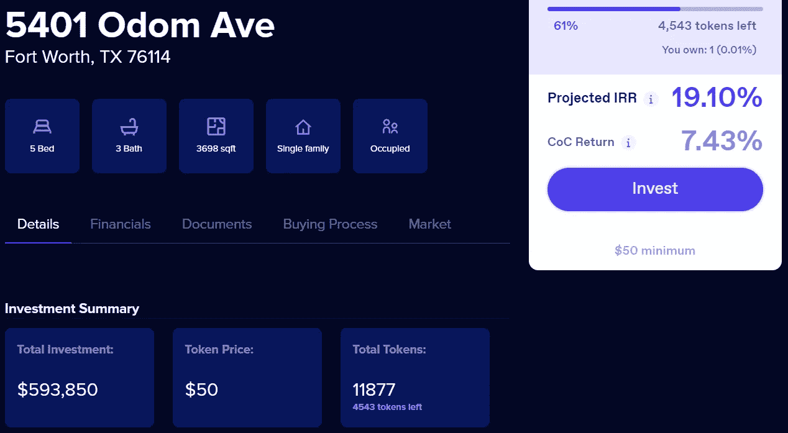
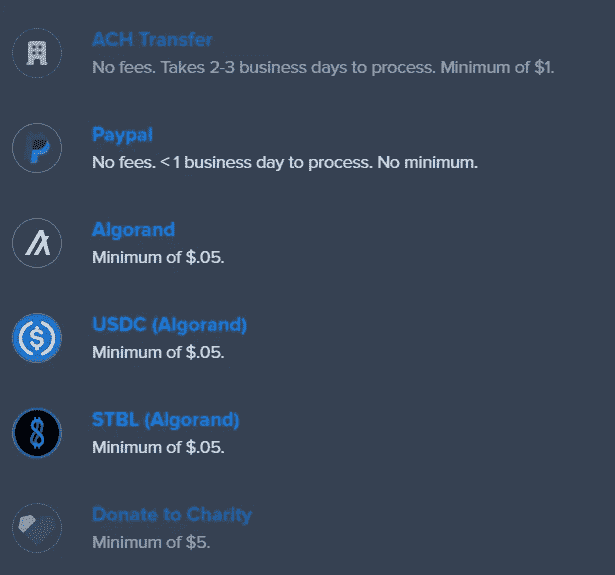
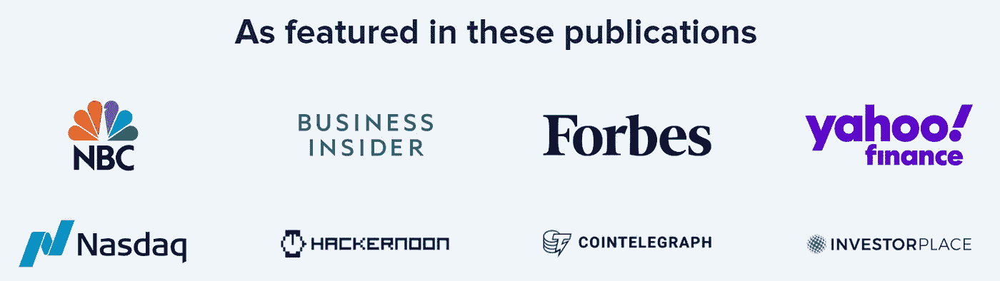
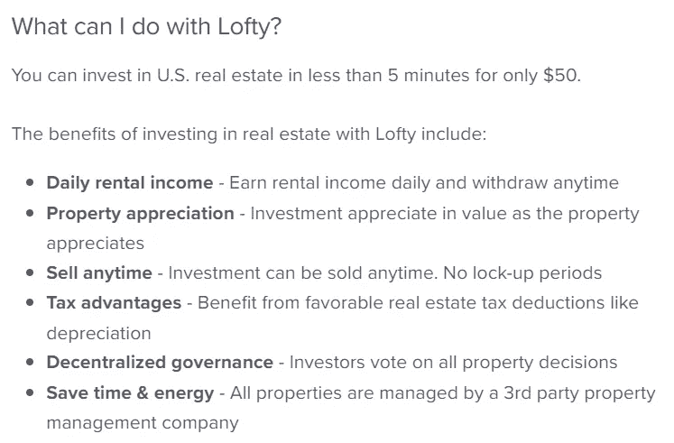

# 用 Algorand 进行部分房地产投资

> 原文：<https://medium.com/coinmonks/fractional-real-estate-investing-with-algorand-d425ef1a937e?source=collection_archive---------15----------------------->

大家好，欢迎回到另一篇文章。这篇文章将会和我正常的赚钱类文章有一点不同。我想在这篇文章中更多地关注投资。

如果你像我一样，那么你总是在寻找有前途的项目，你可以投资你辛苦赚来的密码。我想我找到了阿尔格兰德·区块链号上运行的数字黄金。让我解释一下。

我一直想投资房地产，但一直没有资金。房地产挣钱需要很多。投资房地产不仅需要大量的资金，还需要了解市场和耐心才能找到租户或买家。如果我告诉你，在 ALGO 区块链有一个平台，允许你购买部分房产，但仍然从租户支付的租金中获得被动收入，会怎么样？你可能会认为我疯了，这是不可能的。

这是可能的，而且现在正在发生。房地产市场正在发生变化，并慢慢转向区块链技术，以传播财富，让日常生活中的人们更容易投资。为了更好地解释，我想和你分享一个我发现的网站。让我知道你认为这个新的房地产投资的想法。

[**清高**](https://www.lofty.ai/refer?grsf=0143ph)

[Lofty](https://www.lofty.ai/refer?grsf=0143ph) 是一个允许你投资房地产的网站，起价仅为 50 美元。这个项目在 ALGO 区块链上运行，允许你购买房产的一部分。你仍然可以获得拥有和出租房产的所有好处，但增量较小，而且不必做任何“繁重的工作”。所有的奖励，没有工作。

在我走得更远之前，我想让你知道，如果你使用我的推荐链接，你将获得 25 美元，我将获得 25 美元的房地产股票投资信贷。使用[崇高](https://www.lofty.ai/refer?grsf=0143ph)90 天后，您将获得 25 美元的信用。

既然我已经说清楚了，那就让我来解释一下崇高是什么，以及你如何使用它。

[清高](https://www.lofty.ai/refer?grsf=0143ph)是一个神奇的项目，可以让你在不富裕或对房地产一无所知的情况下投资房地产。我一直想投资，但一直没有时间或资金来实现这个梦想。崇高允许像我这样的人投资少至 50 美元，并开始从财产中赚取被动收入。你在上面看到的房产只是你可以投资的房产中的一部分，而且房产的数量还在增长。

我个人认为这是一个伟大的想法，并将其用于 ALGO 区块链是巨大的。当然，还有其他网站，如 Fundrise、Groundfloor、RoofStock 等，但这些公司缺乏的是实施区块链技术。我相信区块链技术。我相信这有助于提高透明度，还权于民。这仅仅是开始，我非常期待看到未来会发生什么。

[清高](https://www.lofty.ai/refer?grsf=0143ph)透明好用。如果你决定签约并投资，Lofty 有你需要了解的关于你感兴趣的房产的一切信息，包括你能挣多少钱，房产是什么样的，面积大小，以及你能想到的任何其他信息。

你可以用密码、信用卡、借记卡或你的银行账户进行投资。这使得投资变得容易。另一件很棒的事情是，当你准备好提取你的收入时，你可以用很多不同的方式提取。您可以提取到您的 ALGO 钱包，贝宝，银行，USDC 和 STBL(阿尔格兰德)。我认为这很神奇，可以让你随心所欲地赚钱。

[清高](https://www.lofty.ai/refer?grsf=0143ph)已被多家知名公司采用，并且每天都在增长。我看到这家公司在不久的将来会变得很大。我相信区块链技术在买卖实物和数字物品时有着重要的作用。目前有 33 处房产可供选择，但我认为随着时间的推移，这将成为区块链房地产业最大的品牌之一。

如果你决定检查这一点，并使用我的链接投资，那么你将获得 25 美元的投资信贷，我也是。所以这是一个双赢的局面。不过，在你持有账户 90 天后，你才能收到 25 美元的信用点数。我第一次注册的时候没有被告知这一点，所以我想知道我的信用在哪里。稍微挖掘了一下，发现这是一个等待的过程。你会明白的，只是需要一些时间。这是一项长期投资，给你带来的是被动收入。所以等 90 天应该不是问题。我建议将您注册的日期放在您的日历中，这样您就可以知道 90 天过去了，如果没有通过，您可以联系支持人员。支持是快速和友好的，有帮助，所以不要犹豫，如果你有任何问题。

我希望每个人都喜欢我的文章。如果你喜欢，请关注更多的内容，并帮助我的网页成长。在评论里让我知道你对[清高](https://www.lofty.ai/refer?grsf=0143ph)的看法。

我感谢你们所有人花时间阅读我的文章！查看我的网站，了解更多的赚钱方法和我的其他内容。https://hattysshack.com/

扫描上面的二维码查看我的网站或点击链接。

[上的原创文章 read.cash](https://read.cash/@HattyHats/fractional-real-estate-investing-with-algorand-cc8f8d10)

> 交易新手？尝试[加密交易机器人](/coinmonks/crypto-trading-bot-c2ffce8acb2a)或[复制交易](/coinmonks/top-10-crypto-copy-trading-platforms-for-beginners-d0c37c7d698c)