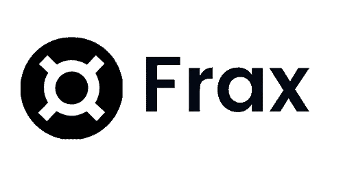

# 弗雷克斯金融公司，密码银行？

> 原文：<https://medium.com/coinmonks/frax-finance-the-crypto-central-bank-a542cda9cb02?source=collection_archive---------16----------------------->

> 什么是 FRAX？

[Frax](https://frax.finance/) 是一种算法稳定币，由 USDC 等其他稳定币支持。它的创造者[萨姆·卡泽米安](https://twitter.com/samkazemian)意识到许多算法稳定币由于冷启动问题而失败:即持有没有抵押品的稳定币的风险，因此，在一开始，它就设定了 80%到 85%的抵押率。自那以后，它一直在这个数字上下波动。这个想法…