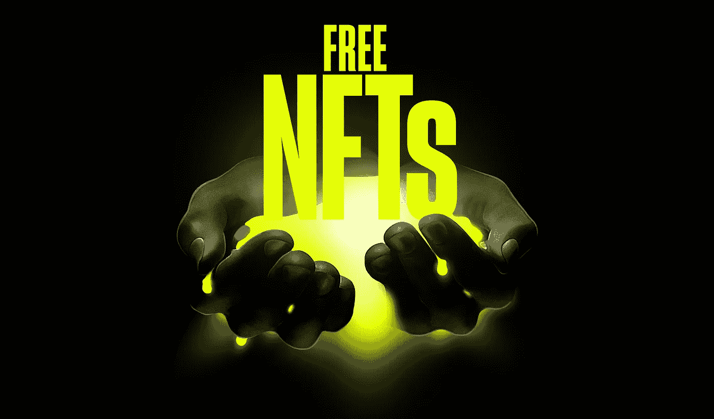

# 免费 NFTs——好还是坏？此外，一个免费的智能合同模板，用于免费造币和分级定价的 NFT 收藏。

> 原文：<https://medium.com/coinmonks/free-nfts-good-or-bad-plus-a-free-smart-contract-template-for-free-mint-nft-collections-7f7d47edd61c?source=collection_archive---------16----------------------->

在过去的几个月里，随着(几乎)每个人都被熊市所累，NFTs 找到了一种新的发展方式——免费薄荷糖。

那么，免费薄荷糖是好是坏呢？我们已经听到了双方的观点，以下是我们的看法。

像任何其他好主意一样，我们人类会找到一种方法来扭转它，让它变坏。这就是生活中的事情，由你决定选择哪一方。

# 让我们从“坏”开始。

你可能认为这是免费的薄荷糖；有什么不好的呢？

让我们首先尝试定义或分类“坏”:

*   这对整个 NFT 行业来说可能是不利的；
*   这对 NFT 收藏家和投资者来说可能是件坏事。

为坏事开始发生打开大门的是，在 0 ETH/mint 或非常非常低的价格下，例如 0.00 x ETH/mint——质量标准下降得非常低。突然之间，在艺术品上投入零努力是可以的(人们不会真的创造任何东西)，在社区上投入零努力，没有分歧，没有路线图，什么都没有——这看起来“可以”,因为你支付给 mint 的价格是 0 ETH 或非常接近它。

## 对行业不利

这造成的第一个问题是市场充斥着糟糕的、低效率的项目。这给还没有进入 NFT 领域的人或者/和谈论 NFT 行业的主流媒体留下了不好的印象。这只是另一个关于为什么 NFT 整体上是不好的论点。

很清楚，对吧？现在让我们深入一点。

## 现金抢夺

免费薄荷糖怎么可能是抢钱的？简单…在我们看来，即使是非常低的薄荷价格(低于 0.01 ETH/薄荷)也应该被认为是“免费薄荷”

很容易理解，以每薄荷不到 0.01 ETH 的价格运送垃圾 NFT 仍然是运送垃圾并为此收费，当你增加倍数，例如 5000 时，这是一种现金掠夺。

另一方面，其中一些项目被大肆宣传。如果创作者在这方面有经验，即使是在 0 ETH/mint，他们也可以通过二级市场销售的版税来赚钱。有些项目会成功，但大多数不会——所以归根结底还是要白花钱。

## NFT 盗窃案

这就是事情变得严重的地方——一个真正糟糕的演员会在免费的薄荷糖后面隐藏一个恶意的智能合同。底线是——终端用户认为他们正在铸造一个免费的 NFT，而事实上，他们的钱包正在被吸干他们拥有的一切。

一团糟，我们知道。但是，很难说哪个更糟糕——贪婪和不劳而获的欲望，还是恶意和利用这种贪婪的意愿。

# 但也不全是坏事。让我们看看免费薄荷糖好的一面。

我们认为免费造币运动有几个交织在一起的积极因素:乐趣、速度、想法验证和社区启动。

## 乐趣

首先，我们认为免费薄荷糖很有趣。如果其背后的创造者没有任何不良意图，免费薄荷可以成为每个人的有趣体验。

创作者不需要花费数月的辛勤工作和数万美元来建立一个社区，参与者只需支付一点汽油就可以成为互联网笑话或正在形成的迷因的一部分。

也许有一天它会变成有价值的东西，但很可能不会，但谁在乎呢？我们都笑得很开心，笑得很开心。另外，那些刚进入这个领域的人可能学到了一些东西。

## 速度和创意验证

一个免费的造币厂可以让创作者快速行动。有创业经验的人知道这种速度有多有价值——知道你对产品市场适应性的判断是对还是错。

免费造币厂就像“免费试用”，它可以帮助创始人发现他们的大创意是否有普遍的兴趣。换句话说，它可以帮助他们测试他们的愿景的“炒作潜力”，并为“主要系列”建立基础。

如果没有人对你免费的故事感兴趣，很有可能也没有人会花钱去创作它——这将为你节省大量的时间和金钱。

## 社区启动

另一方面，如果人们喜欢你的想法和你的故事，并且他们开始大量出现——你可能会有所发现。

如果你的免费薄荷糖进行得令人难以置信的顺利，这 100%表明你正在做某事，你应该进一步发展这个想法。

它的好处是，此时此刻，你已经获得了一些宣传和动力，你已经确定并聚集了你的早期采用者，你可以开始进一步建立你的社区。

在这种情况下，好处确实很多。仅举几个例子:

*   首先，你的不和不会从两个成员开始(假设一个项目至少有两个创始人)——你的不和会从几百个成员开始，如果不是几千个的话。
*   这将使你更容易与已经建立的 NFT 项目合作。人们会想和你一起工作。
*   你将有免费造币厂的二次销售，这些二次销售的版税可以帮助你资助真正的东西的开发。

这种介绍性的免费造币厂将成为我们下一个大项目的方法。这将允许我们事先验证我们的想法，并讲述一个更好的故事——无论如何，我们最终都是故事讲述者。

如果这篇文章有什么启示的话——那就是**由我们选择一方**，我们是要成为“绝地”还是“西斯”，以及**永远是 RTFC** (阅读他妈的合同)在你点击那个造币按钮之前。

# 你在标题中提到的免费智能合同模板怎么样？

关于这个…:)我们希望鼓励和帮助所有的创作者、艺术家和有想法的人。假设您是其中之一，我们希望让您的生活更轻松，因此我们制作了一个智能合同模板。它是免费的、强大的，并且随时可以部署。所有你需要做的是调整基本参数，如你的收藏名称，代币追踪器，价格，以及其他一些东西。

以下是本合同中包含的功能的简要概述:

*   Merkle 树允许列表/白名单
*   每个钱包和交易限额
*   分级定价
*   合同暂停状态控制
*   供应管理
*   令牌 URI 管理
*   管理员/所有者造币厂
*   付款拆分器

在我们分享下载链接之前，先说一下分级定价——合同允许您设置定价等级。例如，您可以配置合同，使第一个 1000 薄荷是免费的，第 1001–2000 个是 0.00 倍 ETH/薄荷，2000 个及以上是 0.00Y ETH 薄荷。您可以拥有无限的层，也可以将整个集合设置为自由的。

每钱包和每交易限额允许您配置单个钱包可以铸造的 NFT 数量的限制，以及单次交易中可以铸造的 NFT 的最大数量。

该合同还允许部署者在部署合同后控制供应。

allowlist/whitelist 支持是通过 Merkle 树机制实现的，契约允许您在部署契约后更新 allowlist/whitelist。

基本 URI 和文件扩展名管理允许您控制您的元数据，并做实时或延迟收集揭示。

这是一份成熟的智能合同，几乎包含了您需要的一切。

[**你可以从我们的 GitHub 仓库这里**](https://github.com/0xRebels/free-mint-template) 下载合同。为了完全透明，合同确实包括了 2.5%的可选小费，以防你正在做一个付费造币厂，但正如我们所说的，这是完全可选的，你可以自由地从合同中删除它。

我们希望这篇文章对您有所启发，我们与您分享的智能合同对您有所帮助。如果你已经在设计或计划开始设计你的 NFT 系列，我们很乐意收到你的来信，并尽我们所能帮助你。欢迎在[推特](https://twitter.com/0xRebels)上联系我们。

保持安全，小心地毯和骗局，在 [Twitter](https://twitter.com/0xRebels) 和 Medium 上关注我们，获取更多类似的文章。

愿原力与你同在:)

> 交易新手？尝试[加密交易机器人](/coinmonks/crypto-trading-bot-c2ffce8acb2a)或[复制交易](/coinmonks/top-10-crypto-copy-trading-platforms-for-beginners-d0c37c7d698c)