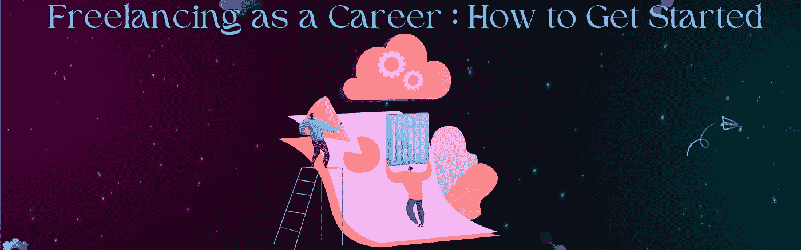
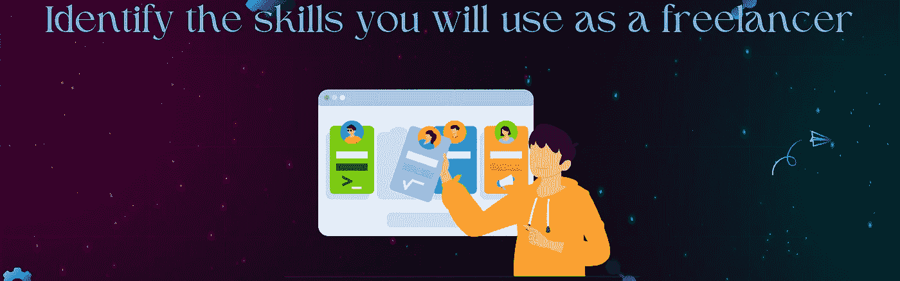
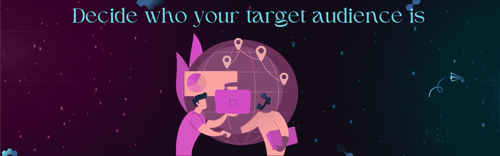
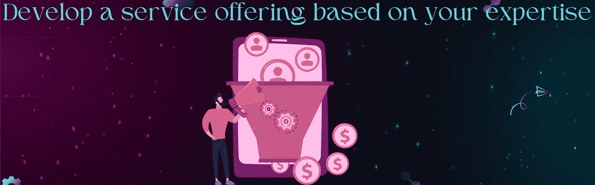
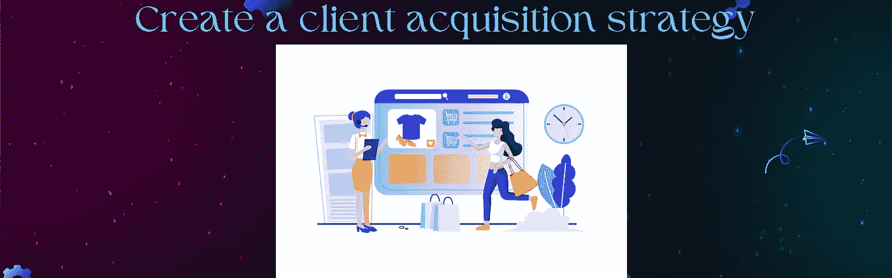

# 自由职业:如何开始

> 原文：<https://medium.com/coinmonks/freelancing-as-a-career-how-to-get-started-c016c78cda5?source=collection_archive---------43----------------------->

**freelancing as a career : how to get started**

在这个远程工作的时代，越来越多的人渴望成为自由职业者或开始从事自由职业。因此，下一个问题是如何开始自由职业？

做一名自由职业者从未如此容易。此外，对自由职业者的需求比以往任何时候都高，公司越来越愿意雇佣自由职业者，而不是全职员工。

大多数工作都可以远程完成，公司不必向全职员工提供与自由职业者相同的财务或健康福利。那么也许是时候让你自己创业，建立一个自由职业者的生意了。

现在让我们来讨论一下如何用很少的初始投资一步一步地快速开展自己的自由职业业务:

*   为你的自由职业生涯设定具体目标
*   **确定你作为自由职业者将会用到的技能**
*   **决定谁是你的目标受众**
*   **根据你的专业知识开发服务**
*   **通过创建作品集展示你的技能**
*   **创建客户获取策略**
*   **利用你已经拥有的网络**
*   **识别并创建新的连接**

概述

让我们继续前进

# 为你的自由职业设定具体的目标:

set specific goals for your freelancing career

开始自由职业的第一步是确定你的目标。没有目的地，你就无法开始你的旅程。同理，在没有明确目标的情况下开始自由职业也是不可取的。明确你的目标将有助于你建立一个成功的自由职业者事业。明确你的目标:

你为什么想成为一名自由职业者。找到客户并为他们做好工作的第一步是理解你自己的“为什么”

# 你为什么决定成为一名自由职业者？

*   作为额外的收入来源？
*   为了取代你的全职收入？
*   你对这份工作的预期收入是多少？

你想成为自由职业者的目的将成为你成功的指南针。

# 考虑把自由职业作为兼职或副业

开始兼职做自由职业者或副业是一个聪明的想法。当没有立即产生收入的压力时，更容易考虑你所做的工作类型和你的客户。

因此，明智的做法是，在你觉得有必要之前，开始从事自由职业。通常，自由职业者的关系是建立在信任和相互尊重的基础上的，这些关系的发展需要时间。

因此，如果你是兼职自由职业者或兼职自由职业者，你会给自己机会去建立你全职自由职业者所需要的人际关系。

# 逐步成为全职自由职业者

如果你打算成为一名全职自由职业者，恭喜你！拥有自己的企业从未如此令人兴奋。

如果这是你的目标，确定你必须赚多少钱来支付你的生活费用是非常重要的。术语“生活费用”包括您的所有生活费用，包括税收、保险，甚至退休费用。

在这里你会找到你的自由职业收入来源！

不管你是否有直接的账单要付，甚至是债务，你都需要专注于你的收入目标。这样做，你会阻止自己把自己挖得更深。显然，你在第一个月无法达到这个数字。然而，知道你的收入目标是什么会给你尽快达到它的最高机会。

# 确定你作为自由职业者将会用到的技能:

identify the skills you will use as a freelancer

作为一名自由职业者，为了建立你的事业，你需要能够展示你独特的技能。你拥有的最大财富是你的技能。

首先，确定你在这些年中获得了哪些别人可能不具备的技能，并希望聘用你。详细列出你的技能。

*   利用你以前的工作经验开始自由职业
*   利用你的爱好和自学技能开始自由职业
*   缩小你的专业列表

# 确定谁是你的目标受众:

**decide who your target audience is**

下一步是确定谁会付钱给你，让你使用你已经确定的对你来说最有利可图和最愉快的技能。许多自由职业者在这方面没有表现出深思熟虑和奉献精神。为了避免销售，他们开始从事自由职业，并将接受任何客户提供的任何报酬。

注意不要和那些自由职业者犯同样的错误！

应考虑以下几点:

*   想想你的理想客户，他们需要你提供的那种帮助。
*   深入挖掘客户头像，你的客户的需求应该被认为是尽可能具体的。

确定了你的目标客户，并对自己对他们的了解充满信心后，是时候做一个快速深入的调查了。要让这个客户值得服务，有几件事必须是真的。请考虑以下情况:

*   该客户是否意识到自己的问题并寻求帮助？
*   这个客户有能力支付你的服务吗？

# 基于您的专业知识开发服务产品:

**develop a service offering based on your expertise**

选择你的技能只是开始自由职业的第一步——接下来你需要卖掉它们。为了推销你的技能，你需要把它们当成一种服务。通过以下方式为您的客户提供服务:

提供解决方案来代替服务

确定目标客户的需求，并相应地定位您的解决方案

当你开始做自由职业时，你会收取多少费用？

把这些和你为客户开发的公式放在一起

# 通过创建作品集来展示你的技能:

make your skills visible by creating a portfolio

不管你的客户怎么想，他们雇佣你是因为他们相信你的能力。对他们来说至关重要的是，你要实现你所承诺的工作质量，并且做到你所说的。所以你应该非常清楚你需要在你的作品集里提到什么:

开始从事自由职业需要一份作品集吗？

有些客户很容易找到——他们可能是家人或朋友。然而，在大多数情况下，客户需要一个信任你的理由。这种信任需要建立。为了确保新客户有充分的理由信任你，从一开始就准备好工作样本。

**如何为自由职业者准备作品集**

作为一名专业人士，你应该将你的作品集和作品样本与你提供的服务结合起来。专注于你真正引以为豪的样品。只包括你最杰出的作品。

**建立一个有助于你开始自由职业的文件夹**

所以，当你想开始自由职业时，你应该随身携带一些工作样本，向客户展示你的能力。如果你还没有为客户完成工作的例子，考虑一下你为自己或他人完成的免费项目。

**开始从事自由职业时如何展示你的作品**

一些人在 Instagram、Dribbble 或 Behance 等第三方网站上分享他们的投资组合。或者，有些人可能会创建自己的投资组合网站。如果需要，请不要犹豫使用第三方平台。让你的客户能够方便地访问你的作品将有助于你的成功。

# 创建客户获取策略:

**create a client acquisition strategy**

恭喜你，你的鸭子正式排成一列了！

至此，你已经为自由职业者的创业建立了坚实的基础。下一步是找到你的第一个客户。

作为一名自由职业者，寻找新客户有三个主要策略可以考虑:

1.  直接与客户接触
2.  作为分包商提供协助
3.  利用自由职业者求职网站

现在你已经考虑了所有这些要点，你已经准备好开始你的自由职业生涯了

# 利用您已经拥有的网络:

**utilize the network you already have**

在本节中，我们将讨论如何直接找到客户以及如何分包。

前面我提到过，人们会雇佣他们高度信任的人。此外，他们更有可能和自己喜欢的人一起工作。你最有可能被了解你、喜欢你、信任你的人雇佣，尤其是当你刚开始做自由职业者的时候。

这些人是你的支持者。你已经有支持者了。他们是你的朋友、家人、同事和同事。这些人是你的拥护者。你已经有支持者了。他们是你的朋友、家人、同事和同事。你总是最有可能从你的拥护者那里获得雇佣或推荐。

大多数服务型企业是通过口碑发展起来的，你的拥护者是你的关键营销工具。很可能这些倡导者不会像你所希望的那样善于把你介绍给别人。

这是可以改变的。

# 确定并创建新的连接:

**identify and create new connections**

理想情况下，如果你和你的支持者重新联系，他们中的一个会雇用你，或者把你介绍给愿意雇用你的人。现在是你建立新关系和拓展自由职业的时候了。通过各种方式让你的客户可以找到你，比如通过社交媒体、直接电话、电子邮件等。，方便他们与你合作。当你开始从事自由职业时，你的首要目标应该是获得更多的支持者。

“支持者”一词是用来将他们与客户区分开来的。

我们当然希望有客户，但客户首先是支持者。如果没有支持者，他们就不会成为客户；他们必须说服自己，你是合适的人选。任何外联活动的主要目标都是培养新的倡导者。外联不包括销售项目。在外展中，目的是销售对话。

# 接下来，采取行动:

我们很高兴有你和我们在一起！加入我们的社区，为您的旅程提供支持。

在自由职业市场 Uniblok，我们将指导你开始成功的自由职业生涯的每一步。

访问我们的网站:【https://uniblok.io/ 

在以下网站查看 Uniblok:[insta gram](https://www.instagram.com/uniblok_techpvtltd/)|[脸书](https://www.facebook.com/Uniblok-Tech-Pvt-Ltd-115934447782742/)|[Linkedin](https://www.linkedin.com/company/uniblok-tech-pvt-ltd)|[Twitter](https://twitter.com/UniblokPVTLTD)|[Pinterest](https://in.pinterest.com/UniblokTechPvtLtd/)

> *交易新手？试试* [*密码交易机器人*](/coinmonks/crypto-trading-bot-c2ffce8acb2a) *或* [*复制交易*](/coinmonks/top-10-crypto-copy-trading-platforms-for-beginners-d0c37c7d698c)
> 
> *分散加密持股，了解* [*币安替代品*](https://coincodecap.com/binance-alternatives)
> 
> *加入 Coinmonks* [*电报频道*](https://t.me/coincodecap) *和* [*Youtube 频道*](https://www.youtube.com/c/coinmonks/videos) *获取每日* [*加密新闻*](http://coincodecap.com/)

# 另外，阅读

*   [复制交易](/coinmonks/top-10-crypto-copy-trading-platforms-for-beginners-d0c37c7d698c) | [加密税务软件](/coinmonks/crypto-tax-software-ed4b4810e338)
*   [网格交易](https://coincodecap.com/grid-trading) | [加密硬件钱包](/coinmonks/the-best-cryptocurrency-hardware-wallets-of-2020-e28b1c124069)
*   [密码电报信号](/coinmonks/top-3-telegram-channels-for-crypto-traders-in-2021-8385f4411ff4) | [密码交易机器人](/coinmonks/crypto-trading-bot-c2ffce8acb2a)
*   [最佳加密交易所](/coinmonks/crypto-exchange-dd2f9d6f3769) | [印度最佳加密交易所](/coinmonks/bitcoin-exchange-in-india-7f1fe79715c9)
*   [面向开发人员的最佳加密 API](/coinmonks/best-crypto-apis-for-developers-5efe3a597a9f)
*   最佳[密码借贷平台](/coinmonks/top-5-crypto-lending-platforms-in-2020-that-you-need-to-know-a1b675cec3fa)
*   [免费加密信号](/coinmonks/free-crypto-signals-48b25e61a8da) | [加密交易机器人](/coinmonks/crypto-trading-bot-c2ffce8acb2a)
*   [杠杆代币终极指南](/coinmonks/leveraged-token-3f5257808b22)