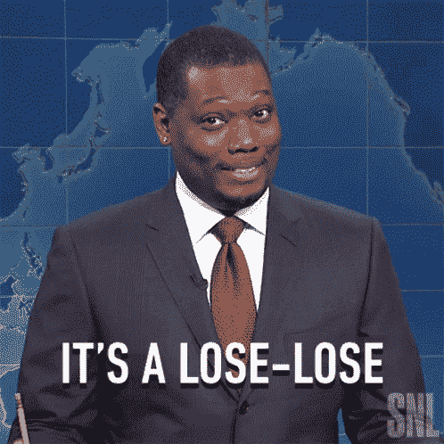
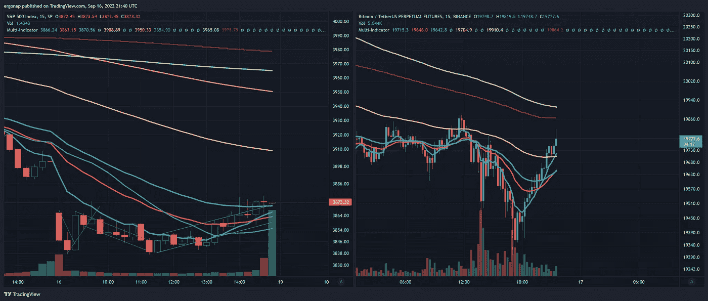

# 星期五点心店

> 原文：<https://medium.com/coinmonks/friday-fudgery-831af6097e4a?source=collection_archive---------40----------------------->

## #加密货币市场/#比特币市场分析 9/16

我在这里用词很轻，但我希望很清楚。由于这是一个[四重巫术星期五](https://www.tradestation.com/insights/2022/02/03/quadruple-witching-dates-2022-trading/\)，我看着交易基本上蒸发了 theta 一个人。有点乱。

there were only ways to lose if you were trying to trade today for long options

$SPY 整天上下波动，BTC 也是如此。

[https://www.tradingview.com/x/Jt1R0JzH/](https://www.tradingview.com/x/Jt1R0JzH/)

请明显注意$BTC 的响应是如何变慢的，因为这正是我想要引起注意的。

还记得我说过，数十亿流动性退出市场的速度比沙子从某人手中滑落的速度还快吗？这就是结果。没有人交易密码，所以价格不会真的变动。

在过去，这在像#kucoin 和 [@krakenfx](http://twitter.com/krakenfx) 这样的交易所很明显，在那里你会看到这种滞后，然后事情神奇地移动。但是现在，情况越来越糟了。糟糕得多。

通常这并不重要，因为人们经常加密头寸，直到后来才忘记。但现在，随着熊市的到来，它将进一步支撑熊市。与此同时，还有什么变化吗？

[https://www.tradingview.com/x/2quQ4Gmb/](https://www.tradingview.com/x/2quQ4Gmb/)

没有。一如既往的看跌，考虑到本月到目前为止的情况，甚至可能更加看跌。随着加息的临近，投资交易员将承受更大的痛苦，我预计会达到 100 个基点甚至更高。

 [## 9 月加息 75 个基点？要玩的 ETF

### 纽约联邦储备银行行长约翰·威廉姆斯最近表示，他预计利率将继续走高，并保持在这一水平

finance.yahoo.com](https://finance.yahoo.com/news/75-bp-rate-hike-september-180006964.html) 

> 交易新手？试试[密码交易机器人](/coinmonks/crypto-trading-bot-c2ffce8acb2a)或[复制交易](/coinmonks/top-10-crypto-copy-trading-platforms-for-beginners-d0c37c7d698c)