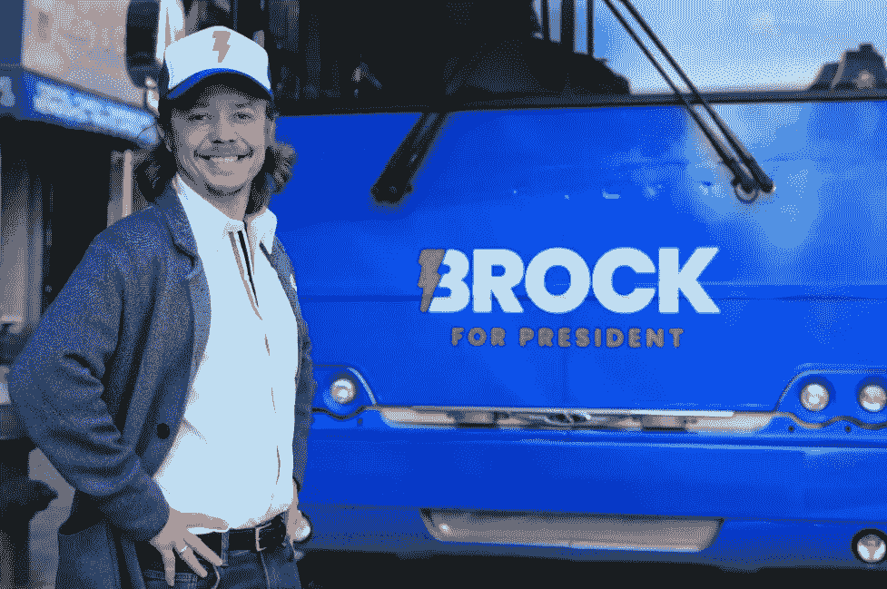

# BTC 10 号的朋友和支持者:布洛克·皮尔斯

> 原文：<https://medium.com/coinmonks/friends-and-supporters-of-btc-10-brock-pierce-68d0ddbd7adc?source=collection_archive---------33----------------------->

我今天谈论的这个人是最早进入我们这个行业的人之一，或者更确切地说，他是创始人之一:他的名字叫布洛克·皮尔斯。41 岁，企业家，前美国总统候选人，前童星。

Brock Pierce

他在很小的时候就第一次出现在商业广告中。作为一名儿童演员，他演过几部电影。在退出演艺生涯后，十几岁的他创办了数字娱乐网络公司，该公司筹集了 8800 万美元的风险投资。虽然该公司经营得很好，但由于一些法律问题，它于 2000 年 6 月申请破产并关闭。第二年，布洛克创立了互联网游戏娱乐公司。四年后，该公司的收入约为 5 亿美元。2007 年，由于集体诉讼，公司破产，布洛克被迫离职。皮尔斯后来钻研网络游戏，是《魔兽世界》等流行游戏的创始人之一。他已经成为这个行业的先驱之一，他的受欢迎程度也大大提高了。他是加州理工学院、奇点大学和米尔肯全球会议的特邀演讲人。2013 年，布洛克加入了风险投资公司区块链资本(Blockchain Capital)。他还联合创立了 EOS Alliance、Block.one 和 Mastercoin。布洛克·皮尔斯(Brock Pierce)是一位对比特币非常了解的企业家。他在 2013 年开始购买它们，并在第二年共同创立了 Tether。他于 2014 年 5 月当选比特币基金会的董事，该基金会于 2015 年因资不抵债而关闭。他还建议 Airswap，Bancor，BitGo 和其他公司的密码产业。2020 年，他以独立身份参加了美国总统选举，但没有成功。

Brock for President

他认为技术可以给美国经济带来动力。他是通过使用区块链技术的应用程序投票的，在犹他州县使用 Voatz 应用程序。

一直以来，他都是一个慈善家和一个有进取心的人，在萨尔瓦多准备所谓的“比特币法律”期间，他是[总统纳吉布·布克勒](https://www.newcoinpost.com/blog/friends-and-supporters-of-btc-3-president-of-el-salvador-nayib-bukele)的顾问之一。他可以被认为是在中美洲采用比特币的推动者之一。几年前，他搬到了波多黎各的,并致力于使这个岛屿成为加密行业最有趣的地方之一。布洛克是 Integro 基金会的主席，致力于解决该地区的环境、经济和社会挑战。

关于最近的 FTX 事件，Pierce 声明这与比特币或加密技术没有任何关系。

根据一些网站，他的净资产在 10 亿到 20 亿美元之间。

你认识在我们行业中起关键作用的其他人吗？请在评论中告诉我。

胜利者是永不放弃的梦想家。

***免责声明*** *:我不知道所使用的图片有任何第三方权利。如有任何资料来源，我保证予以引用，如有要求，我将调整立场。*

***免责声明*** *:交易加密货币具有很高的风险，可能不适合所有投资者。在决定交易加密货币之前，你应该仔细考虑你的投资目标和你的经验水平。自己做研究。此处表达的所有观点归各自作者所有，不应被视为任何形式的财务建议。*

*关于作者*

[*CRYPTO _ ALBERT*](https://twitter.com/albertovischio?t=C3Xj9pTm9Q7EZqwjrGHQdA&s=09)

*主编* [*新币帖*](https://www.newcoinpost.com/) *。我帮助人们更好地理解加密货币领域及其目的。*

> 交易新手？试试[加密交易机器人](/coinmonks/crypto-trading-bot-c2ffce8acb2a)或者[复制交易](/coinmonks/top-10-crypto-copy-trading-platforms-for-beginners-d0c37c7d698c)