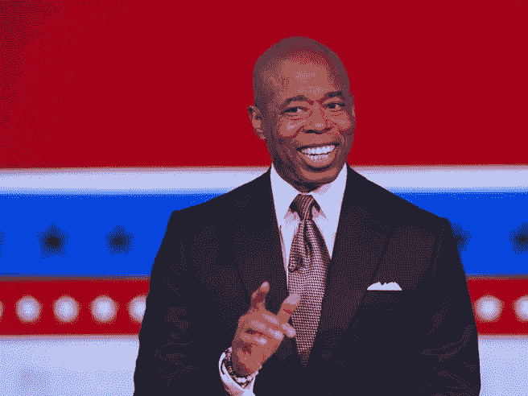
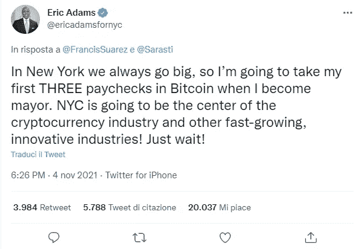
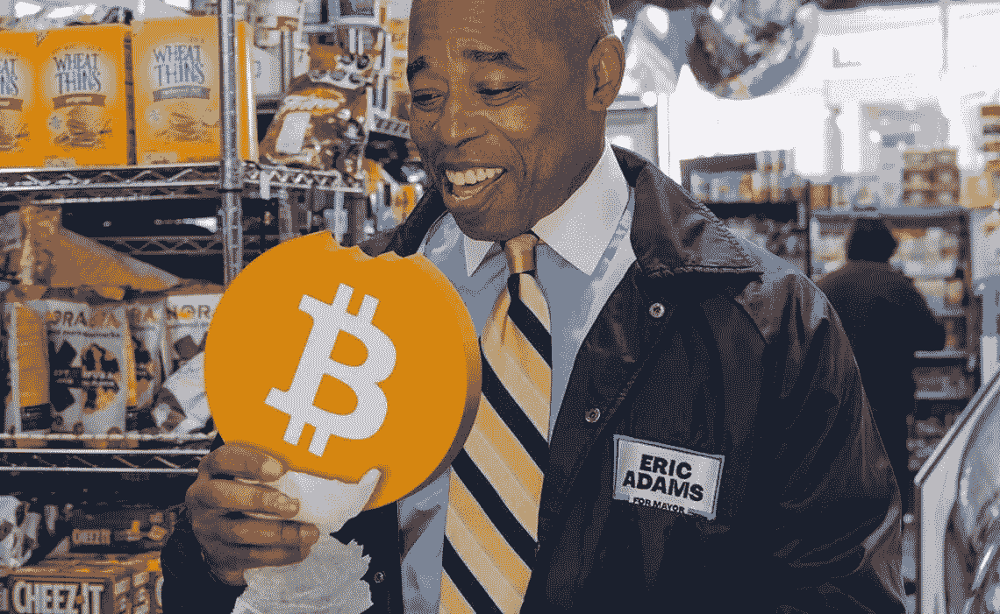

# BTC 的朋友和支持者#2:纽约市长埃里克·亚当斯

> 原文：<https://medium.com/coinmonks/friends-and-supporters-of-btc-2-mayor-of-new-york-eric-adams-5222c41be8a8?source=collection_archive---------28----------------------->

在迈阿密市长弗朗西斯·泽维尔·苏亚雷斯的文章之后，我继续回顾支持比特币的有影响力的人。今天我要说的是埃里克·亚当斯，纽约市市长，民主党人，61 岁，自 2022 年 1 月 1 日以来一直统治着纽约市。

Eric Adams, Mayor of NYC

2022 年 1 月 20 日，他[宣布](https://www.nytimes.com/2022/01/20/nyregion/eric-adams-bitcoin-cryptocurrency.html)他的工资将通过[比特币基地](https://coinbase.com/join/vischi_mb)自动转换成加密货币，准确的说是以太坊和比特币。根据[美国劳工部规定](https://www.shrm.org/resourcesandtools/legal-and-compliance/employment-law/pages/payment-in-cryptocurrency.aspx)，纽约市不能用加密货币支付员工。通过使用像比特币基地这样的加密货币交易所，任何以美元支付的人都可以在资金存入他们的账户之前将资金转换成加密货币。在他发表声明之前，他在自己的官方主页上发了一条推特[，回复迈阿密市长弗朗西斯·苏亚雷斯，称当他成为市长时，他也会用比特币支付他的前三份工资。](https://twitter.com/ericadamsfornyc/status/1456311827550384129)

The annoucement of Eric Adams on Twitter

亚当斯市长表示，“纽约是世界的中心，我们希望它成为加密货币和其他金融创新的中心。站在这种创新的最前沿将帮助我们创造就业机会，改善我们的经济，并继续吸引全球各地的人才。”当被问及在熊市中他是否没有改变对加密货币工资的想法时，亚当斯回答说:“当股票市场暴跌出我的 401 (k)时，我损失了大约 10 万美元。我们知道它上下起伏。比特币将继续存在，大部分投资都在纽约市。”

Eric Adams bullish on BTC

当纽约州参议院批准[一项工作证明(PoW)开采禁令法案](https://www.nysenate.gov/legislation/bills/2021/a7389/amendment/a?intent=oppose)禁止该州任何新的比特币开采业务时，亚当斯表示他反对这一决定。据 Brain Pascus 2022 年 6 月 14 日的一条[推文](https://twitter.com/brianpascus/status/1536472739913015297?s=20&t=wUO9MfxFPZC5ahxjIhE-hA)显示，亚当斯计划要求州长 Hochul 否决密码开采法案。

Proof of Work (PoW) mining ban bill of the New York State Senate

纽约是继迈阿密之后美国第二个获得 Citycoin 的城市， [NYCCoin](https://www.citycoins.co/nyccoin) ，这是一种由 Stacks 协议支持的加密货币，可以在比特币上实现智能合约。NYCCoin 的目标是建立 web3 应用程序，创建 NFT，或者改善城市的数字基础设施。任何人都可以挖掘 NYCCoin，通过智能合同为 NYCCoin 编程，甚至可以从协议中获得 BTC，因为它得到了更多的使用。NYCCoin 在 [Coinmarketcap](https://coinmarketcap.com/currencies/nyccoin/) 上市，今天的价格是 0.00037 美元。

NYCCoin

请在下面留下评论，告诉我你对 Citycoins 的看法，以及它们是否是一个注定要起飞的项目。也告诉我，如果你知道任何其他值得注意的比特币和加密货币的支持者。把这个空间当成一个没有审查的谈话场所。

胜利者是永不放弃的梦想家。

**免责声明** : *我不知道所用图片的任何第三方权利。如有任何资料来源，我保证予以引用，如有要求，我将调整立场。*

**免责声明** : *交易加密货币具有很高的风险，可能不适合所有投资者。在决定交易加密货币之前，你应该仔细考虑你的投资目标和你的经验水平。自己做研究。此处表达的所有观点归各自作者所有，不应被视为任何形式的财务建议。*

> 加入 Coinmonks [电报频道](https://t.me/coincodecap)和 [Youtube 频道](https://www.youtube.com/c/coinmonks/videos)了解加密交易和投资

# 另外，阅读

*   [最佳加密交换平台](https://coincodecap.com/best-crypto-swap-platforms) | [最佳加密交易所](https://coincodecap.com/crypto-exchange)
*   [购买比特币印度](/coinmonks/buy-bitcoin-in-india-feb50ddfef94) | [Pionex 评论](/coinmonks/pionex-review-exchange-with-crypto-trading-bot-1e459d0191ea) | [加密交易机器人](/coinmonks/crypto-trading-bot-c2ffce8acb2a)
*   [n 零复习](/coinmonks/ngrave-zero-review-c465cf8307fc) | [Phemex 复习](/coinmonks/phemex-review-4cfba0b49e28) | [PrimeXBT 复习](/coinmonks/primexbt-review-88e0815be858)
*   最佳[区块链分析](https://bitquery.io/blog/best-blockchain-analysis-tools-and-software)工具| [赚比特币](/coinmonks/earn-bitcoin-6e8bd3c592d9)
*   [Cloudbet 赌场评论](https://coincodecap.com/cloudbet-casino-review) | [点火赌场评论](https://coincodecap.com/ignition-casino-review)