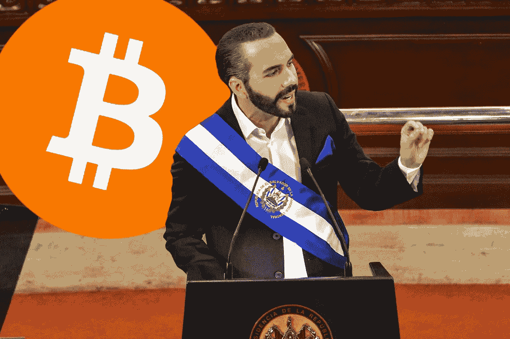
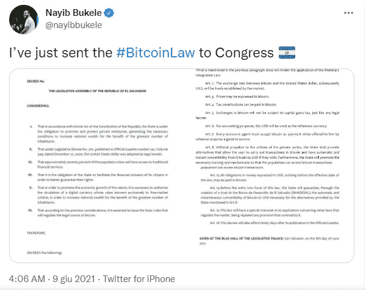
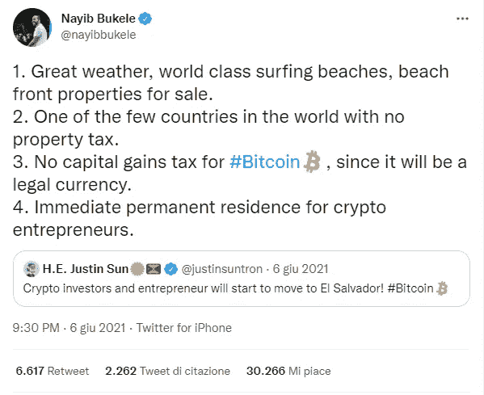

# BTC 的朋友和支持者#3:萨尔瓦多总统纳伊布·布克勒

> 原文：<https://medium.com/coinmonks/friends-and-supporters-of-btc-3-president-of-el-salvador-nayib-bukele-db0162673b9e?source=collection_archive---------53----------------------->

另一个公开支持比特币的人是萨尔瓦多的企业家兼总统 Nayib Bukele，萨尔瓦多是一个约有 600 万居民的中美洲小国，以其太平洋海滩、冲浪和美丽的山脉而闻名。

President of El Salvador Nayib Bukele

41 岁，独立，Bukele 从小就以他的技能和创业精神而闻名，因为他在 18 岁时就已经是一家公司的掌舵人了。Bukele 拥有 Yamaha Motors Salvador，这是一家在萨尔瓦多销售和分销雅马哈产品的公司，他还在 2011 年担任 OBERMET，S.A. DE C.V .的董事和总裁。他开始了政治生涯，在担任新库斯卡特兰和圣萨尔瓦多市长后，他当选为总统，并于 2019 年 6 月 1 日就职。

2021 年 6 月 5 日，Bukele 宣布，他计划向立法议会提交一份[法案](https://twitter.com/nayibbukele/status/1402446890466217985?ref_src=twsrc%5Etfw%7Ctwcamp%5Etweetembed%7Ctwterm%5E1402446890466217985%7Ctwgr%5E84cd0293aa90d80d5b696ca2b1e3b5b42e83d9de%7Ctwcon%5Es1_&ref_url=https%3A%2F%2Fcdn.embedly.com%2Fwidgets%2Fmedia.html%3Ftype%3Dtext2Fhtmlkey%3Da19fcc184b9711e1b4764040d3dc5c07schema%3Dtwitterurl%3Dhttps3A%2F%2Ftwitter.com%2Fnayibbukele%2Fstatus%2F1402446890466217985image%3Dhttps3A%2F%2Fi.embed.ly%2F1%2Fimage3Furl3Dhttps253A252F252Fabs.twimg.com252Ferrors252Flogo46x38.png26key3Da19fcc184b9711e1b4764040d3dc5c07)，这将使萨尔瓦多成为第一个使比特币成为合法货币的国家。立法议会于 2021 年 6 月 8 日批准了该法案，计划于 2021 年 9 月 7 日生效。

The tweet about the Bitcoin Law to Congress

2021 年 6 月 6 日，Bukele [发推文](https://twitter.com/nayibbukele/status/1401622548396314631?ref_src=twsrc%5Etfw%7Ctwcamp%5Etweetembed%7Ctwterm%5E1401622548396314631%7Ctwgr%5Ea99429e50d794857a6f3e6b7472d12b8a7e483fc%7Ctwcon%5Es1_&ref_url=https%3A%2F%2Fwww.technologyshout.com%2Fcryptocurrency-entrepreneur-obtains-permanent-residency-el-salvador-president-nayib-bukele%2F)称，加密企业家将在萨尔瓦多拥有永久居留权，并且不会对比特币征收资本利得税，因为它将是一种合法货币。孙正义[总在推特上回复](https://twitter.com/justinsuntron/status/1401783058852814850?ref_src=twsrc%5Etfw%7Ctwcamp%5Etweetembed%7Ctwterm%5E1401783058852814850%7Ctwgr%5Ea99429e50d794857a6f3e6b7472d12b8a7e483fc%7Ctwcon%5Es1_&ref_url=https%3A%2F%2Fwww.technologyshout.com%2Fcryptocurrency-entrepreneur-obtains-permanent-residency-el-salvador-president-nayib-bukele%2F)“太神奇了！现在打包！”而 CZ [贴出了](https://twitter.com/cz_binance/status/1401727814454317056?ref_src=twsrc%5Etfw%7Ctwcamp%5Etweetembed%7Ctwterm%5E1401727814454317056%7Ctwgr%5Ea99429e50d794857a6f3e6b7472d12b8a7e483fc%7Ctwcon%5Es1_&ref_url=https%3A%2F%2Fwww.technologyshout.com%2Fcryptocurrency-entrepreneur-obtains-permanent-residency-el-salvador-president-nayib-bukele%2F)一张米老鼠把衣服装进行李箱的动画图，写着“诱人”。

The tweet about permanent residence for Crypto entrepreneurs

几周前，当比特币跌至 18000 美元，人们开始怀疑加密货币时，Bukele [发推文](https://twitter.com/nayibbukele/status/1538356901297143809?ref_src=twsrc%5Etfw%7Ctwcamp%5Etweetembed%7Ctwterm%5E1538356901297143809%7Ctwgr%5Effde8369d66b1f58ea03429a1850533c37acb4a2%7Ctwcon%5Es1_&ref_url=https%3A%2F%2Fbitcoinist.com%2Fel-salvador-president-says-bitcoin-will-grow%2F)称，比特币是安全的，其价值将在熊市后大幅增长。2021 年 9 月，Bukele [宣布](https://www.reuters.com/technology/el-salvador-buys-its-first-200-bitcoins-president-says-2021-09-06/)萨尔瓦多持有 400 枚比特币，2021 年 10 月 4 日，他还[发推文](https://twitter.com/nayibbukele/status/1445112928403865614):“比特币不能被黑”。Bukele 还表示，他将出席比特币 2022 大会，但后来不得不取消，因为萨尔瓦多出现了[无法预见的情况](https://twitter.com/TheBitcoinConf/status/1511751005377073154)，需要他紧急关注。

President of El Salvador Nayib Bukele

虽然对于比特币的支持者来说，布克勒总统是一个神话，但对于传统金融专家来说，他的所作所为是危险的，可能会给中美洲国家带来风险。苏黎世 Vontobel Asset Management 的投资者卡洛斯·德索萨(Carlos de Sousa)表示:“一个不可预测的人掌控一切，不会让人对任何人产生多少信心。”。“他不仅仅推广比特币。你让一个总统用政府的钱在手机上交易比特币，这是前所未有的。”纽约金融服务公司 Stifel Nicolaus & Co .的 nathalie Marshik[预测](https://finance.yahoo.com/news/el-salvador-bonds-surge-bukele-205837982.html)美国在 2022 年将有 10 亿美元的资金缺口。你怎么想？你同意布克勒对比特币的中长期愿景吗？或者他所做的一切对他的国家来说都是有风险的吗？请在下面留下评论，把这个空间当成一个没有审查的谈话场所。

胜利者是永不放弃的梦想家。

**免责声明** : *我不知道所用图片的任何第三方权利。如有任何资料来源，我保证予以引用，如有要求，我将调整立场。*

**免责声明** : *交易加密货币具有很高的风险，可能不适合所有投资者。在决定交易加密货币之前，你应该仔细考虑你的投资目标和你的经验水平。自己做研究。此处表达的所有观点归各自作者所有，不应被视为任何形式的财务建议。*

> 交易新手？尝试[加密交易机器人](/coinmonks/crypto-trading-bot-c2ffce8acb2a)或[复制交易](/coinmonks/top-10-crypto-copy-trading-platforms-for-beginners-d0c37c7d698c)