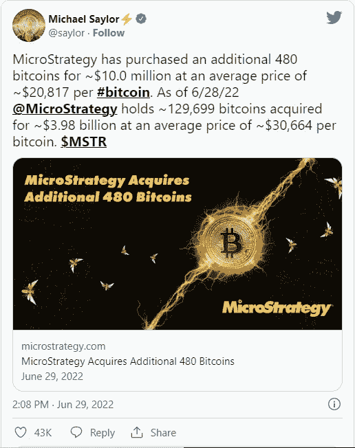
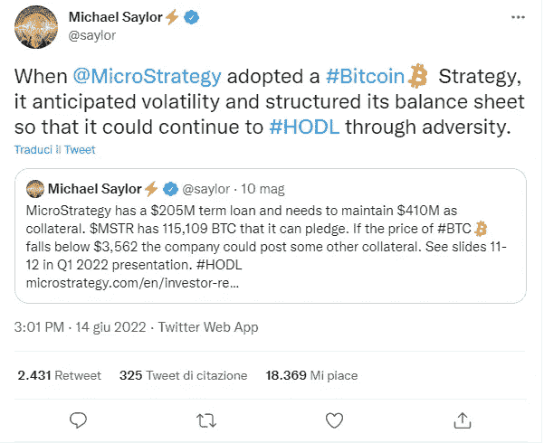
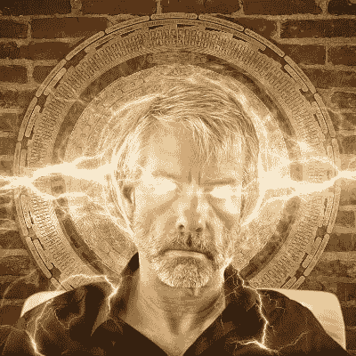

# BTC 5 号的朋友和支持者:微战略公司的联合创始人迈克尔·塞勒

> 原文：<https://medium.com/coinmonks/friends-and-supporters-of-btc-5-cofounder-of-microstrategy-michael-saylor-26a660a249ce?source=collection_archive---------43----------------------->

在这些献给比特币支持者的文章中，我不能忘记一个人，他最近不顾熊市，坚持支持比特币的主张:迈克尔·塞勒。

Michael Saylor, cofounder of MicroStrategy

企业家，他是 MicroStrategy 联合创始人，该公司提供商业智能、移动软件和基于云的服务。他也是《移动浪潮》一书的作者。他创建了 Saylor 学院并担任其受托人，这是一家为超过 100 万学生提供免费教育的非营利组织。

MicroStrategy

Saylor 从 1989 年到 2022 年担任 MicroStrategy 的首席执行官。2022 年 8 月 8 日，公司[宣布](https://www.microstrategy.com/en/investor-relations/press/microstrategy-announces-separation-of-chairman-and-ceo-roles-and-second-quarter-2022-financial-results)“迈克尔·塞勒(Michael Saylor)将担任执行主席的新职务，公司总裁冯乐(Phong Le)也将担任公司新的首席执行官和董事会成员。塞勒先生将继续担任董事会主席和公司高管。”

在他 2022 年 6 月 29 日的[推特](https://twitter.com/saylor/status/1542117682207678465?s=20&t=WXr-ShvOY-jHdnWwhT0b4w)中，Saylor 宣布，MicroStrategy 以 1000 万美元的价格额外购买了 480 个比特币，平均价格为每比特币 20，817 美元，你可以在提交给美国证券交易委员会(SEC)的[表格 8-K](https://www.microstrategy.com/content/dam/website-assets/collateral/financial-documents/financial-document-archive/form-8-k_06-29-2022.pdf) 中看到。

The tweet of Michael Saylor about the purchase of additional 480 BTCs

MicroStrategy 现在持有 129，699 BTC，成为比特币最大的公司持有者。

塞勒因其对比特币的观点受到了严厉批评。一些批评也来自他的公司，因为根据他的诽谤者，他将使 MicroStrategy 面临破产。Saylor 用一条推特回应了批评，称“当 MicroStrategy 采用比特币策略时，它预计到了波动性，并构建了资产负债表，这样它就可以在逆境中继续 HODL。”

The tweet of Michael Saylor about Bitcoin strategy of MicroStrategy

几天前，迈克尔·塞勒被指控逃税 2500 万美元。据[特区司法部长 Karl Racine](https://oag.dc.gov/sites/default/files/2022-08/2022-08-22%20Complaint%20in%20Intervention_0.pdf) 称，MicroStrategy 合谋帮助 Saylor 逃税。AG 的办公室表示，它正在寻求收回总额超过 1 亿美元的未付税款和罚款。据称，Saylor 声称居住在弗吉尼亚州或佛罗里达州，这两个州的个人所得税税率较低或没有，而实际上他住在华盛顿附近的几个不同的房子里。MicroStrategy 就这起诉讼发布了一份[声明](https://twitter.com/EamonJavers/status/1565114999105798144):“该案件是涉及 Saylor 先生的个人税务问题。公司不负责他的日常事务，也不监督他的个人税务责任。

对于加密货币爱好者来说，塞勒是一个偶像，因为他是一个真正的比特币传播者。从他的推特个人资料可以看出，他发布了一条[推文](https://twitter.com/saylor/status/1307029562321231873?s=20&t=trqgUwNEIKJj1xPD4Wy4Gw)，证实了他对比特币的信心。

Michael Saylor is a true BTC evangelist

YouTube 上有许多视频总结了 Saylor 的哲学，我特别选择了两个。首先，他建议购买比特币而不是黄金。

在第二篇文章中，他谈到了比特币、通货膨胀和货币的未来。

你还知道其他值得注意的比特币福音传播者吗？请在下面的评论中告诉我，并告诉我为什么你认为我应该写一篇关于他/她的文章。

把这个空间当成一个没有审查的谈话场所。

胜利者是永不放弃的梦想家。

***免责声明*** *:我不知道所使用的图片有任何第三方权利。如有任何资料来源，我保证予以引用，如有要求，我将调整立场。*

***免责声明*** *:交易加密货币具有较高的风险，不一定适合所有投资者。在决定交易加密货币之前，你应该仔细考虑你的投资目标和你的经验水平。自己做研究。此处表达的所有观点归各自作者所有，不应被视为任何形式的财务建议。*

> 交易新手？试试[加密交易机器人](/coinmonks/crypto-trading-bot-c2ffce8acb2a)或者[复制交易](/coinmonks/top-10-crypto-copy-trading-platforms-for-beginners-d0c37c7d698c)