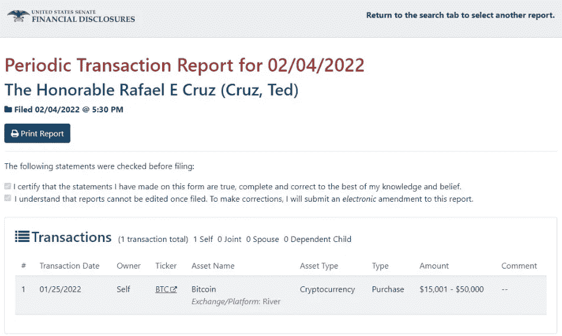

# BTC 6 号的朋友和支持者:参议员拉斐尔“特德”克鲁兹

> 原文：<https://medium.com/coinmonks/friends-and-supporters-of-btc-6-sen-rafael-ted-cruz-51732649ee0b?source=collection_archive---------7----------------------->

在这篇文章献给 MicroStrategy 的联合创始人迈克尔·塞勒(Michael Saylor)之后，我继续回顾支持比特币的有影响力的人。今天我要说的是参议员拉斐尔·“特德”·克鲁兹，他自 2013 年以来一直担任德克萨斯州的初级美国参议员。律师，共和党人，51 岁，他因支持比特币和公民个人自由的[言论](https://www.youtube.com/watch?v=gegRA25QsEo)而闻名。他经常公开反对 T4 税，尤其是那些影响中小企业的税收。

Sen. Ted Cruz

1 月 25 日，克鲁兹通过 River 经纪公司购买了价值 1.5 万至 5 万美元的比特币。那些日子里，比特币的交易价格在 3.6 万至 3.7 万美元之间。

*United States Senate Financial Disclosures*

同样在 2021 年 11 月，他在参议院提交了一份[决议](https://www.congress.gov/117/crec/2021/11/01/167/191/CREC-2021-11-01-pt1-PgS7540-2.pdf)，要求国会大厦内的所有礼品店、餐厅和自动售货机接受加密货币支付。据 [Breitbart News](https://www.breitbart.com/politics/2021/11/01/exclusive-sen-ted-cruz-proposes-to-increase-cryptocurrency-awareness-acceptance-in-congress/) 报道，克鲁兹在接受采访时表示:“随着消费者更好地理解和接受加密货币，商家越来越多地接受加密作为一种支付方式。国会通常对采用新技术反应迟缓。我的法案将让国会在这个问题上发挥领导作用，让国会自助餐厅、自动售货机和礼品店接受加密支付。”2021 年 8 月，虽然许多参议员投票支持所谓的*基础设施法案*，但克鲁兹反对该法案，原因是对密码行业进行了繁重的[300 亿美元的监管](https://finance.yahoo.com/news/infrastructure-bill-looks-raise-30b-212531925.html)。克鲁兹说:“让我们认识到，如果我们把所有 100 名参议员聚集在这个会议厅里，让他们站起来，说出两句话来定义加密货币到底是什么，你不会找到超过 5 个能回答这个问题的人”。下面是参议员克鲁兹关于这个问题的视频。

Sen. Cruz on the Senate Floor: Washington Bureaucrats Are Trying to Kill Crypto

他也反对*基础设施法案*中的[条款](https://www.finance.senate.gov/imo/media/doc/Wyden%20Lummis%20Toomey%20Crypto%20Amendment.pdf)，批评者称该条款将“经纪人”的定义扩大到矿工，甚至可能包括验证员和编码员。2022 年 5 月，参议员克鲁兹[宣布](https://twitter.com/SenTedCruz/status/1529118669636345859?ref_src=twsrc%5Etfw%7Ctwcamp%5Etweetembed%7Ctwterm%5E1529118669636345859%7Ctwgr%5E53ee130191eab0234c9cfa64b3ebf6a707afc34b%7Ctwcon%5Es1_&ref_url=https%3A%2F%2Fwww.businesstoday.in%2Fcrypto%2Fstory%2Fted-cruz-wanted-to-make-texas-oasis-for-bitcoin-hours-before-shootout-334968-2022-05-25)他想让德克萨斯成为比特币和加密的“绿洲”。

The tweet of Sen. Cruz

克鲁兹还表示，他非常看好比特币。下面的视频显示了这位美国参议员今年 2 月在保守党政治行动会议(CPAC) 2022 活动上的讲话。

Ted Cruz explains why he is very bullish on Bitcoin

参议员克鲁兹[将美国民主党人](https://www.youtube.com/watch?v=8Bw2xT3xw1s)比作中国共产党人，因为他认为他们想不惜一切代价阻止比特币和加密货币。据 Block 报道，参议员克鲁兹说:“他们不喜欢他们无法控制的东西。这正是大多数民主党人不喜欢比特币的原因。为什么比特币会让[伊丽莎白·沃伦](https://www.theblock.co/linked/126271/senator-elizabeth-warren-seeks-answers-from-bitcoin-miner-greenidge-on-its-environmental-impact)晚上翻来覆去抽搐？因为她希望她那黏糊糊的社会主义小手指能够控制我们每个银行账户里的每一分钱。”

YouTube 上有一个视频特别总结了克鲁兹的哲学。

告诉我，如果你想让我写一篇关于你认为支持比特币和加密货币的特定人士的文章。把这个空间当成一个没有审查的谈话场所。

胜利者是永不放弃的梦想家。

***免责声明*** *:我不知道所使用的图片有任何第三方权利。如有任何资料来源，我保证予以引用，如有要求，我将调整立场。*

***免责声明*** *:交易加密货币具有很高的风险，可能不适合所有投资者。在决定交易加密货币之前，你应该仔细考虑你的投资目标和你的经验水平。自己做研究。此处表达的所有观点归各自作者所有，不应被视为任何形式的财务建议。*

> 交易新手？尝试[加密交易机器人](/coinmonks/crypto-trading-bot-c2ffce8acb2a)或[复制交易](/coinmonks/top-10-crypto-copy-trading-platforms-for-beginners-d0c37c7d698c)