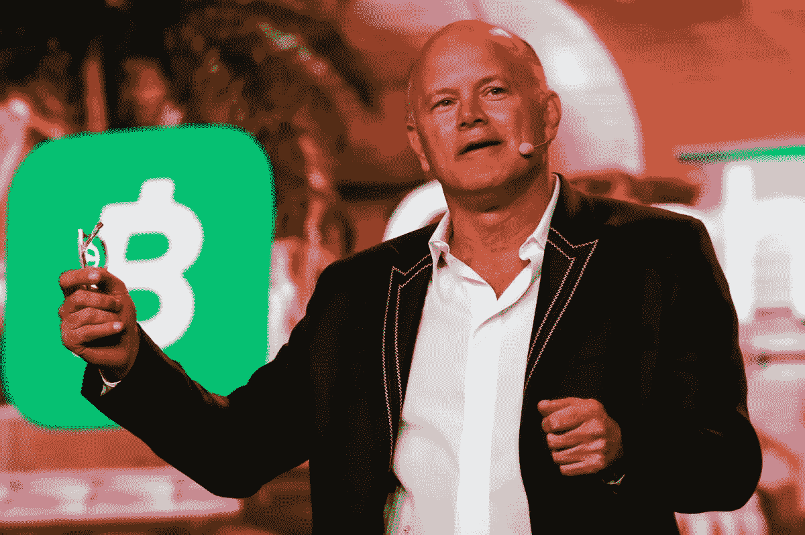

# BTC 7 号的朋友和支持者:迈克·诺沃格拉茨

> 原文：<https://medium.com/coinmonks/friends-and-supporters-of-btc-7-mike-novogratz-88e4adf875ff?source=collection_archive---------24----------------------->

我每天都会收听 crypto，经常会发现关于加密货币行业中一个非常有影响力的人的每日新闻。他叫迈克·诺沃格拉茨。

Mike Novogratz

57 岁，美国投资者，现任 [Galaxy Investment Partners](https://www.galaxy.com/) 的首席执行官，这是一家数字资产和区块链的领导者，帮助机构、初创公司和合格的个人塑造不断变化的经济，为数字原生生态系统提供定制的平台解决方案。

Galaxy Investment Partners

1989 年，他首次加入投资行业，在高盛担任短期债券销售员。在目前的公司之前，他在 Fortress Investments 担任重要职务。诺沃格拉茨在 2012 年至 2015 年期间在纽约美联储金融市场投资咨询委员会任职，现在担任保释项目的主席。他还是 Club 兰贡医疗中心监督委员会的成员，也是普林斯顿大学运动俱乐部和美国爵士乐基金会的成员。诺沃格拉茨先生获得了普林斯顿大学的经济学学士学位。

据《纽约客》的[报道，2013 年，诺沃格拉茨将自己的 700 万美元投资于加密货币(当时 BTC 的价值约为 100 美元)。他在 2017 年表示，他 20%的净资产在 BTC 和瑞士联邦理工学院。他](https://www.newyorker.com/magazine/2018/04/16/a-sidelined-wall-street-legend-bets-on-bitcoin)[说](https://www.thecoinrepublic.com/2022/03/28/michael-novogratz-is-bullish-on-ethereum-and-nft/)从 2016 年到 2017 年，他从加密货币中赚了 2.5 亿美元。诺沃格拉茨称自己为“比特币的阿甘”。

2019 年 11 月，Novogratz [宣布](https://www.bloomberg.com/news/articles/2019-11-19/mike-novogratz-wants-to-bring-bitcoin-to-the-1-with-new-funds?leadSource=uverify%20wall)银河数字控股有限公司推出了两只比特币基金，面向合格的机构投资者，目标是“美国的财富”或 50 多岁和 80 多岁的人，他们可能基本上被抛在加密货币投资的边缘。2021 年 3 月，Novogratz [证实](https://www.cnbc.com/2021/03/31/bitcoin-bull-mike-novogratz-says-he-is-shocked-by-the-speed-of-crypto-adoption.html)他对加密技术的采用速度感到震惊，即使他对主要机构采用比特币和其他加密货币的乐观前景也不够积极。

诺沃格拉茨有着可爱随和的性格，在他的电台和电视采访中最能迎合普通公民。2021 年 5 月，他[在 Twitter 上宣布了](https://mobile.twitter.com/novogratz/status/1397607134322376706?cxt=HHwWhICyjZWSpuUmAAAA)他的新播客 [Next with Novo](https://podcasts.apple.com/us/podcast/next-with-novo/id1534832567) ，其中谈论了许多关于加密空间和更多的内容。他的目的纯粹是教育性的，同时也很有趣。这是诺沃格拉茨最近对美国消费者新闻与商业频道的采访。他肯定地说，尽管处于熊市，比特币仍然是一种强劲的宏观资产。

关于迈克·诺沃格拉茨的最后一个好奇心:在他的右臂上有一个纹身，上面有[比特币和月亮](https://twitter.com/novogratz/status/1370713117169176579)，在他的左臂上有一个纹身是关于 UST/露娜撞车事件的。

The LUNA tattoo of Mike Novogratz

"我的纹身将不断提醒人们，风险投资需要谦逊."他[说](https://twitter.com/coindesk/status/1526989241137389570)。

告诉我，如果你想让我写一篇关于你认为支持比特币和加密货币的特定人士的文章。把这个空间当成一个没有审查的谈话场所。

胜利者是永不放弃的梦想家。

***免责声明*** *:我不知道所使用的图片有任何第三方权利。如有任何资料来源，我保证予以引用，如有要求，我将调整立场。*

***免责声明*** *:交易加密货币具有较高的风险，不一定适合所有投资者。在决定交易加密货币之前，你应该仔细考虑你的投资目标和你的经验水平。自己做研究。此处表达的所有观点归各自作者所有，不应被视为任何形式的财务建议。*

*关于作者*

[*CRYPTO _ ALBERT*](https://twitter.com/albertovischio?t=C3Xj9pTm9Q7EZqwjrGHQdA&s=09)

*主编* [*新币帖*](https://www.newcoinpost.com/) *。我帮助人们更好地理解加密货币领域及其目的。*

> 交易新手？尝试[加密交易机器人](/coinmonks/crypto-trading-bot-c2ffce8acb2a)或[复制交易](/coinmonks/top-10-crypto-copy-trading-platforms-for-beginners-d0c37c7d698c)