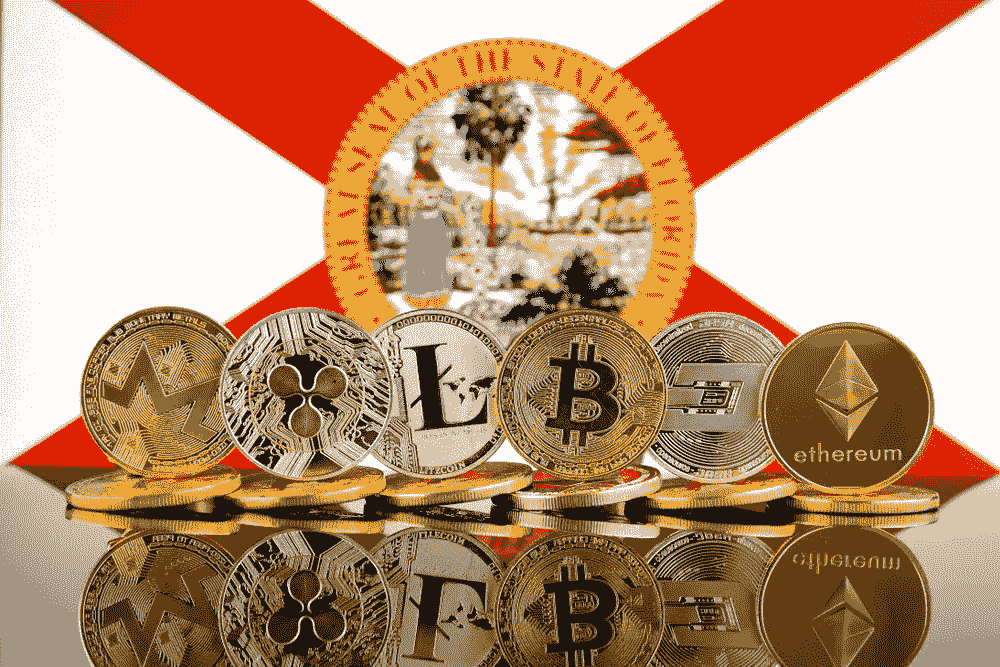

# BTC 8 号的朋友和支持者:佛罗里达州州长罗恩·德桑蒂斯

> 原文：<https://medium.com/coinmonks/friends-and-supporters-of-btc-8-governor-of-florida-ron-desantis-38923657903f?source=collection_archive---------30----------------------->

在浏览关于加密世界的新闻时，我发现了另一个人，他是政治的一部分，支持比特币。他的名字是罗恩·德桑蒂斯，自 2019 年以来担任佛罗里达州州长。

Gov. Ron DeSantis

44 岁，共和党人，他毕业于耶鲁大学和哈佛大学法学院，2004 年加入美国海军，在佛罗里达州中区的美国检察官办公室担任特别助理。

2022 年 3 月，州长德桑蒂斯表示，佛罗里达州正在“想办法”允许企业用比特币纳税，并签署了一项法案，要求为学校学生开设金融知识课程。

他还担心美国总统乔·拜登的[以数字货币为重点的行政命令](https://www.whitehouse.gov/briefing-room/presidential-actions/2022/03/09/executive-order-on-ensuring-responsible-development-of-digital-assets/)，该命令通过六个关键优先事项定义了数字资产的国家政策:

-保护美国消费者、投资者和企业

-保护美国和全球金融稳定

-减轻非法使用数字资产带来的非法金融和国家安全风险

-促进美国在技术和经济竞争力方面的领导地位，以加强美国在全球金融体系中的领导地位

-支持技术进步，确保负责任地开发和使用数字资产

-探索美国中央银行数字货币(CBDC)。

根据德桑蒂斯的说法，当谈到分散的加密资产和集中的数字银行货币时，人们缺乏理解。

早在 2021 年 12 月，德桑蒂斯就在给立法者的预算建议中要求为 [**金融服务部门**](https://www.myfloridacfo.com/) 拨款 20 万美元，以允许企业使用加密货币支付国家费用。

他还表示，该州将启动试点计划，探索将区块链技术用于医疗补助支付和车辆所有权，后者将通过佛罗里达州高速公路安全和机动车辆部运行。“作为州政府，我们认为这是我们欢迎的事情，我们希望确保州政府对加密友好，”德桑蒂斯说。州长和迈阿密市长 Francis Xavier Suarez 的目标是将佛罗里达打造成一个加密投资的中心，那里有很多企业家正在拥抱这个行业。

Florida aims to become a hub of crypto investments

“佛罗里达州鼓励加密货币作为一种商业手段，并进一步提高佛罗里达州对企业和经济增长的吸引力，”德桑蒂斯在佛罗里达州的[2022-23 预算提案](https://www.flgov.com/2021/12/09/governor-ron-desantis-announces-the-freedom-first-budget/) ( [*自由第一预算*](http://www.freedomfirstbudget.com/content/Current/Reports/BudgetHighlights.pdf) )中写道。Blockchain.com、Etoro 和 FTX 已经在佛罗里达州和迈阿密开设了分店。

告诉我，如果你想让我写一篇关于你认为支持比特币和加密货币的特定人士的文章。把这个空间当成一个没有审查的谈话场所。

胜利者是永不放弃的梦想家。

***免责声明*** *:我不知道所使用的图片有任何第三方权利。如有任何资料来源，我保证予以引用，如有要求，我将调整立场。*

***免责声明*** *:交易加密货币具有较高的风险，不一定适合所有投资者。在决定交易加密货币之前，你应该仔细考虑你的投资目标和你的经验水平。自己做研究。此处表达的所有观点归各自作者所有，不应被视为任何形式的财务建议。*

*关于作者*

[*CRYPTO _ ALBERT*](https://twitter.com/albertovischio?t=C3Xj9pTm9Q7EZqwjrGHQdA&s=09)

*主编* [*新币帖*](https://www.newcoinpost.com/) *。我帮助人们更好地理解加密货币领域及其目的。*

> 交易新手？尝试[加密交易机器人](/coinmonks/crypto-trading-bot-c2ffce8acb2a)或[复制交易](/coinmonks/top-10-crypto-copy-trading-platforms-for-beginners-d0c37c7d698c)