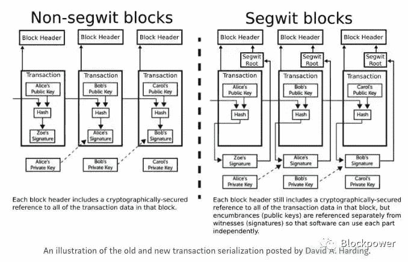

# 来自塞格维特(一)

> 原文：<https://medium.com/coinmonks/from-segwit-i-9603eb5879c9?source=collection_archive---------48----------------------->

总的逻辑路线是，在 stablecoins 崛起之前的很长一段时间里，以太被用作 BTC 资产层面的第二层，因为 BTC 的电子现金交易系统本身本质上是失败的，大量的 BTC 被用于数字黄金目的，并且因为 Omni 网络的可扩展性有限，人们开始寻找可以自己承载交易的新项目， 而最近以太网的高气费也显示了第二层的机会，所以我们选择了以太网第二层项目 Coda，以及传统的第一层项目 NEAR 和 Avalanche 协议进行增强。

在计算机网络通信体系结构的 OSI 模型中，区块链逻辑体系结构分为三层。针对不同的层，即层 0/1/2，改进了现有的缩放方案。
第 0 层扩展需要改变底层传输数据
第 1 层扩展通过改变区块链协议来提高区块链效率
另一方面，第 2 层在应用层进行修改。
链上扩展主要是增加块大小或使用更快的一致性算法

有四种类型的链外扩展:状态通道、侧链、跨链和链外计算，可以解释为通过将不重要的部分置于链外来减轻链上的压力。

到目前为止，这些扩展方案都提供了提高可伸缩性的解决方案。也有多种解决方案相结合来提高可伸缩性。

今天我们将谈论 BTC 网络公司的 segwit。

Segwit 是对比特币共识规则和网络协议的升级，其提议和实施将基于 BIP-9 软分叉。

在密码学中，术语“见证”用于描述密码挑战的解决方案。在比特币中，“见证”满足一个加密条件，该条件被置于未用完的交易输出(UTXO)上。

在比特币环境中，数字签名是一种见证。但是“见证”是一个更广泛的任意解决方案，它可以满足施加在 UTXO 上的条件，以便 UTXO 可以在解锁后被使用。术语“见证”更常用于“解锁脚本”(或 scriptSig)。

在引入“ **segwit** ”之前，每个交易输入后都有用于解锁的见证数据，见证数据作为输入的一部分嵌入。术语“隔离见证”，或简称为“segwit”，简单地理解为特定输出的签名分离，或特定输入的脚本解锁。以其最简单的形式，这被称为“隔离脚本签名”，或“隔离签名”。

因此，segwit 是对比特币的重组，旨在将交易的见证数据部分移出 scriptSig 字段，并移入伴随交易的独立见证数据结构。请求交易数据的客户端可以选择拥有或不拥有该部分伴随的见证数据。

简而言之:比特币网络的数据结构由以下几部分组成，每一笔交易信息都包含有那笔交易的签名信息，签名信息占据了其中很大一部分。

矿工在打包区块时需要用数字签名逐一验证每笔交易，确认没有问题后才会在区块中记录交易。这将不可避免地导致每个块的大小太大，并且每个事务的验证时间太长。

注意每个事务内容的布局方式。从事务内容的结构中取出脚本签名，并通过指针指向它。这确保了在相同的 1MB 块大小中可以存储更多的事务。

当然，segwit 的优势不仅仅在于扩展事务处理能力。
解决延展性攻击问题
降低个人转让费
它其实是一个软叉，而不是硬叉
有优点也有缺点，比如对全节点钱包的存储需求增加，需要额外的存储空间。

尽管 **segwit** 有这样或那样的优势，但并不是每个人都对此感到高兴，BCH 社区是抵制 **segwit** 的一个群体，segwit 是比特币网络的一个分支，它直接改变块大小，而不是依赖于 BTC 分叉的新交易结构。

随着越来越多的钱包得到升级，隔离见证交易的使用将会增长，此外，闪电网络和类似的第二层网络的发展应该会获得更多动力，以扩大比特币的使用并提升其潜力。我们希望这种变化将逐步发生，以推动整个区块链工业的发展。

> 交易新手？尝试[加密交易机器人](/coinmonks/crypto-trading-bot-c2ffce8acb2a)或[复制交易](/coinmonks/top-10-crypto-copy-trading-platforms-for-beginners-d0c37c7d698c)