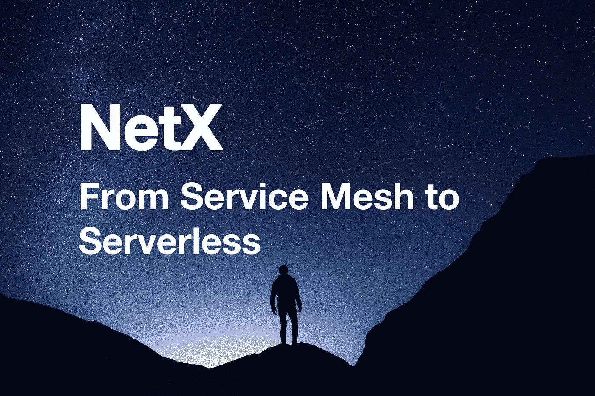
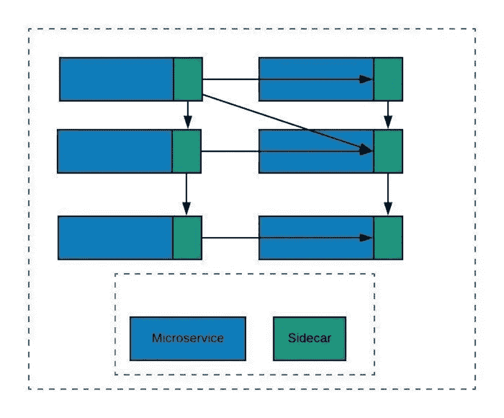

# 从服务网状到无服务器

> 原文：<https://medium.com/coinmonks/from-service-mesh-to-serverless-570ebd69c884?source=collection_archive---------6----------------------->

第三部分第三章**IT 领域的容器结构**

***TL；博士***

*   *服务网格不干涉业务逻辑或服务集成/组合。*
*   *无服务器架构可快速扩展。它的横向扩展具有自动化和灵活性，同时由服务提供商管理。*

**

*亚马逊首席执行官贝佐斯提出的两块披萨法则认为，任何会议都不应该大到两块披萨无法满足整个团队的需求。那就是建立一个不超过两个比萨饼能喂饱的团队。微服务达到了软件开发中低耦合、高内聚的目标。该架构将服务与组织的功能部分联系起来，确保不会出现被动的波动。每个孤立的服务独立更新、扩展和重启，不会影响其他服务。因此，服务团队以小规模、无关联的捆绑形式出现。最终，这些松散耦合、孤立、紧凑的团队打开了持续更新和敏捷协作的大门。*

*微服务受到挑战和限制的困扰。*

*   *技术门槛。在实现微服务时，开发团队一直面临着棘手的问题，包括基本服务发现、配置中心和认证管理。此外，服务政府级处理各种挑战，包括负载平衡、熔丝退化、灰度释放、故障转移、分布式跟踪等。所有设置的入口都很高。*
*   *代码入侵。侵入式主流框架，如 Spring Cloud 和 Dubbo，推高了技术升级和更换成本。开发团队的消极意愿为微服务的推出铺平了道路。*

*这就是服务网格介入改变的地方。*

# ***服务网状架构***

*边车是服务网络的核心。在下图中，每个微服务都配有一个边车。Sidecar 将我们的思想从非业务特性中解放出来，例如只关注业务逻辑的服务治理。入站和出站流量、服务订阅、发现、融合、流量限制和其他非业务功能都从服务中剥离出来，并集成到 sidecars 中。*

**

*服务网格和 API 网关是两个紧密结合的概念，既有相似之处，也有专门的任务。在某种基础上，一个服务网格可以被感知为**分布式的、微级的 API 网关**，满足服务发现、债务平衡、流量控制等微服务需求。*

## ***服务网格的利弊***

***优点***

*   *商品特性是在微服务代码之外实现的，它们是可重用的。*
*   *它解决了微服务架构中的大部分问题，这些问题我们以前都有专门的解决方案:分布式跟踪、日志记录、安全性、访问控制等。*
*   *在选择微服务实现语言时更加自由:您不需要担心给定的语言是否支持或具有构建网络应用程序功能的库。*

***缺点***

*   *复杂性:拥有一个服务网格极大地增加了给定微服务实现中的运行时实例的数量。*
*   *服务网格不会解决任何与业务逻辑相关或与服务集成/组合相关的问题。*
*   *服务网格解决问题的子集:服务网格仅解决服务间通信问题的子集，但是有许多复杂的问题，例如复杂的路由、转换/类型映射，以及与其他服务和系统的集成，需要在您的微服务的业务逻辑中解决。*

# ***无服务器架构***

*无服务器的理念远远领先于服务网格。无服务器架构构建和管理微服务框架。与传统架构相比，这种事件触发机制由第三方在无状态的临时计算容器中运行。基本概念包括功能即服务(FaaS)。开发者上传功能到云厂商提供的 FaaS 平台。函数仅在被请求时被实例化，然后被销毁。按需解决方案极大地释放了服务器资源/占用，并减少了计费。无服务器计算一般应用于不太强调实时响应的无状态场景，比如应急处理、数据统计分析、视频解码、离线批量计算等。*

## ***无服务器架构的利与弊***

***优点***

*   *作为简单的外包解决方案削减运营成本。雇佣供应商来管理服务器、数据库、应用程序甚至逻辑。*
*   *降低开发成本。基础设施即服务(IaaS)和平台即服务(PaaS)的前提是服务器和操作系统管理可以商品化。另一方面，无服务器后端即服务是整个应用程序组件商品化的结果。*
*   *快速扩展。水平扩展是自动化的、灵活的，并由服务提供商管理。*
*   *易于管理。与其他架构相比，这种架构的运行方式相当简单。*

***缺点***

*   *消除了有状态服务的灵活性。*
*   *延迟困扰着高度分布式和松散耦合的无服务器应用程序。*
*   *本地测试是一个相当大的挑战。应用程序连接的本地模拟只是偶然运行，尤其是在与性能和可伸缩性相关的时候。*

*生产关系依赖于生产力。随着这两个要素的分配和优化，云计算的概念蓬勃发展。我们没有骑马骑得更快。相反，我们努力像福特一样发明汽车，像诺贝尔一样申请炸药专利，像孟德尔一样用豌豆做实验，等等。*

```
***The Writer says...**NetX aims at building the Web3 organism. We try to figure out solutions confronted by the present IT industry. To do that, we will look into every module of it to find out setbacks. Then we’ll focus on finding solutions through experiments. It’s a dynamic evolving process. To get the best solution, we have to be clear about the problems and this will be the main idea of Chapter Three. It makes me feel excited when thinking about sharing my thoughts and I do invite you to join me in this exploration and contribute to the evolvement of NetX.*
```

# *📚必读*

*[NetX 系列 1.1](/triaslab/rethinking-the-it-industry-d101384e801) | [NetX 系列 1.2](/coinmonks/a-letter-from-satoshi-nakamoto-345a45d012bb) | [NetX 系列 1.3](/coinmonks/out-of-control-the-post-it-evolution-dd64e05ff5bc) | [NetX 系列 2.1](/coinmonks/life-emerges-9ebf26304cd4) | [NetX 系列 2.2](/coinmonks/life-is-out-of-control-9f8e5b7b4b99) | [NetX 系列 2.3](/coinmonks/the-kite-flies-up-and-i-become-the-kite-40678b9dabda) | [NetX 系列 3.1](/coinmonks/the-container-in-the-it-field-21250e3e8b5) | [NetX 系列 3.2](/coinmonks/microservice-architecture-for-new-technologies-d0e37cfccdfa)*

****NetX，面向数字生活的可信可靠的智能自治系统链原生互联网(***[***Trias***](https://www.trias.one/)***)****

*[***铁人三项***](https://www.triathon.space/#/)***|***[***Ethanim***](https://www.ethanim.network/)***|***[***Tusima***](https://www.tusima.network/#/)***| behemotumius | Leviatom | Divina****

> *交易新手？尝试[加密交易机器人](/coinmonks/crypto-trading-bot-c2ffce8acb2a)或[复制交易](/coinmonks/top-10-crypto-copy-trading-platforms-for-beginners-d0c37c7d698c)*