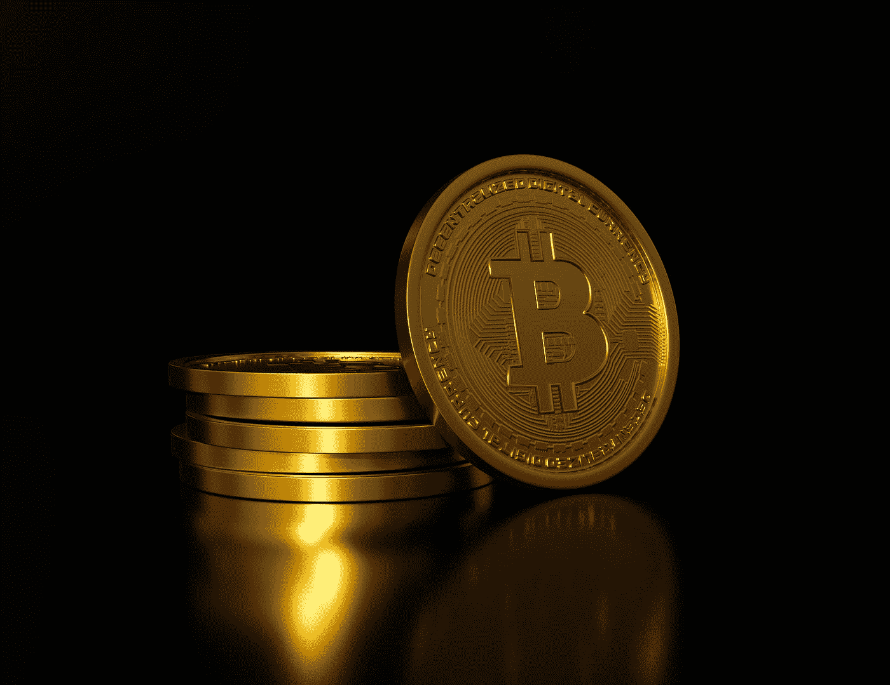

# 从 Web3 到 DeFi:了解区块链行业的最新发展

> 原文：<https://medium.com/coinmonks/from-web3-to-defi-understanding-the-latest-developments-in-the-blockchain-industry-163e304c595f?source=collection_archive---------52----------------------->

Photo by [Mariia Shalabaieva](https://unsplash.com/@maria_shalabaieva?utm_source=medium&utm_medium=referral) on [Unsplash](https://unsplash.com?utm_source=medium&utm_medium=referral)

区块链行业在不断发展，近年来，web3 和 DeFi 技术的应用越来越多。但是这些技术到底是什么，它们是如何改变我们与区块链互动的方式的？

Web3，也称为分散式 Web 或 d web，指的是使用区块链技术来创建一个分散式互联网。它允许用户直接连接到区块链，而不需要中介，从而实现更高的隐私性和安全性。这可以通过使用分散式应用程序(dApps)来实现，这种应用程序建立在区块链技术的基础上，不依赖于集中式服务器。

> 不知道什么时候买卖，试试[复制交易](http://coincodecap.com/go/bityard)。

DeFi，即分散金融，指的是使用区块链技术创建开放、透明和安全的金融服务。DeFi 应用程序或 dApps 允许用户访问各种金融服务，如贷款、借款和交易，而不需要传统的金融机构。这可以为那些可能无法获得传统银行服务的人提供更多的金融服务，以及更低的费用和更快的交易时间。

区块链工业的一个关键发展是 web3 和 DeFi 技术的集成。例如，分散交易所(dex)允许用户直接交易加密货币，而不需要集中交易所。这可以提供更高的安全性，因为没有中心故障点，还可以降低欺诈或操纵的风险。

Web3 和 DeFi 技术仍处于早期发展阶段，有许多挑战需要解决。然而，它们有可能彻底改变我们与区块链互动和获取金融服务的方式，在未来几年，它们的采用率可能会继续增长。

随着区块链行业的发展，了解最新发展动态并了解这些技术如何影响您的业务或个人使用区块链非常重要。通过保持消息灵通，您可以就如何最好地利用这些技术做出明智的决策，并保持领先地位。

> 加入 Coinmonks [电报频道](https://t.me/coincodecap)和 [Youtube 频道](https://www.youtube.com/c/coinmonks/videos)了解加密交易和投资

# 另外，阅读

*   [用于 Huobi 的加密交易信号](https://coincodecap.com/huobi-crypto-trading-signals) | [HitBTC 审查](/coinmonks/hitbtc-review-c5143c5d53c2)
*   [TraderWagon 回顾](https://coincodecap.com/traderwagon-review) | [北海巨妖 vs 双子星 vs BitYard](https://coincodecap.com/kraken-vs-gemini-vs-bityard)
*   [如何在 FTX 交易所交易期货](https://coincodecap.com/ftx-futures-trading)
*   [OKEx vs KuCoin](https://coincodecap.com/okex-kucoin) | [摄氏替代品](https://coincodecap.com/celsius-alternatives) | [如何购买 VeChain](https://coincodecap.com/buy-vechain)
*   [ProfitFarmers 回顾](https://coincodecap.com/profitfarmers-review) | [如何使用 Cornix Trading Bot](https://coincodecap.com/cornix-trading-bot)