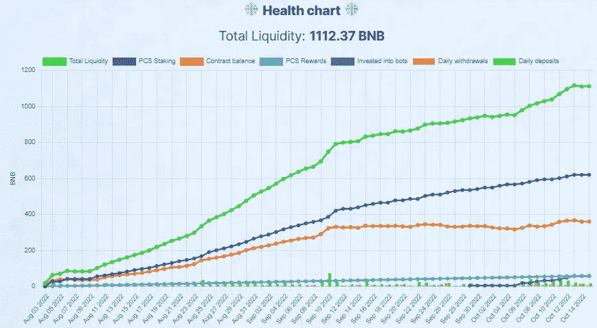

# 霜之湖——谁是神秘的冬天？

> 原文：<https://medium.com/coinmonks/frostflakes-crypto-winter-who-5239e8b5af6f?source=collection_archive---------5----------------------->

大家好，我是尼尔森，和我一起做每周回顾，看看关于*的新闻。*

**

*这个项目的名字可能是霜冻，但只是继续得到**热！***

*数字…*

**

***合约 TVL** —目前位于 360.92 BNB，合约 TVL 较上周的评论上涨了 3.03%，较我们 9 月 17 日的首次评论上涨了 4.65%。
**PCS 池** —目前池中余额为 620 BNB，比上周增加了 6.71%，比我们的第一次审查增加了 35.22%。**考虑到自交易机器人实施以来，资金池从每笔存款中获得的百分比开始下降，这一 35.22%甚至更令人惊讶。
*个人电脑分红—*** 本周我们累计获得 59.65 BNB，较上周增长 17.7%。这些资金池每周产生大约 100 亿英镑的股息，**尽管 BNB 最近一直处于下跌趋势，导致资金池出现一些非永久性损失，但我们敢想象 BNB 普莱斯何时会出现转机吗？机器人军队**——机器人现在有 58 只 BNB 喂养它。自开始以来超过 205%……在我写这篇评论的时候，总共有 7 个机器人在运行，我期待看到这支军队毫无疑问会实现的勇敢征服。*

***真正的 TVL！**
坐席 1112.37 BNB 皇家 TVL(合同金额 TVL+PCS+bot)显示比上周增长 11.13%，比我们第一次审核时增长 38.46%。**我真的缺乏可以总结如何完美的** [***霜湖***](https://www.frostflakes.org/?ref=0x45ad3e64a5e6884163a9083b3401cd73903d1f14) **正在处理这个加密的冬天…感谢 Jack 构建了这个惊人的项目，感谢所有理解这个概念并每天尽自己的一份力量帮助这个项目创造新纪录的社区成员…***

***有用链接:
> >** [*蛙人*](https://www.frostflakes.org/?ref=0x45ad3e64a5e6884163a9083b3401cd73903d1f14)<< *>>*[*蛙人往期文章*](/@Nelson_Crypto_Journey/list/frostflakes-hidden-gem-3d64c5b284e4)<< *>>*[*FF TG*](https://t.me/frostflakes_miner)<< *>>**

*如果你喜欢我的文章，请考虑一些掌声，因为它有助于达到更多的人，如果你想知道更多关于我的加密之旅考虑订阅。*

**本文无意构成投资建议。作者和出版物均不对您可能因这些信息而招致的任何投资、利润或损失承担任何责任或义务。我们鼓励读者在做出任何和所有投资决定之前，进行尽职调查和研究，或咨询持牌金融顾问或经纪人。此内容仅用于一般信息和教育目的。尽管作者力求准确，但文章中的数据并不可靠。作者可能拥有文中讨论的加密货币和代币。文章可能包含附属链接。**

> *交易新手？尝试[加密交易机器人](/coinmonks/crypto-trading-bot-c2ffce8acb2a)或[复制交易](/coinmonks/top-10-crypto-copy-trading-platforms-for-beginners-d0c37c7d698c)*