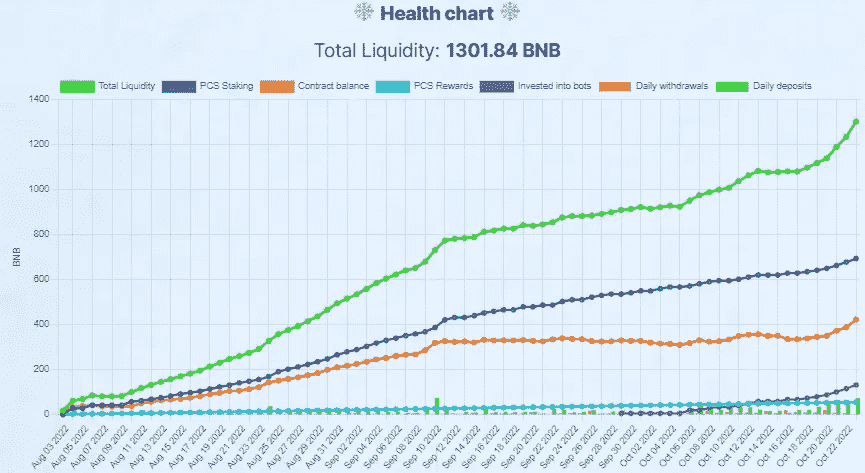

# 霜冻——不可阻挡的暴风雪！

> 原文：<https://medium.com/coinmonks/frostflakes-the-unstoppable-snow-storm-cc91e136057f?source=collection_archive---------6----------------------->

大家好，我是 Nelson，和我一起做每周回顾

**

*对于那些可能还不知道的人。
[*frost lakes*](https://www.frostflakes.org/?ref=0x45ad3e64a5e6884163a9083b3401cd73903d1f14)*是一个项目，该项目与其他几个项目一起寻求改变 DeFi 的当前形式，并利用外部收入来源来减少甚至打破破坏大多数项目的 ponzinomics…
凭借一个非常敬业的团队和一个小型但极其敬业的社区，该项目在 ATH 之后继续创造 ATHs，本周几乎所有指标都是 ATH！**

**(*如果你想了解更多其他旨在减少或 0%庞氏骗局的项目，请查看我的列表。—*[*https://medium . com/@ Nelson _ Crypto _ Journey/list/reduced-ponzinomic-projects-f 4 f0a 420 E4 da*](/@Nelson_Crypto_Journey/list/reduced-ponzinomic-projects-f4f0a420e4da)*)***

**让我们来看看这些数字……**

****

**毫无疑问，这是 [*霜降*](https://www.frostflakes.org/?ref=0x45ad3e64a5e6884163a9083b3401cd73903d1f14) 中最好的一周，看看那些非常含蓄的“角”……令人惊叹……
为什么我们会问？有什么新闻或最近的发展吗？简短的回答是没有。没有重大新闻，没有额外的相关进展…
这个问题的答案要简单得多。
稳定、努力工作、致力于社区、透明，以及**结果**！**

****合约 TVL**—ATH 421.97 BNB。比上周增长 16.92%，自 9 月 17 日我们开始审核*号以来增长 22.36%。就在一个多月前…
**PCS POOLS**——ATH 693.5 BNB。比上周增长 11.85%，比过去一个月增长 51.25%！机器人军队——131.50 BNB 现在分配给机器人军队。较上周回顾增长 126.72%。
**每股红利** — 54.86 BNB。过去一周下跌了 8.03%。
在我看来，这种下降可能与以下事实有关:自从 bot 军队启动以来，基金现在获得的份额比以前少了，以前 PCS 基金从所有存款中获得 50%,现在获得 25%,剩下的 25%分配给 bot 军队。
但是，如果资金池仍然获得 25%的收益，那么如果其余指标不仅上升而且在 ATH，那么它们为什么会下降呢？可能是 2 中的 1，甚至是 2，都与 IL 有关。***

****1 — BNB 价格最近一直在下跌，并且与蛋糕搭配在一起，很可能池从新鲜存款中获得的 25%以及收益不足以对抗持续的 IL。
2—*[*frost lakes*](https://www.frostflakes.org/?ref=0x45ad3e64a5e6884163a9083b3401cd73903d1f14)*pool share 收到的百分比减少，导致股息不足以对抗 IL。****

****大男孩！
真实的 TVL** — ATH 1301.84 BNB 合计 TVL……
比上周回顾上涨 17.03%，一个月上涨 62.05%！！！**

**这也是简单地说，843.94 将是没有额外收入流的 TVL，在此之前发生了所有索赔。1301.84 BNB 是实际的 TVL 减去迄今提出的所有索赔。
从 8 月 3 日到现在，457.9 BNB 来自外部收入流，**这是不到 3 个月的 457.9。平均每月 167.52 BNB，主要来自泳池！收入流现在占实际 TVL 的 35%，比没有收入流的 TVL 高出 54%****

**当许多人说减少庞氏骗局或一个项目摆脱庞氏骗局就像在密码空间中观看绿洲一样，他们应该看看 [*霜湖*](https://www.frostflakes.org/?ref=0x45ad3e64a5e6884163a9083b3401cd73903d1f14)……
[*霜湖*](https://www.frostflakes.org/?ref=0x45ad3e64a5e6884163a9083b3401cd73903d1f14) 摆脱庞氏骗局了吗？不，前面还有一段漫长而艰难的路要走，但这证明了只要有决心和努力，一切都是可能的…**

****有用链接:
> >** [*霜降*](https://www.frostflakes.org/?ref=0x45ad3e64a5e6884163a9083b3401cd73903d1f14)<< *>>*[*霜降往期文章*](/@Nelson_Crypto_Journey/list/frostflakes-hidden-gem-3d64c5b284e4)<< *>>[*FF TG*](https://t.me/frostflakes_miner)<<***

*如果你喜欢我的文章，请考虑一些掌声，因为它有助于达到更多的人，如果你想知道更多关于我的加密之旅考虑订阅。*

**本文的任何内容都不构成投资建议。作者和出版物均不对您可能因这些信息而招致的任何投资、利润或损失承担任何责任或义务。我们鼓励读者在做出任何和所有投资决定之前，进行尽职调查和研究，或咨询持牌金融顾问或经纪人。此内容仅用于一般信息和教育目的。尽管作者力求准确，但文章中的数据并不可靠。作者可能拥有文中讨论的加密货币和代币。文章可能包含附属链接。**

> *交易新手？尝试[加密交易机器人](/coinmonks/crypto-trading-bot-c2ffce8acb2a)或[复制交易](/coinmonks/top-10-crypto-copy-trading-platforms-for-beginners-d0c37c7d698c)*