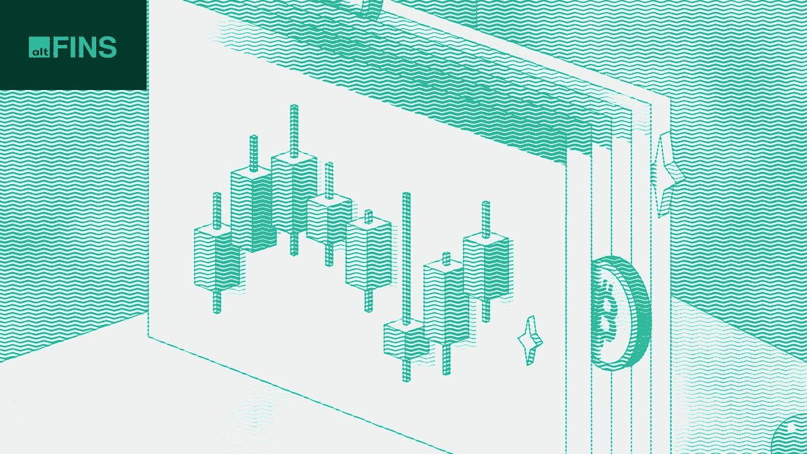

# FTX-阿拉米达戏剧带来了加密市场的恐惧！如何保护你的加密资金？

> 原文：<https://medium.com/coinmonks/ftx-alameda-drama-brought-fears-into-crypto-market-how-to-keep-safe-your-crypto-funds-90e0ad7ab88b?source=collection_archive---------12----------------------->

Source: [altFINS](https://altfins.com/)

**[**比特币**](http://r.email.altfins.com/mk/cl/f/BjSZ0CuZke2WQAsHTULyp8-sUl_Xo_-POZnXgoad_GVSZvPfSzw4aUqCyVS44WLvnrRIPMIlK7P6quIxMUPO3evy8lusS-Gt2463gER89PQr0_Myg4r_6IIEBkfiWJ8KRVCxPP3KHFgNSAGIxj1o2bkaJ6Z17P-xkNmyO8VJOAuUAEHIcK32kyMjeMUDh02leFxG2e0ozDj1WAUGlm5PZCw2uZswlb_aZ5Oa1bzZZbGePzm5-VlxqbKpfu7m7jeEcldPZ_wivl82xObJ9A95aMY0zBFUTT1tdFBCEw0zl1P_W0KaWnERzW-u) **和** [**以太**](http://r.email.altfins.com/mk/cl/f/awfoRbpJeU0AzJxgycUaQkp7uaWmT37pFTANynYV95rzMwAJ16Y6Pg7xzvM9-Oc7v2geS9nOcmZUIDUefnHdG9GZMQaP5IS67vueN2KyJMDcMy9yoTwN8OLvBTUCsZqgyojhQbTAvlExdAJ6lhveKxRJb0Xzsg5pDTOV-GMmnUqHeeVAqiFcoNmwV--Gbvb2zN_oPRrgkqjl3EVOav7B7eapCy0LXg7tH_cPrsZsqPBhqSvjfWY2m1cQ2PMk86ExnW50x1-u5GP5TJkxyx6F37K-1PFt5XZnQ23KRrAIsv_zUCglsc-kwt1Spw) **在过去的 24 小时内大幅抛售，因为 FTX-阿拉米达的戏剧带来了对 2022 年早些时候可能发生的新的全市场崩溃**的担忧。**

****由于市场对这一消息反应剧烈，加密市值下跌超过 8%** 。 [FTX](http://r.email.altfins.com/mk/cl/f/oPLwucDyvma-vzz_43seuQBOL1gMIKCIqN4Ri_yrrmC4cWTlLEqDaoE5FJqdJ5ju-Cq2GudAsx6-tkkOlxxTdg_IF_vKgteooI5gDMTW8pEVpHuVPj9pyAPdeaPcbgWaAuiD6AKA-Rv9JDdO0KgvHBU0cNm-rmTqNKwwI6fCeReAMRx2S2m9IT0M_KzciWazY31tJrpBcxZ1ZX7B7kF574NRWqTVyNA-fLm5I_a2DnJzGmDF7424L5T21R5nkrUrpWJ4BiExFAOuJ5JG06oVtbd2W4Ld2x9S9iFVsGPwLFsChz2OCb3_TmvrOGw) 是一家集中的加密交易所，是加密领域具有系统重要性的参与者，其流动性问题是在被投资者的许多撤销请求淹没后出现的。**上周，Coindesk 报告称，阿拉米达的资产负债表中有 40%由“FTT”组成，这是 FTX 的本土标志，据 Defiant 报道，FTX 似乎在 2022 年 9 月使用其本土标志以 40 亿美元救助了阿拉米达。****

**在这个坏消息之后，FTT 价格自周二以来暴跌了近 90%，引发了 FTX 的银行挤兑。其他与 FTX 关系密切的项目(如 **SOLANA** )也因投资者逃往安全地带而遭遇意外的撤资请求和象征性出售。**

**显然，这些事件给加密市场、其声誉和可信度带来了更大的压力。2022 年 5 月发生的 Terra-Luna 崩盘已经对市场造成了不利影响。现在看到中央加密交换失败，进一步削弱了用户和公众对加密的信心。这也引发了这样一个问题:这种加密余波会持续多久，会有多糟糕。**

**一方面，它有利于行业清洗自己的坏的和不负责任的行为者，这样密码市场可以变得更强大，并开始重建其声誉和信誉。另一方面，这些事件只是提供了进一步的证据，表明推动投资者和交易者直接管理他们的数字资产的更多去中心化从来都不算晚。通过选择**分散交易所**，而不是集中，用户可以避免集中交易所突然破产的风险，他们无法提取他们的数字资产或法定货币。**我们在 2022 年 7 月发布的最新** [**独家**](http://r.email.altfins.com/mk/cl/f/QZSEzyTh1PsUsYSY1z-UCtr2n5-kgtUQIrihTo2E-lZ6fL96gP8TioOZAW_UlzWJuNnrB-uW1-zrsKPRZwCq05MxUme0Ng84Q5pYtpEluGLS7wK4F56rgj1YYD3xwplhDSlV3Y7aIn6lwSVkMDUxdxwwA9OQrsJjeLKj_PIsW9IqYB5qhiDnji4-DdEukGSxEIaMTxXM9SMUbGUG-JvjMrTNfCPYrrQ3lNcuAfGwBD-cx0_xdxYTKGrZEQWxL2FpWoRTq86BCIskex7pD7TDRqCUQbBi3l48LccxM1HphvOB) **市场报告中强调了分散交易所的所有好处以及集中式和分散式加密交易所的区别。****

**此外，我们还准备了一个 [**冷加密钱包**](http://r.email.altfins.com/mk/cl/f/KlCBAIm8yyv0lQFP7ji8CO1wpUdJ1Bk0Gg9M3SBOG3mEXz2EEGxXvWfEOdXjitt73xUYk57L9Uwf6GHQ_hDjkEh63iqS7HVrAEgnwyotbsWb7dQ2hOhBsXFHn4Jp72JxwhobXRFcmU2bOR8Q29a2m1g80fZsJ-M9i64P5jOAcvJ4i74oiXc2DMia6Fg0iReOSOST9uURZnnuzhnFbTBRDivFPBZ1WP-Ld0mCXpUVKZPGRd54EGjdJTVJwttl0E-L2WtuMnheCCf2hydRE1_3zD9oyJa1TvZyg3g0CaiLM9EDqrIkmxcb7CKr7xGLtQ) 的全面市场分析，这是一个允许加密市场参与者存储其数字资产的外部硬件。**分析的重点是冷钱包的工作原理，以及它们与热钱包的不同之处，**热钱包通常出现在 FTX 这样的中央交易所。每个投资或交易 crypto 的人都必须考虑将他们的数字资产存储在 cold wallet 中，因为这只会加强安全性，同时让其所有者完全控制。**

> **交易新手？试试[加密交易机器人](/coinmonks/crypto-trading-bot-c2ffce8acb2a)或者[复制交易](/coinmonks/top-10-crypto-copy-trading-platforms-for-beginners-d0c37c7d698c)**