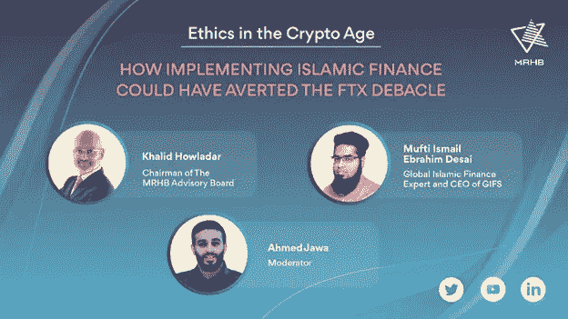

# FTX 崩溃:清真 DeFi 平台 MRHB 提出伦理作为解决方案

> 原文：<https://medium.com/coinmonks/ftx-collapse-halal-defi-platform-mrhb-proposes-ethics-as-a-solution-b209704d88bd?source=collection_archive---------27----------------------->

MRHB。电视网主持了一场 YouTube 直播讨论，提出了实施伊斯兰金融是否能够避免 11 月 FTX 崩溃的问题。

MRHB 顾问委员会主席 [Khalid Howladar](https://www.linkedin.com/in/khalidhowladar/) 对 FTX 的崩溃感到震惊，因为许多经验丰富的投资者如红杉资本、软银、淡马锡控股和资产管理巨头贝莱德都参与其中。

> *“老练的投资者中止尽职调查的事实非常令人震惊，”Khalid 说。*

缺乏监管是对交易公司 Alameda Research 在 FTX 代币上的杠杆作用的主要批评。这家贸易公司的所有者是 FTX 的首席执行官山姆·班克曼·弗里德。这一信息的披露导致投资者清算他们的资产，FTX 宣布破产。

MRHB(发音为“Marhaba”)提出了另一个论点:加密中的伦理。

> Khalid 说:“在 crypto 中需要一些基本的东西，如公司治理、诚信、信任、审计和透明度。“如果你从商业中去除道德，你得到的只是贪婪和腐败”。

伊斯兰金融区别于传统金融的一个关键是禁止对债务收取利息的剥削做法，也称为“riba”。

还禁止投资于任何涉及被禁止活动的企业，包括但不限于赌博、色情和出售酒精和猪肉。

伊斯兰金融的关键是金融活动和交易是以诚实和负责的方式进行的，因此像 FTX 发生的骗局和欺诈是可以避免的。

虽然只有第二年的运作，MRHB 没有浪费时间在建立一个忠诚的投资者社区和推出真正有用的产品，促进了道德规范的发展。

与典型的自我保管加密钱包不同， [Sahal 钱包](https://mrhb.network/ecosystem/sahal-wallet)充当了整个 MRHB 生态系统的网关。此外，Sahal 上列出的所有代币都经过了 Shariah Governance Board (SGB)的筛选，以确保列出的每个代币或项目都是清真的，不涉及基于利益的交易。

SGB 由伊斯兰教法学者组成，他们是伊斯兰金融和加密货币领域的专家。他们确保所有 MRHB 产品和与之相关的活动都是清真的。

要获取最新更新，请关注 [MRHB。在](https://mrhb.network/) [Twitter](https://twitter.com/marhabadefi) 、[脸书](https://www.facebook.com/MRHBDeFi)、 [LinkedIn](https://www.linkedin.com/company/marhabadefi) 和 [Youtube](https://www.youtube.com/c/MarhabaDeFi) 上建立网络，并加入他们的 [Telegram](https://t.me/mdf_official) 社区。

> 交易新手？尝试[加密交易机器人](/coinmonks/crypto-trading-bot-c2ffce8acb2a)或[复制交易](/coinmonks/top-10-crypto-copy-trading-platforms-for-beginners-d0c37c7d698c)