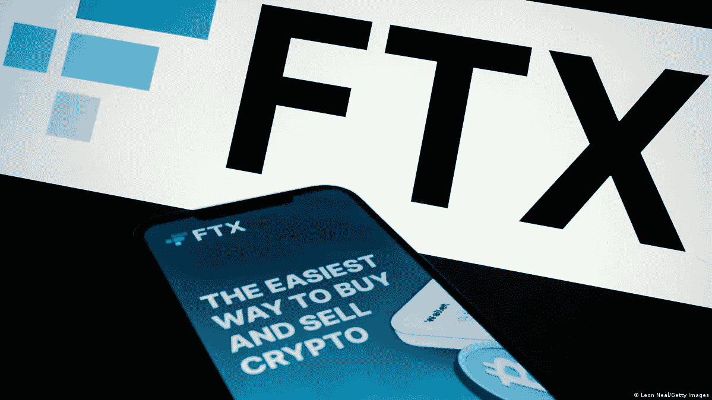

# FTX 崩溃:投资者需要吸取的惨痛教训

> 原文：<https://medium.com/coinmonks/ftx-collapsed-harsh-lessons-for-investors-to-learn-de6980200a7d?source=collection_archive---------9----------------------->

## FTX 加密货币交易所的爆炸式崩溃

The Collapse of FTX

FTX 加密交易所的爆炸式崩溃给整个行业带来了冲击波，损失了上百万投资者一大笔钱。

FTX 的加密货币交易所曾是世界上最大的加密货币交易所之一，直到 T4 在一周内以惊人的方式崩溃。

11 月 11 日，加密货币交易所 FTX 公司在特拉华州申请破产，同时申请破产的还有其他一些由加密企业家萨姆·班克曼-弗里德创立和运营的公司。FTX 的倒闭，一度价值 320 亿美元，是 crypto 在市场和华盛顿摇摆不定的命运中最引人注目和最重要的受害者。

现在，让我们讨论什么是 FTX

# 什么是 FTX？

阿拉米达研究的成功让班克曼-弗里德建立了一个密码帝国。这个投资组合的关键组成部分之一是 2017 年创建的加密货币交易所 FTX。加密交易所允许客户使用数字资产和传统货币买卖数字资产。FTX 和它的竞争对手币安一起统治了这个领域，处理了世界各地的大部分加密交易。FTX 在安提瓜和巴布达注册成立，总部设在巴哈马。币安没有正式的总部，也不在美国，这使得这两家公司可以从事并允许在美国不合法的交易(但两家公司都有符合美国法规的美国分公司)。作为最初的投资者，币安在 FTX 的建立中发挥了重要作用。

除了其交易平台，FTX 还推出了一种“本土”加密货币 FTT，用于支付在 FTX 平台上的运营。2021 年，币安首席执行官赵昌鹏出售了他作为早期投资者获得的 FTX 股份，并获得了部分 FTT 代币。

# **发生了什么事**

11 月 2 日，有影响力的加密新闻出版物 [Coindesk](https://www.coindesk.com/business/2022/11/02/divisions-in-sam-bankman-frieds-crypto-empire-blur-on-his-trading-titan-alamedas-balance-sheet/) [报道了一份泄露的文件，该文件似乎显示阿拉米达研究公司的资产负债表上有异常大量的 FTT 代币，尽管这两家公司作为不同的法律实体应该在财务上分离。这不仅有资产隔离的影响，而且 FTT 的流动性不足以支撑阿拉米达的资产负债表。](https://www.coindesk.com/business/2022/11/02/divisions-in-sam-bankman-frieds-crypto-empire-blur-on-his-trading-titan-alamedas-balance-sheet/)

11 月 6 日，作为对 Coindesk“爆料”的回应，赵在 Twitter 上宣布，他已决定清算其持有的股份赵指出，出售将在一段时间内以尽量减少市场影响的方式进行。尽管有这些保证，这一举动还是吓坏了市场，FTT 价格暴跌。交易员们迅速试图清算他们自己的 FTT 敞口，由此引发的 FTX“挤兑”导致仅三天时间就出现了约 60 亿美元的资金缺口。

11 月 8 日，币安同意救助 FTX，收购其唯一的重要竞争对手。赵指出，此次出售将使 FTX 能够兑现其承诺，并支付其撤资。

11 月 9 日，币安宣布将不再收购 FTX，这是“公司尽职调查的结果”(这条推文已不可用)。币安提到了 FTX 的监管调查和有关资金处理不当的报道。

11 月 10 日，FTX 宣布与区块链平台 Tron 达成协议，允许其使用 FTX 以外的数字钱包来交换一些代币。

11 月 11 日，FTX、阿拉米达研究公司和其他一些班克曼-弗里德投资公司承诺在特拉华州破产，班克曼-弗里德辞去首席执行官职务，股价和市值下跌了 80-90%。

11 月 11 日，在申请破产保护后不久，据报道，FTX 超过 6 亿美元的数字资产被黑客窃取。

# **接下来会发生什么**

FTX 的崩溃是迅速而残酷的。班克曼-弗里德和 FTX 都被认为是相对安全的人，是一个行业的声誉良好的代表，该行业一直在努力避免被批评为不受监管的犯罪和投机的温床。除了名誉损失，FTX 的倒台还对加密市场产生了重大的经济冲击。数字资产的总市值下降了约 20%，所有主要数字货币都出现了大幅亏损。然而，值得注意的是，如果币安能够避免类似的结局，其唯一真正的竞争对手的引人注目的衰落可能会对它产生积极的影响。

州、联邦和国际金融监管机构已经宣布对 FTX、FTT 和阿拉米达研究公司进行审查，特别是 FTX 基金——以及客户基金——是否被用于非法支持阿拉米达研究公司。在没有国会立法的情况下，联邦机构将利用这一影响提议更多的权力和更密切的监督，最明显的是证券交易委员会(SEC)主席加里·詹斯勒(Gary Gensler)。FTX 的崩溃将 SEC 置于一个非常有趣的位置，它呼吁更严格的密码监管可能是正确的，但也可能是监管和监督失败，允许(或至少没有阻止)崩溃的发生。

华盛顿的立法者和游说者将会因为 crypto 最响亮和最强大的声音之一的倒下而感到震惊。国会中那些试图引入广泛授权密码行业的立法的人，现在将被那些视 FTX 投资者为受害者的人挫败。众议院金融服务委员会宣布将于 12 月举行听证会调查 FTX，预计班克曼·弗里德将出席，这是两党罕见的一致。众议院金融服务委员会主席玛克辛·沃特斯指出，“FTX 的倒台对超过 100 万用户造成了巨大伤害，其中许多人都是普通人，他们将辛苦赚来的积蓄投资到了 FTX 加密货币交易所……”她的共和党委员会对手、资深成员帕特里克·麦克亨利也发表了一份声明，称“我们必须让坏人承担责任，这样负责任的参与者才能利用技术建立一个更具包容性的金融系统。”参议院银行委员会主席谢罗德·布朗也宣布了举行类似听证会的意图。

然而，还有待观察的是，FTX 的崩溃将对国会正在起草的加密货币立法产生什么影响，包括 Waters-McHenry 法案和参议院农业委员会主席 Debbie Stabenow 和高级成员 John Boozman 正在起草的另一项法案。由于在起草过程中难以达成一致意见，沃特斯-麦克亨利法案被认为是逾期的。FTX 的崩溃将为立法者提供动力来完成这些立法文本，但不会使这项任务变得更容易。

从长期来看，FTX 的崩溃可能会增强传统银行业和其他高度监管实体的实力(这多少有点讽刺意味，因为班克曼-弗里德曾夸口 FTX 的资产负债表足以收购高盛)。

据估计，班克曼-弗里德已经损失了他 260 亿美元个人财富的 96 %,可以说是有史以来损失最快、最大的财富之一。此外，Bankman-Fried 肯定会受到联邦金融监管机构以及纽约和巴哈马法庭的调查。尽管辞去了 FTX 首席执行官的职务，但在此期间，班克曼-弗里德被认为没有帮助解决一系列令人困惑和误导的推文。

一些批评家将 FTX 的崩溃与其他混乱的破产相提并论。虽然破产的重要性让人想起雷曼兄弟，但前财政部长拉里·萨默斯告诉彭博，这种情况让他想起了安然丑闻，他说:“房间里最聪明的家伙。不仅仅是财务错误，从报告中可以肯定，还有欺诈的迹象。公司历史上早期的体育场命名。没有人真正明白财富从何而来。”

# 投资者可以从 FTX 崩盘中吸取教训

在经历了数字资产艰难的一年后，许多投资者对加密货币交易所 FTX 最近的崩溃感到措手不及，因为客户正在等待关于估计价值 10 亿至 20 亿美元的失踪资金的答案。

尽管随着 FTX 进入破产保护，该公司的未来——以及对消失资产的调查——都处于悬而未决的状态，但专家表示，对加密投资者来说，有一些重要的教训。

佛罗里达州博卡拉顿市财富管理公司(Ulin & Co. Wealth Management)首席执行官、注册理财规划师乔恩·乌林(Jon Ulin)说:“FTX 的崩溃严酷地提醒人们，在一个仍然相当新的、不受监管的金融行业中，想要快速赚钱，天下没有免费的午餐。”。

## 1.了解你持有加密货币的风险

CFP 凯文·卢姆(Kevin Lum)是洛杉矶 Foundry Financial 的创始人，他与年轻投资者一起工作，他说他的客户中大约有 50%持有某种形式的密码。

虽然他不一定认为客户需要减少风险，但他说，他们需要了解数字货币的持有地点以及在那里持有资产可能存在的风险。

“我认为 FTX 的崩溃最终将有利于像富达这样的传统金融公司，他们正在进入加密领域，因为他们有一定程度的信任，”Lum 说。

本月早些时候，富达投资宣布计划推出一款免佣金的加密产品，允许投资者买卖比特币和以太。

FTX 的崩溃也重新激起了人们对冷藏或让数字货币离线的兴趣，使其不那么容易受到黑客攻击。然而，此举降低了资产的流动性，也加大了快速交易的难度。

## 2.多样化总是很重要

专家表示，无论你是投资股票、加密货币还是其他资产，大部分的单一持有都可能存在风险。

“多样化总是很重要，”CFP 乔治·加利亚迪说，他是马萨诸塞州列克星敦市科罗曼德尔财富管理公司的创始人。

“对于加密货币配置非常高的个人来说，不管是不是在 FTX，今年的加密货币价格暴跌都是分散投资类别的痛苦教训，”他说。

自 2021 年 11 月达到 68，000 美元的历史最高水平以来，比特币的价格暴跌了四分之三以上，截至 11 月 17 日，已跌至 17，000 美元以下。

CFP、Wealthspire Advisors 副总裁凯文·布雷迪(Kevin Brady)表示:“(FTX)的崩溃应该是一个教训，任何单个公司——无论是加密交易所还是更传统的业务——都可能在困境中破产。”。

他说，在权衡投资组合配置时，单一资产的 5%开始变得重要，10%则“非常集中”。当然，对一些投资者来说，可能有减轻处罚的情节。

“即使一项金融资产本质上是投机性的，它仍然可以在多元化的投资组合中发挥作用，尽管数额很小，”Ulin & Co .的 Ulin 说。

## 3.期待更多的秘密监管

关于加密货币应该如何分类和监管的辩论一直在进行，在 FTX 事件的影响下，这一辩论愈演愈烈。

今年 6 月，怀俄明州共和党参议员辛西娅·卢米斯(Cynthia Lummis)和纽约州民主党参议员柯尔斯顿·吉利布兰德(Kirsten Gillibrand)提出了一项法案，为数字货币创建一个监管架构，将大部分资产定义为商品，如黄金或石油，由商品期货交易委员会(Commodity Futures Trading Commission)监管。

专家表示，FTX 危机可能会加速这些讨论，并加快未来指导方针的时间表。“我认为我们会看到监管规定，”CFP、华盛顿德兰西财富管理公司(Delancey Wealth Management)创始人伊沃·约翰逊(Ivory Johnson)说。“我认为这些糟糕的商业模式将会消失。”

众议院金融服务委员会(house Financial Services Committee)主席、加州民主党人玛克辛·沃特斯(Maxine Waters)和北卡罗莱纳州资深共和党众议员帕特里克·麦克亨利周三宣布，计划在 12 月举行两党听证会，调查 FTX 的崩溃。

虽然国会将最终决定政府机构如何监管加密货币，但证券交易委员会主席加里·詹斯勒(Gary Gensler)一直在推动更严格的规则。“投资者在这个领域需要更好的保护，”他在 11 月 10 日告诉美国消费者新闻与商业频道的“Squawk Box”。

## 4.备份您的加密交易记录

无论你在哪里持有数字货币，专家建议定期下载你的交易历史。

税务律师、注册会计师兼戈登法律集团总裁安德鲁·戈登(Andrew Gordon)表示，收集申报文件是加密税最困难的部分之一。他说，如果一家交易所关闭，你仍然需要记录来提交你的回报。

“两周前，很少有人怀疑 FTX 会面临这种情况，”戈登说。

此外，他说，通过跟踪全年的情况，你会对自己的利润和亏损有更好的感觉，从而更容易通过税收损失收获等策略来削减账单。他表示:“当纳税时间到来时，这将让你处于一个更有利的位置。”

# 炒作广告的惨痛教训

围绕 FTX 戏剧性的兴衰有一系列问题。不过，一个问题是，至少在过去一年里，该品牌的大多数广告——以及大量与加密相关的品牌——是如何利用名人效应和炒作来将加密投资框定为一项历史性的好举措的。正如马特·达蒙(现在臭名昭著)在将加密与人类飞行和太空旅行的发明相比较时说的那样，“幸运青睐勇敢者。”

广告行业是一个相对努力工作的行业，也是一个谈论很多的行业，致力于品牌目标工作和品牌透明度，同时也为许多社会事业承担公益 PSA 和宣传工作。虽然这显然是明目张胆的奖励诱饵，但这种类型的创意产出也将广告的传统声誉(作为媒体和职业)重新定义为风格多于实质。这个行业的秘密工作的夸张狂妄，正如其 FTX 工作的缩影，破坏了所有这些崇高的努力。

围绕利用主要名人营销加密货币公司的辩论已经发生了一年多，至少从 2021 年 6 月 13 日金·卡戴珊(Kim Kardashian)发布 Instagram 故事吹捧 EthereumMax 开始。根据 Morning Consult 的一项研究，21%的美国人观看了该广告，英国金融行为监管局称其为“历史上受众人数最多的金融推广”10 月，卡戴珊因未向观众披露她获得代言费而被美国证券交易委员会罚款 126 万美元。

FTX 已经收集了一个非常令人印象深刻的大体育名称稳定，包括汤姆·布拉迪，斯蒂芬库里，迈阿密热火队，梅赛德斯一级方程式赛车，华盛顿奇才队(NBA)和首都队(NHL)，金州勇士队和肯塔基大学男子篮球队。

去年，哥伦比亚大学商学院教授兼哥伦比亚金融科技倡议执行董事 R.A. Farrokhnia 谈到了将消费包装商品或娱乐中常见的广告方法用于加密这种新的、令人困惑的东西的复杂性。“这给参与这些活动的广告公司和名人都带来了声誉风险”。

然而，熟悉 FTX 超级碗广告制作的消息来源称，该品牌的最大目标是娱乐，很少有关于承认加密投资风险的对话。他们想说，“不要错过，”而不是说“不要错过致富的机会。”任务没有完成，因为该品牌还在游戏期间进行了一次大规模的比特币赠品活动。

伊丽莎白·保罗是马丁公司的首席战略官，该公司与比特币基地合作了近一年，但最终在 2021 年底辞职。(不过，该机构确实对该品牌自己的病毒式超级碗广告产生了一些影响。)她表示，他们与比特币基地的大部分战略工作旨在将该品牌定位为房间里的成年人，支持监管和负责任的使用。“为了加密市场的长期成熟，世界最好把这些投资看得更像 401k，而不是体育博彩，”Paul 说。

保罗说，代理商总是有责任利用他们对客户的影响力，这种选择不仅限于加密，而是每天为他们所在的每个类别做出决定。保罗指出，2021 年的一项研究表明，相比政府或宗教机构，消费者更相信品牌能够带来积极的社会变革。“作为这些品牌的建设者，(代理商)总是有机会展示我们讲故事和说服他人的技能——以对企业和他们所服务的社区(有益)的方式利用平台和资源，”保罗说。“或者你可以放弃这种责任，选择不质疑案情摘要并参与其中，在这种情况下，无论好坏，你都做出了贡献。”

广告商和营销人员需要把目标放在前者而不是后者上，否则他们所有工作的有效性和信任度就有被稀释的风险。“加密冬天”从根本上改变了它的营销方式，至少在短期内是如此。没有人在等汤姆·布拉迪的电话。

保罗建议，最终，加密品牌将不得不像他们希望取代的机构那样做广告。“为了给人们更好的安全感，他们可能不得不表现得像不性感的银行，”她说。

# 包裹

在这篇文章中，我们知道了 FTX 加密货币交易所的崩溃，我们也讨论了从这次崩溃中吸取的惨痛教训。

# 与我保持联系！👋

穆罕默德·沙赫扎德
—****瑞思科技*** 的技术副总裁*

***领英**https://www.linkedin.com/in/ishanshahzad/[▶️](https://www.linkedin.com/in/ishanshahzad/)*

> *交易新手？尝试[加密交易机器人](/coinmonks/crypto-trading-bot-c2ffce8acb2a)或[复制交易](/coinmonks/top-10-crypto-copy-trading-platforms-for-beginners-d0c37c7d698c)*