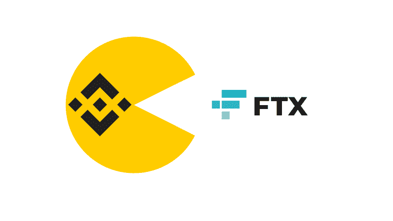
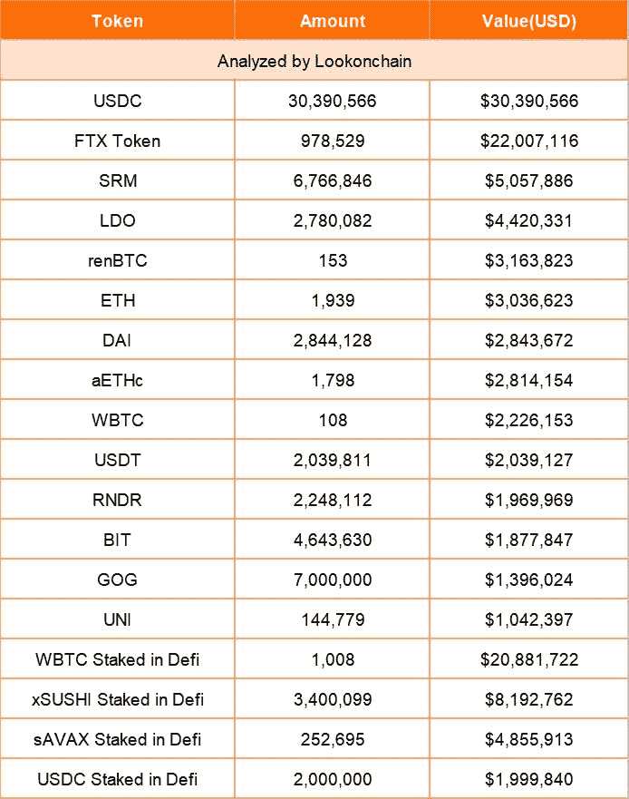
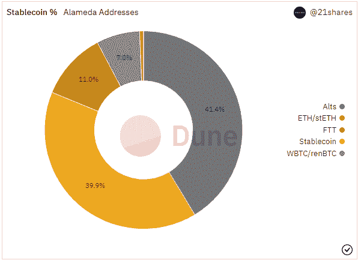
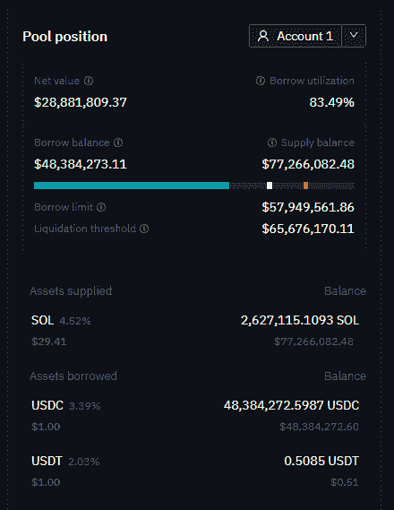
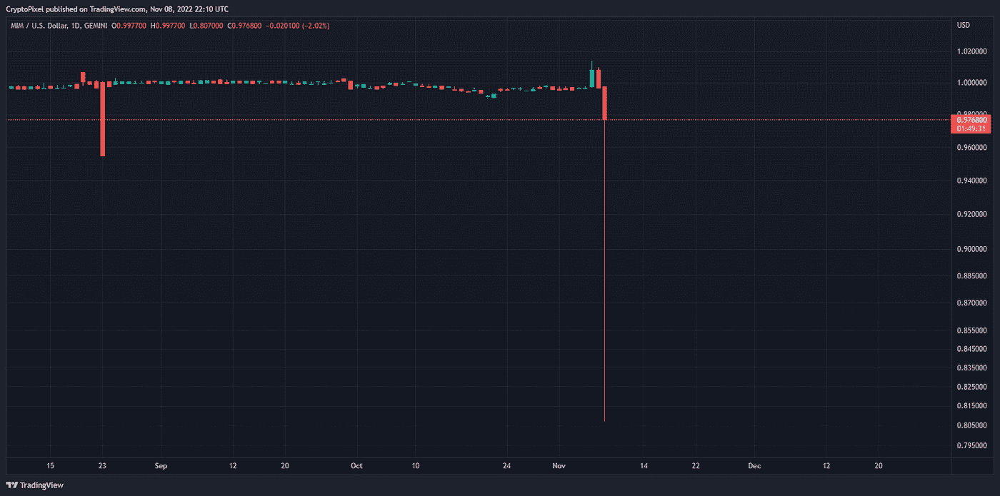

# FTX 可能引发传染病 2.0

> 原文：<https://medium.com/coinmonks/ftx-could-cause-contagion-2-0-7a3d573d2e8a?source=collection_archive---------22----------------------->

在 crypto 从来没有无聊的一天。在我写这篇文章的时候，几个小时前有消息传出，币安已经签署了一份非约束性的 LOI 来购买 FTX。据报道，该交易涉及非美国实体 FTX，这是该实体的大多数。这一令人震惊的声明是在 SBF 和 CZ 之间的公开不和/twitter 争斗之后发布的。在过去的几个月里，[关于阿拉米达研究公司和 FTX 公司可能破产或缺乏流动资金的谣言](https://dirtybubblemedia.substack.com/p/is-alameda-research-insolvent)四处流传。FTT 和 BNB 的代币今天到处都是。这标志着加密领域最大的冲击波之一，并有可能在整个行业产生强烈的连锁反应…再次…好像 Terra 崩溃和随后的 CeFi 蔓延还不够一年…

# 我们是怎么到这里的？简短回顾

一段时间以来，SBF 的项目一直被传言财务状况不佳。然而，还没有任何具体的东西。直到 11 月 2 日来自 Coindesk 的一份[报告](https://www.coindesk.com/business/2022/11/02/divisions-in-sam-bankman-frieds-crypto-empire-blur-on-his-trading-titan-alamedas-balance-sheet/)披露了阿拉米达研究公司在获得其 Q2 资产负债表副本后的财务状况。还大声喊到[肮脏的泡泡媒体](https://dirtybubblemedia.substack.com/)对文档进行可怕的分解。根据这些文件，阿拉米达共有 146 亿美元，其中 58 亿美元由 FTT token 组成，12 亿美元由 SOL 组成，33.7 亿美元由未披露的 cryptos 组成，20 亿美元用于股权投资，22 亿美元用于其他与 SBF 相关的项目，如 SRM、OXY、MAPS 和 FIDA。

总共有 80 亿美元的债务，其中 74 亿美元是贷款，还有不到 3 亿美元的 FTT 代币。Coindesk 无法识别其余部分。截至 2022 年 6 月，阿拉米达手头仅有 1.34 亿美元现金。泄露的信息显示，该公司最大的资产是 FTT，当然是由 FTX 发行的，大约包括总资产的⅓，占阿拉米达净资产的 88%左右。实际上，该公司最大的资产是由一家姊妹公司(FTX)发行的代币，而这种代币又由同一方发行的代币“支持”。一个抵押循环向投资者展示了他们想要看到的东西:增长。尽管它实际上是由稀薄的空气构成的。

所有这些糟糕的财务状况，SBF 对 Celsius 和 3 Arrows Capital 的敞口，当然还有整体看跌的市场情绪，都让 FTX 承受了很大压力。然后是币安的溃败。我不会深入探讨这个问题，因为我认为我们面临的整体市场风险比我们如何走到这一步更为紧迫。这里很好地解释了导致收购 FTX 的事件的时间表。然而，TL；币安不久前开始清算价值约 5.84 亿美元的 FTT，以从 2019 年开始退出其在 FTX 的初始投资者地位。不用说，这给已经遭受重创的代币带来了很大压力。现在，这对市场意味着什么？

# 还有哪些项目对 FTX 有很大影响？

由 [Lookonchain](https://twitter.com/lookonchain?ref_src=twsrc%5Etfw%7Ctwcamp%5Etweetembed%7Ctwterm%5E1589578509609205762%7Ctwgr%5E6618f3de3e61de0e9cc3fe176334d9e79ddaf9fd%7Ctwcon%5Es1_&ref_url=https%3A%2F%2Fblockworks.co%2Fbinance-is-buying-ftx-a-timeline-of-events%2F) 做的超级棒的研究告诉我们，在 56 个最大的阿拉米达地址中，USDC、FTT 和 WBTC 是三个最大的持有地。还有大约价值 400 万美元的 LDO。随着 FTX 和阿拉米达寻求流动性，已经有关于这些头寸大举抛售的报道。

FTX 方面，其最近最大的持有量约为价值 1B 的 FTT、价值 8000 万美元的 USDT、价值 5900 万美元的 PAXG 和价值 5200 万美元的 stETH。通过最稳定的交易所瑞士联邦理工学院和 BTC，不需要火箭科学家就能看出(前)最大的交易所之一与整体市场的紧密程度。

然而，目前围绕大多数加密不和谐频道的恐怖故事是 FTX 拥有的价值超过 12 亿美元的 SOL。好吧，看起来，你可能还记得 6 月份的一只著名的鲸鱼，仍然有 6000 万美元待清算，价格大约是 21 美元。由于 FTT 可能会继续清算其持有的其他股份，以支撑更多的现金，这可能会使索尔的价格下降到该水平以下，引发鲸鱼被清算，从而给令牌带来更大的抛售压力。

但是等等，还有更多。Abracadabra 的 MIM 汇率曾一度跌至 0.80 美元，随后随着 FTT 股市暴跌，“反弹”至 0.97 美元左右。这是它曾经达到的最低水平，甚至超过了它在 Terra 崩溃时的 depeg。尽管现在看起来 FTT 支持 MIM 的金额已经下降到 8 万美元以下，但根据 T2 的 Abracadabra.money analytics 的数据，这是其最大的抵押品，占“大锅”总支持量的 33%。

# 接下来会发生什么？

传染病 2.0？真的是新的传染，还是只是上一个的延续？Crypto 是一个小世界，任何事物都会影响到其他事物。危机蔓延的前一幕之所以变得更加糟糕，是因为每个人都在向每个人借贷，从而在根本不存在的资金基础上创造了杠杆。当时，FTX 正大举收购许多陷入困境的加密贷款机构。现在，说实话，FTX 正被廉价收购。这一领域似乎有整体整合的趋势，我确信这不会是我们明年在加密领域看到的最后一次收购/敌意收购。可以肯定的是，币安上周处于非常强大的地位，现在它已经蚕食了最大的竞争对手之一，将会增长很多。在 crypto 从来没有无聊的一天。

> 交易新手？试试[密码交易机器人](/coinmonks/crypto-trading-bot-c2ffce8acb2a)或[复制交易](/coinmonks/top-10-crypto-copy-trading-platforms-for-beginners-d0c37c7d698c)