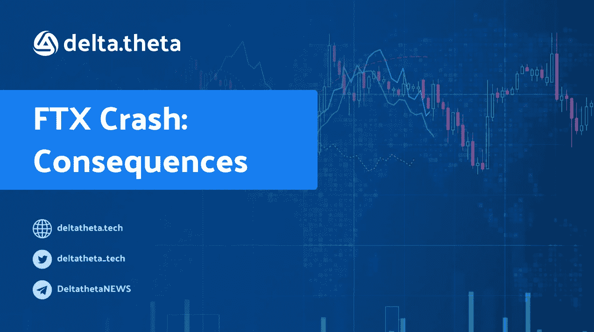
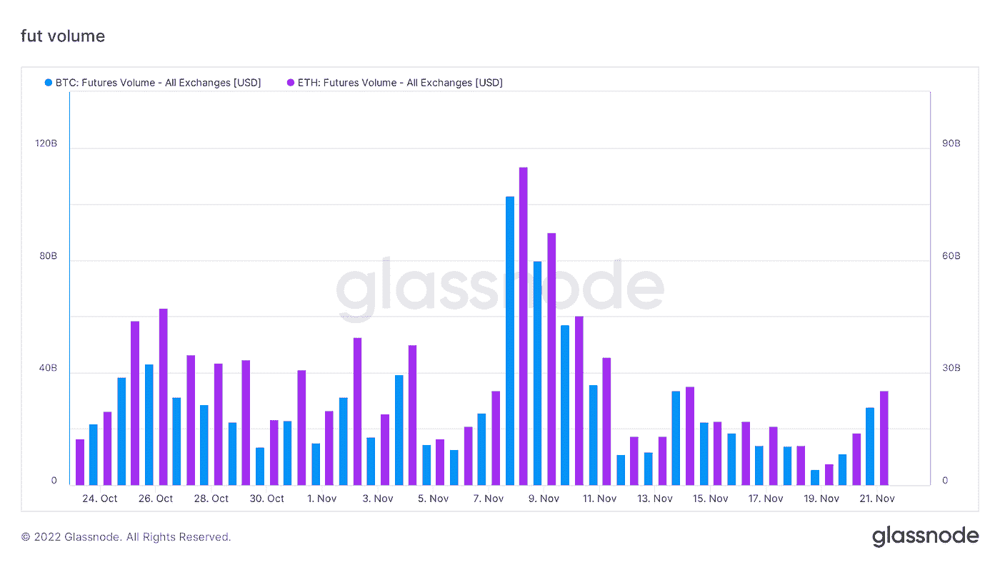
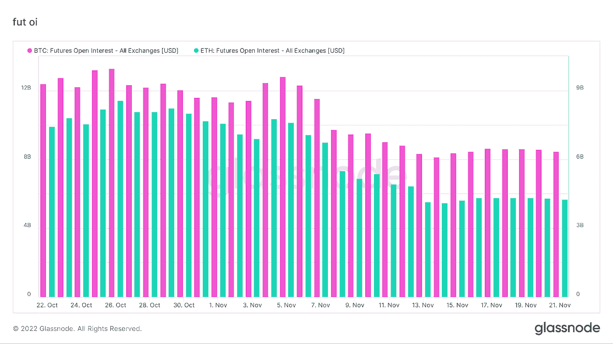
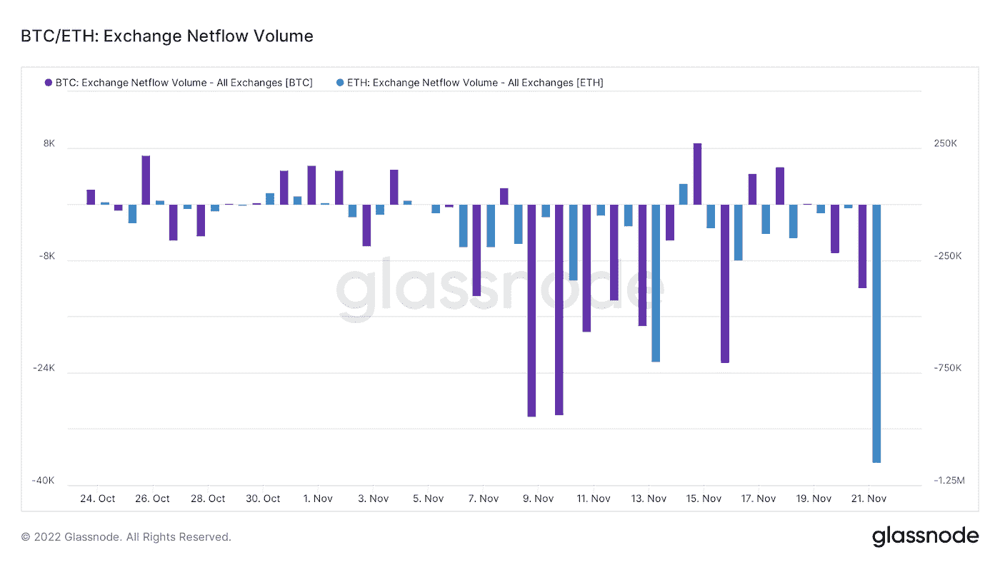
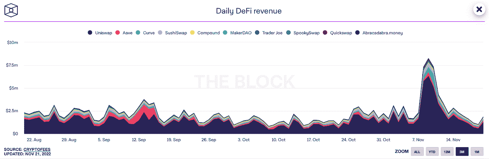
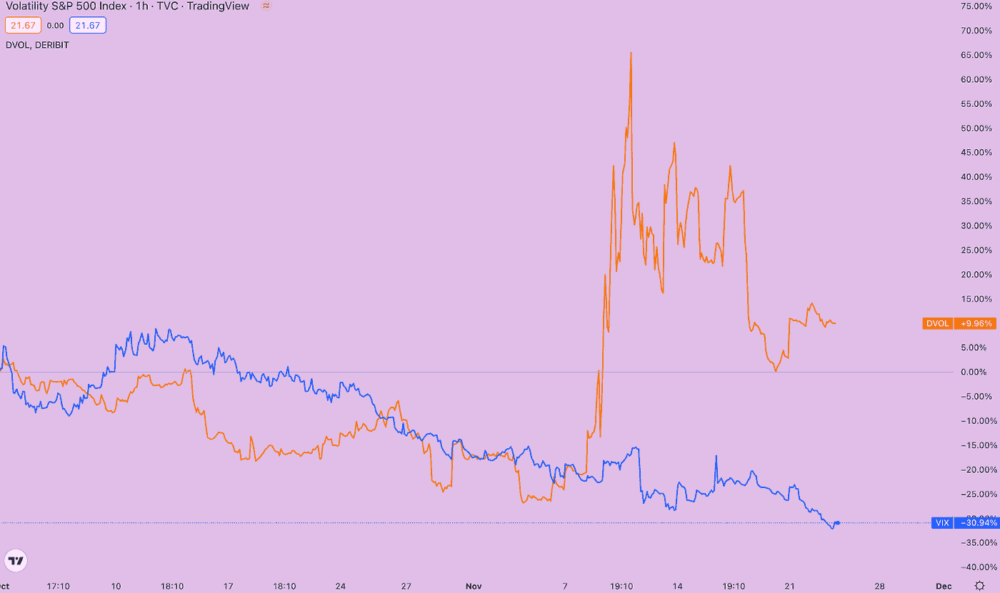
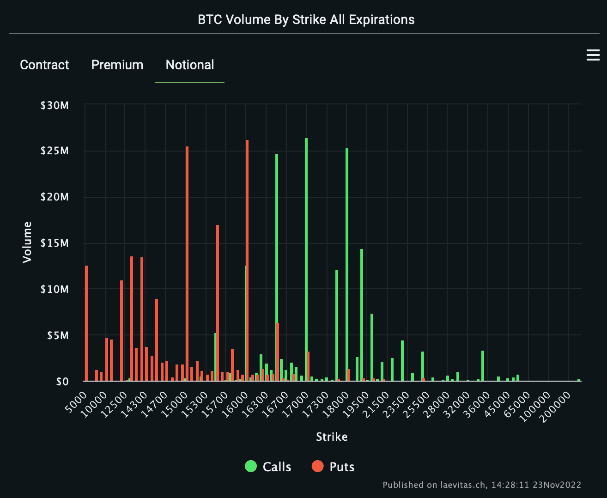
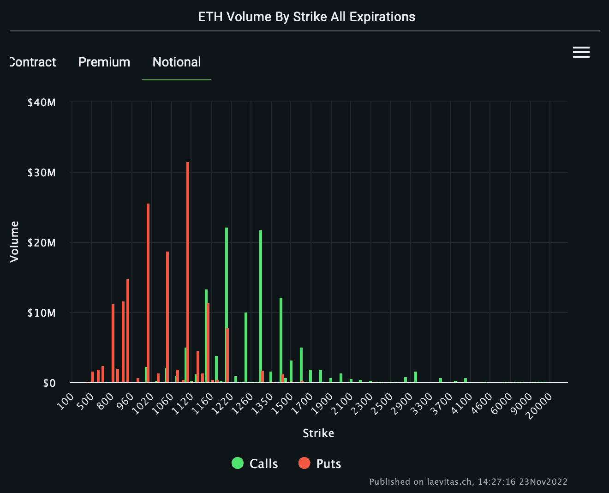
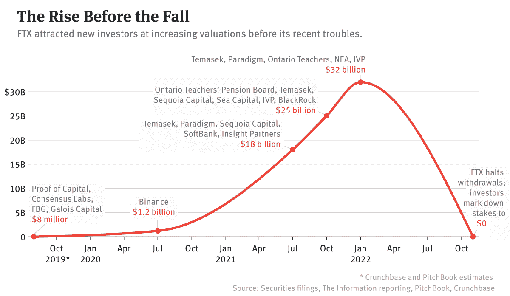

# FTX 粉碎:后果

> 原文：<https://medium.com/coinmonks/ftx-crush-consequences-af06d5e64329?source=collection_archive---------10----------------------->

最近几周发生的与密码行业一家主要公司倒闭有关的事件引发了巨大的市场动荡。虽然散户用户已被确定，而且数量可观，但 FTX 的机构客户可能更容易受到市场问题的影响。

还应该注意的是，FTX 的破产是在风险投资公司 Alameda Research 财务失败的背景下发生的，该公司对加密初创公司的参与在数量和投资方面都是最高的。

为了评估后果，有必要先看看整体市场状况，然后再考虑细节。例如，衍生品市场的情况非常明显:

期货交易量在币安取消可能收购 FTX 的重大消息传出后大幅下降。从 1000 亿美元和 840 亿美元的高点到两种加密货币的 250 亿美元左右，跌幅约为 75%！另一方面，相对于事件发生前的平均水平，下降幅度在 40%左右。

更明显的是期货(包括期货和未平仓合约)的未平仓合约数量下降。比特币和以太网的通常数字分别为 120 亿和 100 亿，这个数字已经下降到 60 亿和 40 亿——比本月初下降了 50%。

FTX 股市下跌对市场活动产生了影响——由于流动性和交易引擎被排除在外，实际交易量减少，大型市场参与者之间失去了信任。

在很明显 FTX 仍然存在流动性问题，而且规模相当大之后，所有的中央交易所都面临着加密货币从其资产负债表中大量撤出的局面。这一周总共收回了约 120 000 BTC 和 2 700 000 埃特。目前，这种流动性在用户的钱包里，他们要么采取观望态度，要么更加积极地使用分散的交易所和交易解决方案。

主要 DeFi 协议(Uniswap、Curve、Compound、AAVE 等)带来的收入激增。，表明用户和流动性的涌入。鉴于活跃的熊市，集中交易高峰之一的下降无疑支持了加密市场的 WEB3.0 行业。然而，赤字使用趋势的可持续性将在未来变得清晰，因为现在讨论长期影响还为时过早。

FTX 事件不仅让普通用户和交易员感到意外，也让期权市场的大型做市商感到意外。

11 月 7 日至 11 日的波动性飙升始于 Twitter 上关于币安可能收购 FTX 的报道，并在交易被放弃并申请破产保护后达到顶峰。大部分交易活动都围绕着比特币价格为 15 000 至 16 000 英镑(以太币价格为 1000 至 1100 英镑)的看跌期权。

尽管市场已经企稳，但流动性仍未完全恢复。索拉纳令牌(SOL)上的选项只适用于现有的罢工，不会有新的罢工。事实上，从新年开始，SOL 上的期权市场将关闭，或者至少暂停。这种情况表明缺乏做市商和/或不愿意组织进一步的代币交易。

除了 FTX 产品投资本身的减记(已经由 Tomasek、Sequoia 和安大略教师养老金委员会宣布)，许多与机构交易员合作或使用跨平台解决方案进行加密交易的大公司都面临着无法收回营运资本的问题。最著名的例子是 Genesis Trading、MultiCoin Capital、AAH 亚洲衍生品交易所。

最具挑战性的情况出现在加密货币控股公司 DCG 周围，其创世纪交易部门有 28 亿美元的“复杂债务”要收。由于去年夏天 3 Arrow Capital 和现在的 FTX 的破产，该公司承担了如此“复杂”的债务。最大借款人破产的后果极其严重，可能会波及到加密行业旗舰灰度信托(也是 DCG 控股的一部分)，其资产负债表上有 655 000 BTC 和 300 万 ETH。在初始贷款或加密贷款中使用信托的股份作为抵押品，以及对市场价值的折扣，造成了在资产负债表上核算这一资产的问题。理论上 1000 个灰度信托份额在资产负债表上等于 1 个比特币，但是现在市场对份额价值有 50%左右非常大的折扣，实际价值和资产负债表价值不一样。正因为如此，这些证券已成为许多 Genesis 交易的流动性抵押品，导致该公司需要 5 亿美元的资本重组。

FTX 的崩溃已经造成了许多伤亡——散户投资者和交易员、投资公司和风险资本基金。只有币安交易所看起来相对稳定，它公布了拥有超过 500 亿美元储备的钱包的地址，因此抵御了恐慌和存款提取的浪潮。比特币基地(其在美国市场的主要竞争对手破产了)和包括 deltatheta 在内的 DeFI 生态系统获得了一个吸引有经验的加密用户的机会，这些用户已经学到了加密金融市场中最重要的一课:“不是你的钥匙，也不是你的钱”。

> 交易新手？试试[加密交易机器人](/coinmonks/crypto-trading-bot-c2ffce8acb2a)或者[复制交易](/coinmonks/top-10-crypto-copy-trading-platforms-for-beginners-d0c37c7d698c)