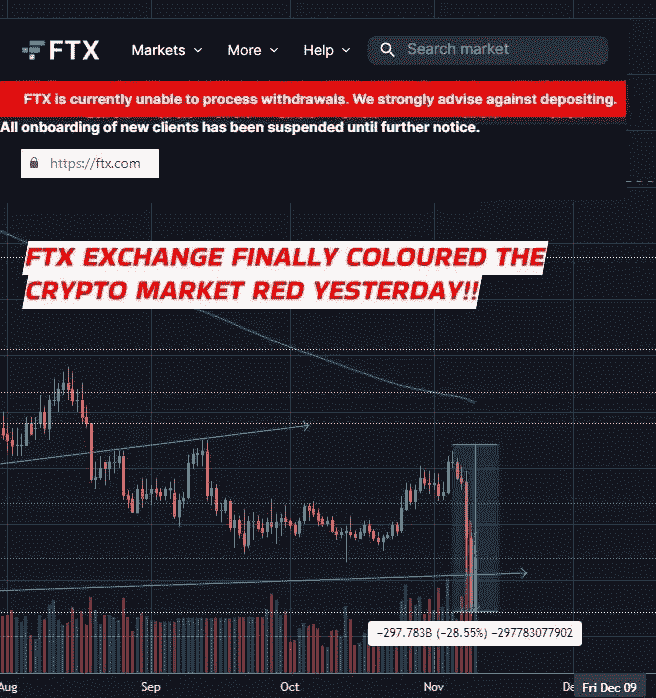
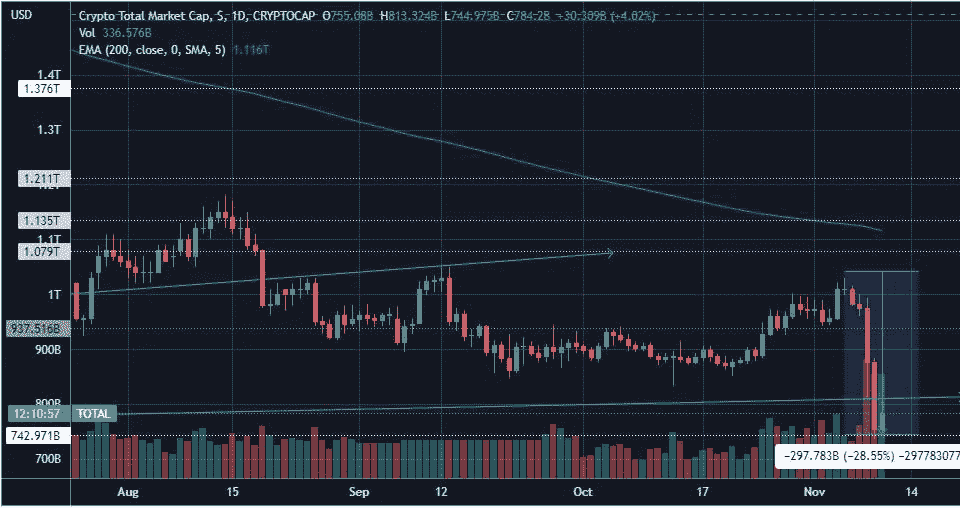
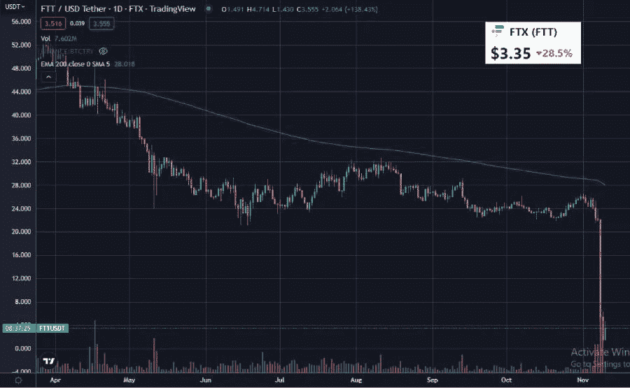

# FTX 交易所昨天终于把加密市场涂成红色了！！

> 原文：<https://medium.com/coinmonks/ftx-exchange-finally-painted-the-crypto-market-red-yesterday-52d992df5696?source=collection_archive---------29----------------------->

昨天，当我发现 BTC 的价格突然跌破 20，000 美元时，我明显感到震惊。随着 BTC，ALT 硬币也经历了合理幅度的下降。我想知道为什么？。

是因为一些宏观经济的原因吗？。很快，我发现不是，这只是加密行业特有的原因，因为标准普尔 500、DJI 和纳斯达克没有明显的下跌。

所以，我查看了加密新闻，加密市场突然变红的原因是 FTX 交易所

[From Tradingview](https://www.tradingview.com/x/rPiVGYej/). Crypto Market Cap has been falling from Nov 6 to Nov 9th all due to FTX Exchange dramas.

# 由于流动性紧缩问题，FTX 继续上演加密业务崩溃的传奇

哦，我的上帝，这是 crypto 中的又一个黑天鹅事件，就好像我们几个月前还没有经历足够的混乱一样，卢纳-UST 崩溃，然后 Celcius 流动性紧缩，平台不允许其客户提取资金！！

当然，类似的事件在 Voyager、Block Fi 等公司身上重演，它们突然都无法处理客户取款。

FTX 交易所[面临着与加密领域所有这些已知和可信实体类似的问题](https://cryptobriefing.com/ftt-tanks-28-as-ftx-exchange-struggles-to-process-withdrawals/)。

*哎哟——这真的很难消化，真的是！！*

# FTX 收购竞争对手币安，因为它已经崩溃了！！

萨姆·班克曼·弗里德创建了 FTX 交易所，他也创建了阿拉米达研究公司。索拉纳区块链反过来是阿拉米达研究公司创立的。

通常，Solana Blockchain 总是在新闻中报道其区块链因拥塞而面临停机和愤怒问题，但在过去几天，FTX 交易所因担心其流动性状况而成为新闻。

当然，现在每个人都知道，FTX 没有足够的资金来兑现[提取他们客户的存款](https://cryptobriefing.com/ftt-tanks-28-as-ftx-exchange-struggles-to-process-withdrawals)，因为昨天 [FTX 同意](https://cryptobriefing.com/binances-ftx-com-acquisition-plunges-market/)被币安收购！！

嗯，是的[币安的 CZ](https://cryptopotato.com/ftt-drops-10-after-binance-dumps-its-entire-stash-of-23-million-ftx-tokens/) 也是导致 FTX 交易所结束的一部分，我现在将讲述这个故事。

# 故事从阿拉米达泄露的财务报告开始

FTX 交易所的麻烦始于上周，加密期刊 Coindesk 报道称[泄露了阿拉米达研究公司的财务数据](https://cryptopotato.com/ftt-drops-10-after-binance-dumps-its-entire-stash-of-23-million-ftx-tokens/)。

alamada Research[6 月份的财务数据](https://cryptobriefing.com/ftt-tanks-28-as-ftx-exchange-struggles-to-process-withdrawals/)显示，该实体的资产为 146 亿美元，负债为 80 亿美元。问题是，Alamada 的 146 亿美元资产是流动性差的资产，如 FTT(FTX 交易所的本地硬币)和其他基于 SOL 的项目令牌，如 SRM，MAPS，OXY。

显然，这可能意味着 Alameda Research 如果出售这些资产，可能无法收回 146 亿美元，因此其稳定的财务状况值得怀疑。这意味着，如果债权人突然要求阿拉米达偿还，该公司可能没有资产偿还债权人。

为了强调 Alamada 在 FTT 的持股范围，考虑一下，当 FTT 的总市值只有 33.2 亿美元时，它持有价值 58.2 亿美元的 FTT 股票。

现在，显然这意味着，如果阿拉米达需要出售 FTT 代币，FTT 代币没有足够的流动性来收回近 58.2 亿美元的价值。

这也意味着，如果阿拉米达哑 FTT 代币，FTT 的价格将大幅下跌，这一切都不符合其他 FTT 持有者的利益。

# CZ 转储 FTT 代币，导致代币价值暴跌

这篇报道从我们的 CZ 开始，那是币安 CEO 赵昌鹏[倾销 2300 万 FTT 代币](https://cryptopotato.com/ftt-drops-10-after-binance-dumps-its-entire-stash-of-23-million-ftx-tokens/)价值 5.84 亿美元。

阿拉米达的首席执行官卡罗琳提出以 22 美元的价格从币安购买所有的 FTT 代币，但我不确定 CZ 是否接受了她的提议。然而，CZ 抛售了这些代币，FTT 的价格开始暴跌。

哎哟——是的，在新闻上看到它跌到了 5 美元以下，想象一下所有 FTT 代币的阿拉米达负债持有，它们的价值就这么没了！！！这都是 CZ 做的！！

From [Tradingview](https://www.tradingview.com/x/VG68Bvdh/). FTT token falls from 26$ on Nov 5th to below 2$ Nov 9th!!

# FTX 无法处理其储户的提款请求

与此同时，FTX 用户担心 FTT 代币贬值，他们肯定也抛售了这些代币。然而，看起来阿拉米达与 FTX 有联系，他们怀疑他们在交易所的存款可能有危险。因此，随之而来的是银行挤兑，大量用户从他们的 FTX 账户中取出他们的 BTC、ETH 和其他密码。

这让 FTX 无法承受，因为很明显，该交易所没有足够的存款来满足所有储户的加密取款请求。因此，很快 FTX 的山姆·班克·弗里德曼承认失败，并愿意将 FTX 卖给币安。

## 客户的存款没有以诚实的方式存放在 FTX 交易所！！

坦白地说，我不明白阿拉米达的财政状况怎么会导致 FTX 的这种局面。同意 FTT 代币正在贬值肯定会导致阿拉米达的金融动荡，但为什么用户存放在 FTX 的密码不在那里，以换取他们撤回？？？

这只能意味着 FTX 没有在用户账户中保留用户资金，他们将用户资金用于交易目的，并毁掉了自己原本稳健的加密交易业务。

毫无疑问，FTX 没有权利接触和使用客户的资金进行交易，因为 FTX 只是应该将用户的资金安全地存放在某个地方。

这应该震惊任何一个，地狱，FTX 是我最喜欢的交换，我曾经使用这个交换从币安过渡。耸耸肩…

Youtuber Nicholus Mertin explains FTX’s laxity in safe keeping of customer deposits better

## 这个故事并没有结束，接下来还会有更多的副作用

这不是故事的结尾…因为，我想知道索拉纳的 SOL 和索拉纳的其他项目会有什么影响。有一些愚蠢的鲸鱼主要持有区块链的大部分令牌，这些令牌经常面临愤怒问题。

此外，阿拉米达，FTX，也许索拉纳生态系统的崩溃会对更广泛的加密生态系统产生什么影响？…等待传染效应，这可能很快会进一步削弱加密市场

> **交易新手？试试** [**密码交易机器人**](/coinmonks/crypto-trading-bot-c2ffce8acb2a) **或** [**复制交易**](/coinmonks/top-10-crypto-copy-trading-platforms-for-beginners-d0c37c7d698c)