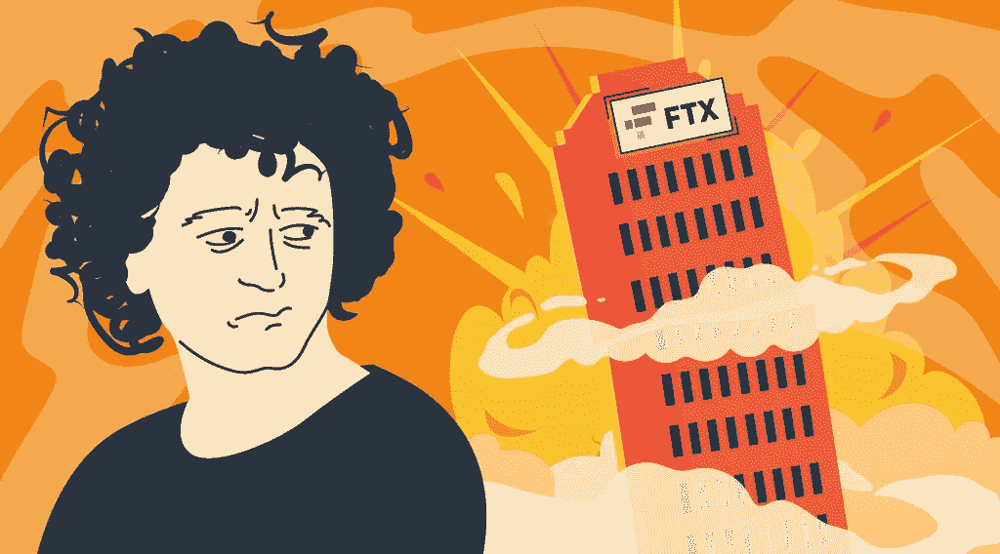
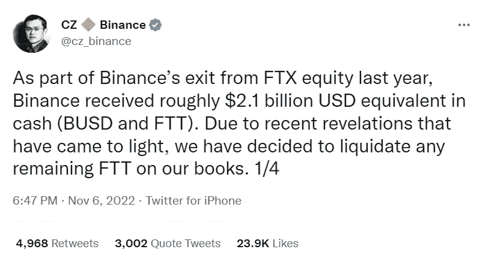
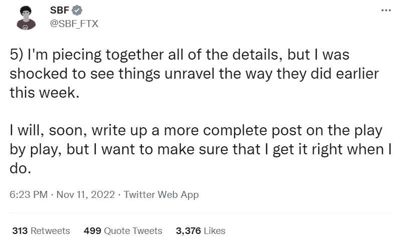
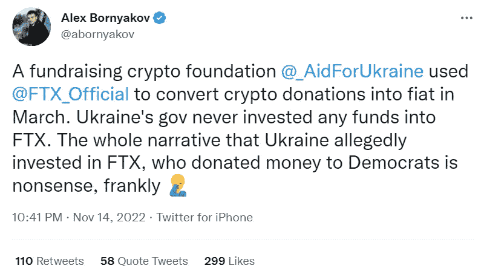

# FTX 交易所:最大的密码交易所之一的崩溃

> 原文：<https://medium.com/coinmonks/ftx-exchange-the-collapse-of-one-of-the-largest-crypto-exchanges-fe1e389fe858?source=collection_archive---------6----------------------->

2022 年，密码行业经历了一系列冲击，加剧了整体市场的负面趋势。首先，5 月份发生的 Terra stablecoin 的惊人下跌使整个加密市场变得不稳定，在这个领域抹去了 2000 多亿美元。今年 6 月，Celsius 发布了一份备忘录，通知用户它已经冻结了他们的资产，导致比特币和其他密码的价格随之下跌。最近一次争议发生在今年 11 月，当时最大的加密交易所之一“FTX”倒闭。那么，FTX 证券交易所是怎么发生的，为什么？

# 什么是 FTX 交易所？

FTX 加密交易所是一家领先的中央加密货币交易所，专注于衍生品和杠杆产品。萨姆·班克曼-弗里德于 2019 年 5 月创立了 FTX，FTX 开始在阿拉米达研究公司工作，这是一家由班克曼-弗里德、卡罗琳·埃里森和简街的其他前员工于 2017 年在加利福尼亚州伯克利创立的交易公司。

FTX 提供一系列交易产品，包括衍生品、期权、波动性产品和杠杆代币。它还在 300 多个加密货币交易对中提供现货市场，如 BTC/USDT、瑞士联邦理工学院/USDT、XRP/USDT 及其本国货币 FTT/USDT。

在 2021 年 7 月的高峰期，FTX 拥有超过 100 万用户，按交易量计算是第三大加密货币交易所。FTX 在安提瓜和巴布达注册成立，总部设在巴哈马。密码交易所与 FTX 关系密切。美国，美国居民可以使用的独立交易所。总部位于巴哈马群岛的 FTX 及其 FTX 美国子公司的管理团队重叠，但资本结构独立。美国居民只能通过美国 FTX 进行交易。

该公司发展迅速，并与多家公司成功合作。在班克曼-弗里德创办公司六个月后，币安的赵昌鹏以大约 1 亿美元的价格购买了 FTX 20%的股份。2021 年 7 月，FTX 从 60 多位投资者那里筹集了 9 亿美元，估值为 180 亿美元，其中包括软银、红杉资本和其他公司。此外，Bankman-Fried 以大约 20 亿美元的价格收购了赵的股份。

FTX 主要是通过一系列高调的收购、激进的营销策略和低廉的交易费用而走红的。主要的风险投资集团也参与进来，向该公司投资了近 20 亿美元。

# FTX 的第一个问题

由于整体市场衰退，更广泛的加密行业衰退已经迫使许多主要平台关闭，但 FTX 似乎不受影响，甚至收购了一些苦苦挣扎的竞争对手。

但本月早些时候，事情开始发生变化，一家专注于加密的数字媒体网站 CoinDesk 公布了一家加密投资公司的资产负债表，该公司也由 Bankman-Fried，Alameda Research 所有。它显示阿拉米达持有大量由 FTX 创造的名为 FTT 的加密令牌。尽管 FTT 密码拥有一定市场价值，但如果价格下跌，阿拉米达将面临破产的风险。

FTT 由 FTX 交易所铸造，并作为奖励发放给用户。FTT 硬币也不如其他代币透明，很难追踪到底制造了多少代币。人们可以买卖 FTT，但交易相对有限。其他平台也持有令牌。

# 围绕 FTX 密码交易所和 FTT 令牌的丑闻

在阿拉米达的资产负债表被泄露后，赵昌鹏在 11 月 6 日宣布，他的公司[将出售其所有的 FTT 代币](https://twitter.com/cz_binance/status/1589283421704290306?lang=en)。

FTT 币的价格急剧下跌。泄露的资产负债表为批评者提供了更多素材，这些批评者称，SBF 的交易公司与其交易所之间存在不健康的重叠。但是，正如赵自己所暗示的那样，卖掉他的代币的决定显然另有隐情。

与此同时，随着价格下跌，许多 FTX 客户开始从该平台撤出资产。虽然阿拉米达和 FTX 之间的联系程度尚未公开，但最近一系列加密平台崩溃已经让加密社区紧张不安。这些提款最终将类似于经典的银行挤兑，即担心银行偿付能力的人们在银行现金耗尽之前匆忙取出自己的钱。数十亿美元从平台上涌出。这决定了 FTX 的命运。11 月 8 日，FTX 停止允许客户从平台上取钱。

# 危机及其后果

包括《彭博》、《金融时报》、《华尔街日报》等媒体机构援引匿名消息称，FTX 需要 80 亿美元来填补其债务和支付能力之间的缺口。NBC 新闻尚未证实这些报道，班克曼-弗里德在采访中表示，他需要在未来两周内筹集 80 亿美元，以纠正账户持有人的问题。一些消息来源称，阿拉米达利用 FTX 基金进行交易。

据报道，在 FTX 破产后，山姆·班克斯曼·弗里德辞去了首席执行官的职务，并被报道已移居阿根廷。虽然这些传言可能不是真的，但由于他住在拿骚，他在事件发生后不久就在推特上发表了他对公司危机的看法。

Sam Bankman-Fried 也证实，该交易所利用阿拉米达的银行账户电汇客户存款。据报道，一些客户被要求通过阿拉米达汇款，阿拉米达与金融科技银行 Silvergate Capital 有银行合作关系。阿拉米达和 FTX 在客户资金问题上的冲突后来成为失败的主要原因。班克曼-弗里德声称，尽管 FTX 从未拿用户的钱去赌博，但它确实把钱借给了阿拉米达。这位前首席执行官声称，他认为阿拉米达有足够的抵押品来支持贷款，但正如报道所言，其中大部分是在本地 FTX 令牌。

曾经价值 320 亿美元的全球帝国在最近几周已经崩溃。因此，竞争对手币安在面临流动性紧缩时签署了收购 FTX 国际业务的意向书。

# 掉进兔子洞

随着故事的展开，我们越来越多地了解到臭名昭著的密码交易所以及班克曼-弗里德一直在做什么。而这个传奇似乎没完没了。总而言之，班克曼-弗里德的大部分净资产在一天之内从 156 亿美元下降到 10 亿美元。这发生在他的加密货币交易所 FTX 需要救助的消息传出后。现在，多达 20 亿美元的客户资金不翼而飞——人们开始质疑班克曼-弗里德是如何为他的高端生活方式提供资金的。

根据一名破产律师和 Sullivan & Cromwell 重组合伙人詹姆斯·布罗姆利(James Bromley)的说法，FTX 花了大约 3 亿美元在巴哈马群岛为高管们买房子。这些律师正在帮助指导 FTX 通过破产程序，在 FTX 申请破产后，客户希望他们能够至少收回部分资金。

布罗姆利说，该公司是由“一小群缺乏经验和经验的人”经营的。他还说，FTX 网络中的公司拥有“不可靠的账簿和记录”Bromley 说，截至 10 月底，FTX 集团有 520 名员工，包括在美国公司注册的全球 330 名员工。他说，后者已降至 260 左右。一位知情人士对最大的秘密消息来源之一说，整个操作是由巴哈马的一帮孩子操纵的。

当他的加密货币交易所在 11 月初开始摇摇欲坠时，Sam Bankman-Fried 在 Twitter 上安抚大家。阿拉米达的首席执行官卡罗琳·埃里森女士是一个在密码圈之外鲜为人知的人物，她一再声称班克曼-弗里德先生的帝国财务基础稳固。

# 阴谋论

崩溃导致一些社交媒体用户声称，加密货币交易所正在清洗美国向乌克兰提供的援助，并将其传递给民主党人，以帮助中期选举。

的确，班克曼-弗里德向民主党人捐赠了大笔资金。记录显示，何和其他 FTX 高管也曾向保守团体捐款。事实上，乌克兰与 FTX 合作推出了一个网站，允许人们捐赠加密货币来支持乌克兰，但多名涉案人员否认了洗钱指控。乌克兰数字转型部副部长 Alex Bornyakov 在 Twitter 上说，乌克兰政府从未向 FTX 投资任何资金。

美国国务院首席副发言人韦丹特·帕特尔(Vedant Patel)说，我们现有的监督机制没有发现资金的预期用途出现偏差。美国国际开发署(u . s . Agency for International Development)的一名发言人表示，世界银行实施的这些保障措施，加上乌克兰政府内部的第三方专家监督支持，确保了资金使用的问责制。然而，尽管有争议的声明，FTX 和代表该公司的律师没有回应置评请求。

# 结论

FTX 的垮台震惊了整个密码界。尽管臭名昭著的加密交易所的命运未知，但不难看出，它将需要很长时间才能恢复，如果有的话。调查刚刚开始，所以我们可以放心，许多新的细节将会出现。

如果你想安全地购买密码，你可以随时使用用户友好的非托管的 [StealthEX](https://stealthex.io/) 密码交换平台。您可以私下购买 crypto，无需注册该服务。我们的加密收藏有 600 多种不同的硬币，您可以立即进行钱包到钱包的转账，没有任何问题。

只需进入[stealth x](https://stealthex.io/)并遵循这些简单的步骤:

1.  选择要兑换的货币对和金额。例如，BTC 到瑞士联邦理工学院。
2.  按下“开始交换”按钮。
3.  提供要将您的加密传送到的收件人地址。
4.  处理交易。
5.  接收您的加密硬币。

在[媒体](https://stealthex-io.medium.com/)、[推特](https://twitter.com/Stealthex_io)、[电报](https://t.me/StealthEX)、 [YouTube](https://www.youtube.com/channel/UCeES_XBesX76ge7xf1meuSw) 和 [Publish0x](https://www.publish0x.com/stealthex) 上关注我们，了解关于 [StealthEX.io](https://stealthex.io/) 和其他秘密世界的最新消息。

在购买任何密码之前，不要忘记做自己的研究。本文表达的观点和意见仅代表作者个人。

*原载于***👈**

> **交易新手？尝试[加密交易机器人](/coinmonks/crypto-trading-bot-c2ffce8acb2a)或[复制交易](/coinmonks/top-10-crypto-copy-trading-platforms-for-beginners-d0c37c7d698c)**