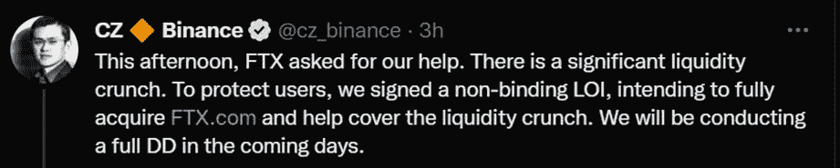
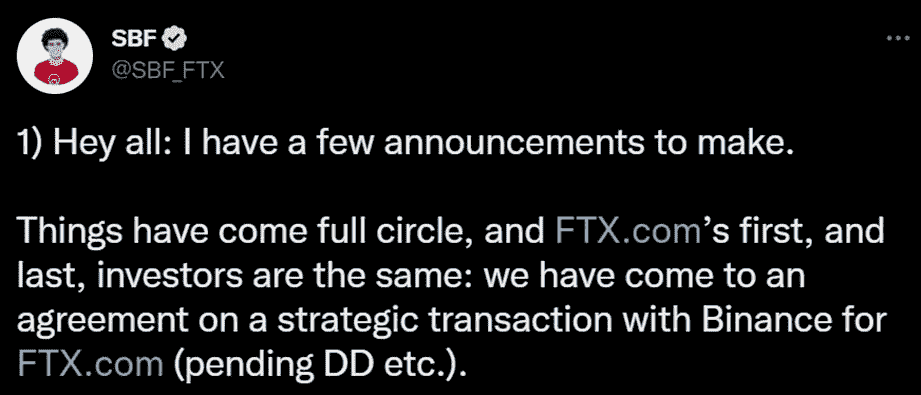
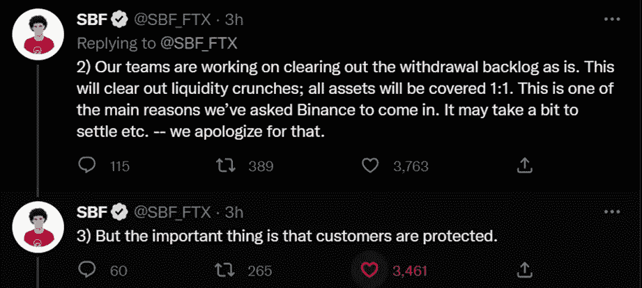
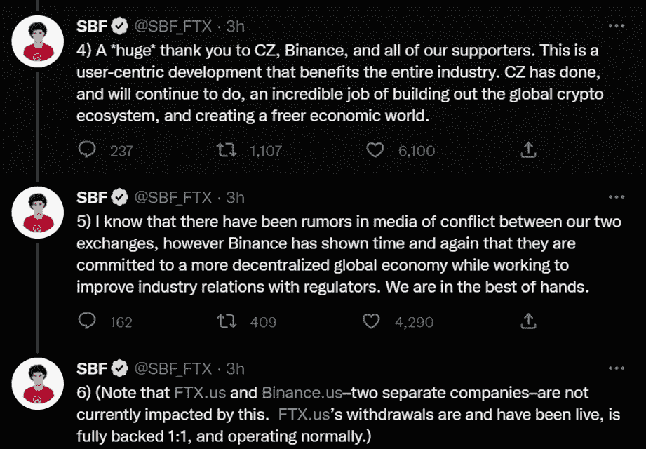

# FTX 交易所的急剧下跌

> 原文：<https://medium.com/coinmonks/ftx-exchanges-precipitous-decline-f49ef77c47f0?source=collection_archive---------48----------------------->

几天来，我们一直在关注一些新闻，这些新闻显然震惊了我们许多在加密货币世界中生活的人，同样也是因为加密货币交易所首席执行官“CZ”赵昌鹏和交易所首席执行官 Sam Bankman-Fried(更好地称为)所做的声明。

CZ 表示，他的公司将清算其持有的 Token 的全部股份，赵表示，这一决定是在“最近的披露曝光”之后做出的
解释说，FTT 的清算“只是退出后的风险管理”，指的是从 Terra 的 Luna Classic(Luna Classic)崩盘中吸取的教训，以及它对市场参与者的影响。

整个行动是在 Sam Bankman-Fried 创立的 Alameda Research 最近泄露的资产负债表之后进行的，该公司声称 Alameda 的数十亿美元资产与 FTX 代币有关联。
然而，Alameda Research 首席执行官卡罗琳·埃里森(Caroline Ellison)在 11 月 6 日的一条推文中表示，资产负债表并没有反映真实情况，并指出有问题的资产负债表只是“我们公司实体的一个子集，其他价值超过 100 亿美元的资产并没有反映在那里。”

中国出生的 CZ 澄清说，他们可以在几个月内完成 FTT 的销售，以尽量减少此举对市场的影响。他认为这不是针对 FTX 的行动。

到目前为止，币安的首席执行官没有明确说明最近披露了什么。FTX 首席执行官山姆·班克曼-弗里德也没有，他只是在推特上写道，“我们都在一起，我祝愿每个人都能最好地推动这个行业向前发展。因为我非常尊重他们为建立我们今天看到的这个行业所做的一切，无论他们是否回报，无论我们是否使用这些方法。包括 CZ。”

鉴于这种情况，有人担心级联清算将产生所谓的死亡螺旋或对加密货币行业的巨大损害。

FTX 交易所首席执行官萨姆·班克曼-弗里德在 11 月 7 日说，“一个竞争对手正试图用虚假的谣言来追赶我们。”他澄清说，FTX 和资产是好的。

SBM 澄清说，FTX 有足够的资金来支付所有客户的持股。我们不投资客户资产(甚至不投资国债)。他表示:我们一直在处理所有提款，并将继续这样做。他补充说，它受到严格的监管，即使它让我们慢了下来。

反过来，FTX 首席执行官强调，他们有超过 10 亿美元的超额现金 GAAP 审计。他评论说，他们在保护客户资产方面有着悠久的历史，这一点在今天依然如此。

有鉴于此，他以一条标注币安首席执行官的信息结束，告诉他，如果他们能够为生态系统而合作，他会很高兴。此前一天，赵昌鹏的言论导致 FTT 价格在几个小时内下跌了 15%。

然而，今天下午两位首席执行官都发表了声明，似乎他们达成了一项协议，以维持市场和他们努力工作的项目。

以下是我从推特网上搜集到的，供大家了解和评价。

最后的交易是将出售给赵昌鹏，在我个人看来，整个加密市场都受到了影响，这是所有货币下跌的原因之一。

因此，如果交易最终完成，两家交易所巨头可能会合二为一。

> 交易新手？试试[加密交易机器人](/coinmonks/crypto-trading-bot-c2ffce8acb2a)或者[复制交易](/coinmonks/top-10-crypto-copy-trading-platforms-for-beginners-d0c37c7d698c)