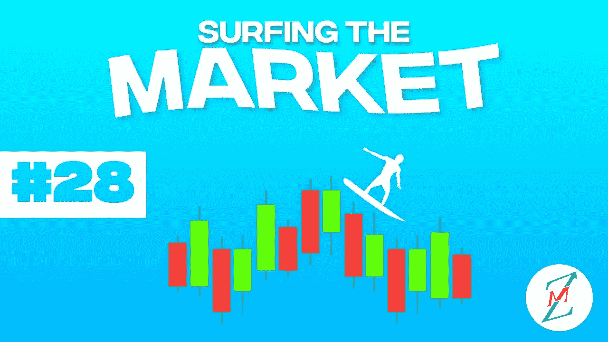
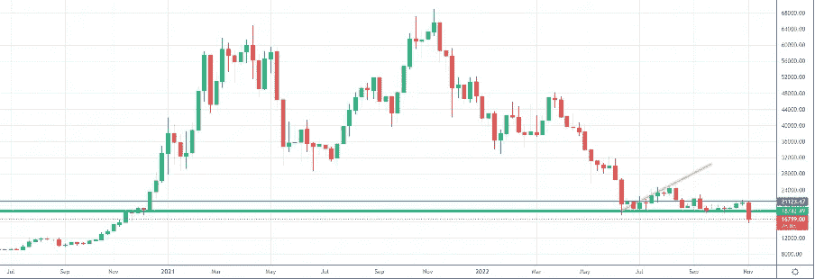
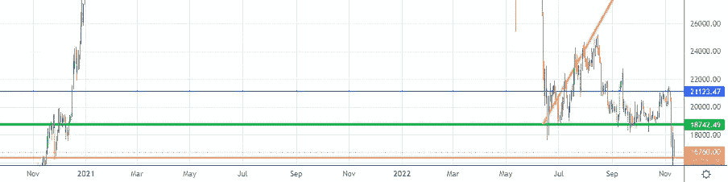
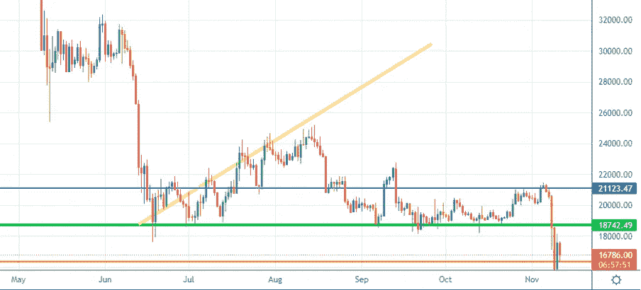
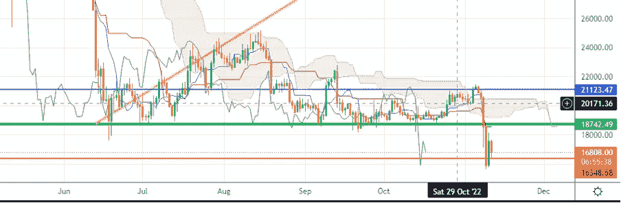
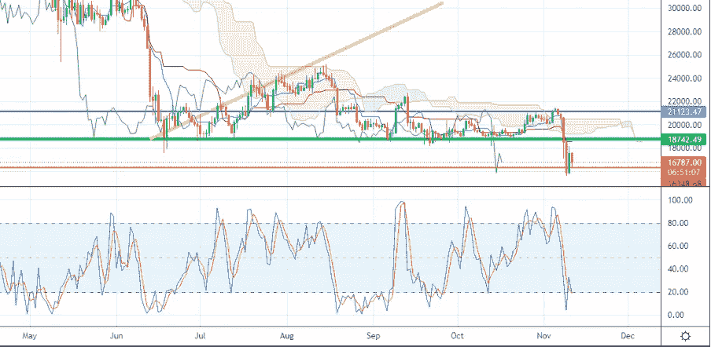

# FTX 申请破产，比特币下跌

> 原文：<https://medium.com/coinmonks/ftx-files-for-bankruptcy-and-bitcoin-drops-6180f64d4771?source=collection_archive---------8----------------------->

我们将进入什么样的市场阶段一直是我们上次约会的开场白问题。我们要听牛市还是熊市？我们会看到牛市还是熊市？
欢迎来到“市场冲浪”,我们已经进行了第 28 次约会，我希望通过这些简单的技术分析，我们已经在某些方面帮助了你，甚至只是评估不同的市场观点。

## 让我们从我们通常的每周视角开始

WEEKLY CHART — Source: Tradingview

由于本周关于 FTX 的重大新闻，价格已经打破了绿色支持。一些错误的人的推文，一个公司就会破产。在 FTX 申请破产之后，其他 130 家公司也申请了破产，因为他们可能把公司的资金留在了 FTX。

如果你想知道我个人对 FTX 局势的看法和后果，请阅读我的上一篇文章
[https://medium . com/coin monks/币安-to-acquire-ftx-is-Chang Peng-Zao-a-new-elon-musk-C4 D8 D1 a3 CB 21](/coinmonks/binance-to-acquire-ftx-is-changpeng-zao-a-new-elon-musk-c4d8d1a3cb21)

昨天唯一的好消息是美国的通货膨胀数据，低于预期。

我将继续引用我自己的话:
“如前所述，在我个人看来，如果出现重大坏消息，如巨大的电力危机、移动网络危机或来自俄罗斯的天然气限制，比特币价格只能跌至 15000 美元。”
嗯，在这种情况下，重大事件发生了，但我没有考虑一级交易所的违约

## 从日常角度来看，我期望什么？

DAYLY CHART — Source: Tradingview

DAYLY CHART — Source: Tradingview

价格在橙色支撑区反弹，比 2021 年底回落了一个水平。我预计这一水平可以保持一点，但现在的情绪非常悲观，因为许多投资者对交易所和加密货币失去了信心

50MA 和 200MA 此时不再提供更多信息。

DAYLY CHART — Source: Tradingview

市目云尚远，云未近青级。

DAYLY CHART — Source: Tradingview

随机指标当然已经跌入超卖区，但我现在对这个指标不太有信心，因为现在这个消息肯定会比传统的技术分析有更广泛的影响。

**特别观察什么？**

我很乐观，因为不可预知的事情发生了。所以现在，我对市场的下一步走势非常谨慎，这可能会受到阿拉米达和 FTX 事件的谣言和行动的影响。

让我知道你对这个新的每周约会的想法，以及你希望更多地考虑(或甚至解释)哪些指标。

请继续关注，当我的内容出来时，请务必关注。

## 促销建议

*还有一件事*:如果你真的不关心技术分析，或者你不喜欢花时间在市场上，一定要去看看[zig nali](https://zignaly.com/app/signup/?invite=mikezillo)平台，这是币安的一个官方经纪合作伙伴，管理着巨大的交易量。他们提供很好的利润分享交易服务，你可以模仿其他专业交易者，与他们分享利润！一定要给个眼神！

如果您有兴趣提前了解我们合作伙伴的指标发布情况，请在此留下评论，以便我们了解您是否有兴趣！

> **我写的任何东西都不能代表任何形式的财务建议。所以，在采取任何行动之前，先做好自己的研究。**

> 交易新手？尝试[加密交易机器人](/coinmonks/crypto-trading-bot-c2ffce8acb2a)或[复制交易](/coinmonks/top-10-crypto-copy-trading-platforms-for-beginners-d0c37c7d698c)