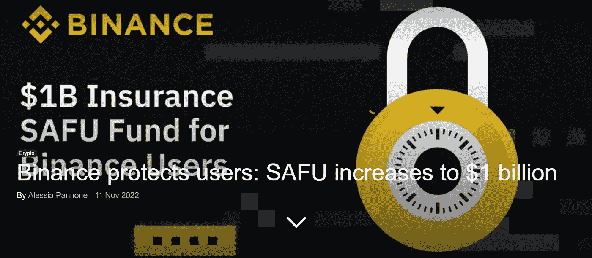
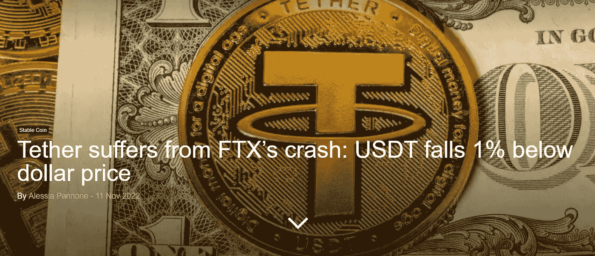

# FTX 破产了，下一个会是谁？Crypto.com？Gate.io？

> 原文：<https://medium.com/coinmonks/ftx-has-fallen-into-bankruptcy-who-could-be-next-crypto-com-gate-io-28db5175468a?source=collection_archive---------19----------------------->

FTX 事件之后，加密市场陷入了真正的混乱，本周的新闻也证实了这一点！

 [## BlockFi 限制平台活动，包括暂停客户取款

### 加密贷款公司 BlockFi 已停止其平台上的客户取款，作为对平台活动的更广泛限制的一部分…

cointelegraph.com](https://cointelegraph.com/news/blockfi-limits-platform-activity-including-a-halt-on-client-withdrawals) 

这是暴风雨前的宁静:BlockFi 也在申请破产。FTX 崩盘注定了这一时期的市场，我们现在必须应对它。

[https://en . crypto nomist . ch/2022/11/11/币安-raises-safu-10 亿/](https://en.cryptonomist.ch/2022/11/11/binance-raises-safu-1-billion/)

有了外汇储备的证明，币安成为了许多其它交易所的检验对象。FTX 违约后，大量用户涌入币安和其他交易所，被迫证明自己的储备。如果他们不这样做，他们就会起疑心。通过这样做，让币安知道他们的口袋有多深，最终再次玩类似的把戏，就像 FUD 对 FTX 所发生的那样，使其崩溃。

[https://en . crypto nomist . ch/2022/11/11/tether-beares-coll pase-fty/](https://en.cryptonomist.ch/2022/11/11/tether-suffers-collpase-fty/)

FTX 违约后，人民币汇率有所波动，但设法恢复了与美元的挂钩。Tether 最近被证明有一些很深的储备，可以被称为稳定硬币。因此就目前而言，USDT 和 BUSD 似乎是最稳定和可靠的稳定-硬币进入市场。即使广泛集中。

 [## Crypto.com 交易所暂停对索拉纳区块链撤回加密价格崩溃-另一个…

### 主要的加密货币交易所 Crypto.com 已经暂停了 USDT 和…

cryptonews.com](https://cryptonews.com/news/cryptocom-exchange-suspends-withdrawals-solana-blockchain-as-crypto-prices-crash-another-exchange-trouble.htm) 

Crypto.com 是下一个破产的交易所吗？还是会是 Gate.io？[在我几天前写的最后一篇文章](/illumination/is-gate-io-the-next-exchange-to-blow-up-fd131ce515e7?source=your_stories_page-------------------------------------)中，我指出了发生在 Gate.io 储量证明附近的奇异巧合

> 交易新手？尝试[加密交易机器人](/coinmonks/crypto-trading-bot-c2ffce8acb2a)或[复制交易](/coinmonks/top-10-crypto-copy-trading-platforms-for-beginners-d0c37c7d698c)