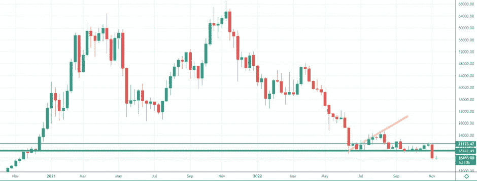
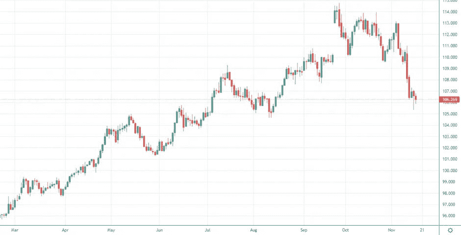
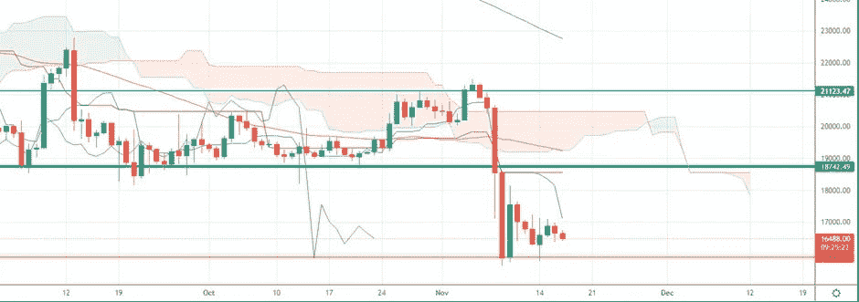
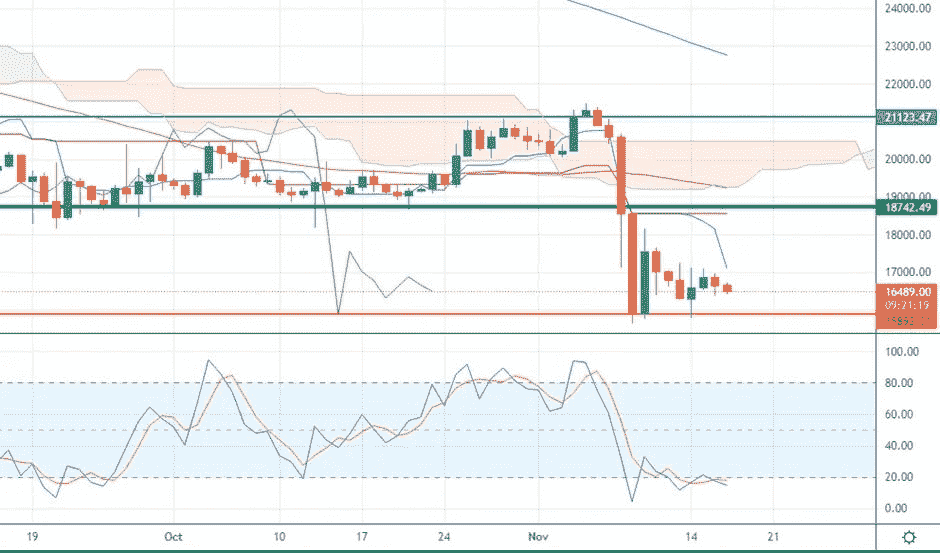

# FTX 续集——区块链破产，市场持续下跌

> 原文：<https://medium.com/coinmonks/ftx-sequel-blockfi-bankrupts-and-the-market-keep-plunging-7e3ec13a8889?source=collection_archive---------37----------------------->

我们将进入什么样的市场阶段一直是我们上次约会的开场白问题。我们要听牛市还是熊市？我们会看到牛市还是熊市？
欢迎来到“市场冲浪”,我们已经进行了第 28 次约会，我希望通过这些简单的技术分析，我们已经在某些方面帮助了你，甚至只是评估不同的市场观点。

# 让我们从我们通常的每周视角开始

DAYLY CHART — Source: Tradingview

橙色支撑目前正在抵制，即使我不排除在即将到来的周末会出现一些假突破，在周末交易量会减少，市场可能更容易定向。

Source: Dollar stregth Index

美元强势指数正在下跌，最终使资产在我们的帮助下经历了一轮牛市后得到喘息的机会。一旦其他交易所崩溃的不确定消息停止流传，这一方面可能会导致比特币的潜在飙升。DXY 的这种模式是比特币恢复更高水平的最佳机会之一，比如在 18700 美元区域的绿线之上。

50MA 和 200MA 此时不再提供更多信息。

DAYLY CHART — Source: Tradingview

Ichimoku 云仍然很远，并且云正在当前的价格水平上建立。从“交易角度”来看，这意味着在未来几天，价格很可能会向上突破。从数学角度来看，这种“交易观点”没有任何意义，因为云必然具有这种演变形式，因为没有这些新价格水平的近期历史。所以不要被骗了。

DAYLY CHART — Source: Tradingview

随机指标仍处于超卖区，并且已经持续了一周。从统计数字来看，我们可能会在未来几天面临价格上涨(如果没有重大新闻发生)。

# 有什么特别要观察的？

由于外汇储备审计证明和更多 FUD 可能进入，整个加密货币市场现在处于不确定的时刻。我想再次看涨，但我现在更愿意谨慎地观察未来几天(和几周)可能会发生什么。无论如何，我会开一个小多头头寸，试图利用潜在的积极消息或 DXY 开始发挥其作用。
让我知道你对这个新的每周约会的看法，以及你希望更多地考虑(或甚至解释)哪些指标。
请继续关注，当我的内容发布时，请务必关注。

# 促销建议

***还有一件事*** :如果你真的不关心技术分析，或者你不喜欢花时间在市场上，一定要看看 [Zignaly](https://zignaly.com/app/signup/?invite=mikezillo) 平台，这是一个管理着巨大交易量的币安官方经纪合作伙伴。他们提供很好的利润分享交易服务，你可以模仿其他专业交易者，与他们分享利润！一定要给个眼神！
如果您有兴趣提前了解我们合作伙伴的指标发布情况，请在此留下评论，以便我们了解您是否有兴趣！

> 我写的任何内容都不能代表任何形式的财务建议。所以，在采取任何行动之前，先做好自己的研究。

> 交易新手？尝试[加密交易机器人](/coinmonks/crypto-trading-bot-c2ffce8acb2a)或[复制交易](/coinmonks/top-10-crypto-copy-trading-platforms-for-beginners-d0c37c7d698c)