# FTX，余波:2023 年比特币基地最值得购买的十大密码

> 原文：<https://medium.com/coinmonks/ftx-the-aftermath-top-10-cryptos-to-buy-on-coinbase-for-2023-9dd3c66f6013?source=collection_archive---------8----------------------->

如此正确的人怎么会如此错误？

在我讲述上个月我[错过的所有事情之前，我想分享一下我做对了的一点智慧:](/coinmonks/top-10-cryptos-to-buy-on-coinbase-in-november-2022-fa752a5d8a28)

> 所以原谅我，如果我认为外面还有危险。。。
> 
> 我们不会在永久的基础上更高，直到所有这些有毒的愚蠢被冲走。

我一点也不知道这个愚蠢的想法来自房间里最聪明的人。

Seems kind of obvious now, doesn’t it.

但是，与其把 FTX 自焚看作是不使用 crypto(T7)的理由，我倒不如把它看作是让 crypto(T8)加入 crypto(T9)的理由。为什么？因为那些不在的人，大部分情况下，**没有得到**。如果你从传统媒体获得消息，你可能会被告知山姆·班克曼-弗里德是一个有远见的人，或者是一个连基本的会计都懒得管的学者兼慈善家，或者——以防这让他显得太过有罪——是一个银行挤兑的受害者。

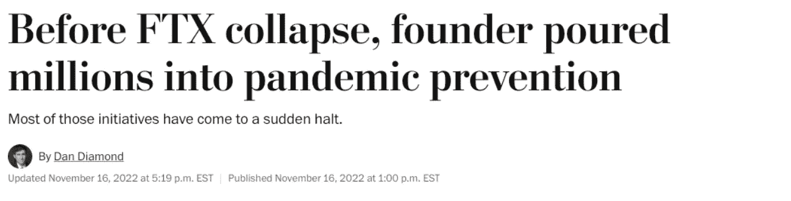

Find someone who loves you as much as this toady loves SBF. **Where do you think he got the money, Dan?**

问一个有史以来最反问的问题:**你在耍我吗？阿拉米达拿走了不少于 100 亿美元的 FTX 客户存款。。。**丢了吧**。天哪，我不知道怎么可能会输掉那么多钱。我甚至认为他们不知道。但是当[有人真的找](https://www.coindesk.com/business/2022/11/02/divisions-in-sam-bankman-frieds-crypto-empire-blur-on-his-trading-titan-alamedas-balance-sheet/)的时候，除了借条和[蟑螂](https://decrypt.co/116593/knockoff-lotions-weight-loss-drugs-chinese-news-sites-inside-alamedas-investment-portfolio)什么都没找到。称 FTX 为“纸牌屋”是对纸牌结构完整性的侮辱。**

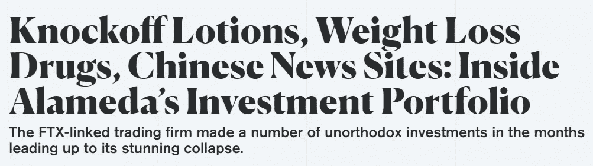

“Unorthodox”? That’s one way of putting it. Even if you were **trying** to lose $16 billion, I don’t think you could have done it any faster than these dumbasses.

SBF，一个被认为是世界级的天才，有 11 个人物供他支配，甚至没有在一座形似巨大头骨的山中建造一个邪恶的恶棍巢穴。 [*NGMI。*](https://www.coinex.com/blog/en_US/1676-crypto-slangs-acronym-gm-ngmi-wagmi-meaning)

说到 NGMI，几乎唯一比 TradPress 更令人作呕的行为是那些认为他们有权利——或者见鬼，甚至有**能力**——以“消费者保护”的名义监管像 FTX 这样的公司的人

“FTX 的内爆应该是一个警钟，”参议员伊丽莎白·沃伦(D-MA)捏着鼻子，在《华尔街日报》的专栏文章中大声说道。她按响自行车喇叭，继续说道:“在下一场加密灾难拖垮我们的经济之前，国会必须堵住我们监管结构中剩余的漏洞。”

她并不孤单。国会议员。。。想要[调查 FTX](https://www.reuters.com/technology/us-senate-hold-ftx-hearing-dec-1-cftc-chairman-testify-2022-11-21/) 并保护人们免于未来的破产。美国国会。

我再问一次: ***你他妈的在耍我吗？***

不管你怎么说 SBF——不，等等，请允许我说:他是一个苍白的妖精，在巴哈马生活和工作，但不知何故从没见过太阳，如果你在字典里查“特权”,你会看到他和他那愚蠢的老鼠窝头发的照片——但至少他很正派，在把钱花在 Adderall 和 degen sh*tcoins 上之前，只困住了他自己的**受害者。国会浪费了美国人缴纳的每一分钱，就像狂欢节彩车上的珠子一样四处乱扔，甚至让还未出生的几代人破产。**

FTX 的资金缺口在 80 亿到 160 亿美元之间——这些数字模糊不清，部分是因为很多数字都是编造的——但是美国政府目前的债务是 31 万亿美元。国会调查 FTX 就像 535 个吸血鬼调查一只蚊子。几十年来，他们的资产负债表一直是欠条和蟑螂。**。这个想法已经滑稽到了滑稽模仿的地步，而事实是，显然没有人说有史以来最大的谎言是令人愤怒的。**

但是，即使华盛顿目前不是金融渎职的污水排放线，如果可以制定监管来阻止 SBF，也可以阻止伯尼·马多夫(Bernie Madoff)，他只能依靠小丑般的打卡“监管者”维持他的庞氏骗局几十年，这些监管者要么不知道他们无能的眼睛在看什么，要么是骗局的容易目标(或者，可能是他们自己在受贿)。

SBF 当然明白这一点，因为他用偷来的钱填满了当前执政党的口袋，试图游说偷来的钱的最终提供者制定法律，允许他继续偷钱。正如主流媒体一样，[魅力攻势](https://twitter.com/ElliottFryback/status/1468679048993800195?ref_src=twsrc%5Etfw%7Ctwcamp%5Etweetembed%7Ctwterm%5E1468679048993800195%7Ctwgr%5Ec5298d09d5335622381ad5376053ac350fb692fc%7Ctwcon%5Es1_&ref_url=https%3A%2F%2Fwww.thegatewaypundit.com%2F2022%2F12%2Fdemocrat-rep-maxine-waters-praises-ftx-founder-new-tweet%2F)仍在发挥作用[:](https://twitter.com/RepMaxineWaters/status/1598693811252875264)

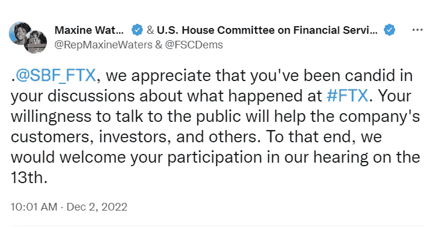

This is a co-tweet from the U.S. House Committee on Financial Services and the soon-to-be-outgoing imbecile who chairs it. This was SBF being candid: [“I had a bad month.”](https://www.vanityfair.com/news/2022/11/sam-bankman-fried-ftx-new-york-times-dealbook-interview#intcid=_vanity-fair-bottom-recirc_63464784-300f-4193-8f96-7ff694b9a350_cral2-2) Oh, FFS. Go [blow him another kiss](https://twitter.com/ElliottFryback/status/1468679048993800195?ref_src=twsrc%5Etfw%7Ctwcamp%5Etweetembed%7Ctwterm%5E1468679048993800195%7Ctwgr%5Ec5298d09d5335622381ad5376053ac350fb692fc%7Ctwcon%5Es1_&ref_url=https%3A%2F%2Fwww.thegatewaypundit.com%2F2022%2F12%2Fdemocrat-rep-maxine-waters-praises-ftx-founder-new-tweet%2F), Rep. Waters.

那些想对我们进行监管的人会试图将原本不应该如此的事情集中化，甚至连 FTX 的内爆应该是去中心化的胜利这一点该死的线索都没有。我们要感谢 CoinDesk，因为它最初的报道让我们看到了 FTX 的蟑螂。当《纽约时报》*、*《华盛顿邮报》*、*《华尔街日报》*正在拿护膝和漱口水的时候，一些最大的推特迷提供了实时更新。*

如果 FTX 是分散的而不是“CeDeFi”呢？

. . . for now.

我们的领导人，几乎一个人，要么不知道他们在做什么，要么他们知道，并利用这一点来丰富自己和/或破产我们。他们是 NGMI。希望他们不会把我们也拖下水。

与此同时，我们中的一些人确实上当了，包括。。。[咳咳](/coinmonks/top-10-cryptos-to-buy-on-coinbase-in-october-2022-8b0400d755e1)。。。

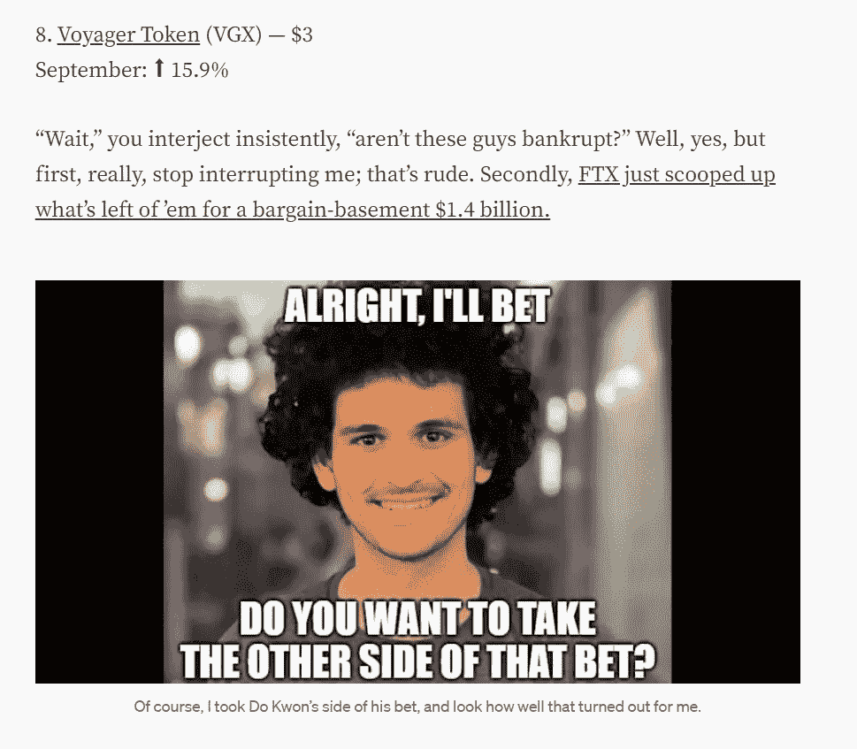

It’s holding up better than my LUNA shilling, FWIW.

也就是说，自从[毁灭地球生态系统](/coinmonks/moonfall-721d5406b57)以来，[的一些悲观主义者一直在期待其他人倒下](/coinmonks/wtf-ccbbb482078b)。

我太聪明了，不会成为他们中的一员，诺西莉！

> 。。。LUNA/Celsius/3AC ménage à twerp 似乎是一个完美的愚蠢圈子，传染仅限于他们自己。
> 
> 处于悬崖边缘的其他人都是如此微不足道的角色，以至于山姆·班克曼-弗里德可以成为一个人的救助机器，这是有道理的。我的意思是，这个人的名字字面上是银行。

有可能 FTX 是这场秘密红色婚礼的最终受害者，而市场已经将死神索取另一具尸体的价格计算在内。股票似乎很好地经受住了这场风暴:

1600 → 1000 is nothing to joke about, unless it’s this year.

但我不想再假设这一切都是向上的了。就像腹泻、性传播感染和印第安纳琼斯续集一样，加密崩溃往往会在你认为它们已经消失的时候发生(这里是我宣布我们将不会在 3 月 15 日看到 2 万美元的 BTC)。

所以这个列表会强大到令人厌烦的地步。现在不是和一袋猪结婚的时候。第一条规则是**不要得到**[***rekt***](https://coinmarketcap.com/alexandria/glossary/rekt)。

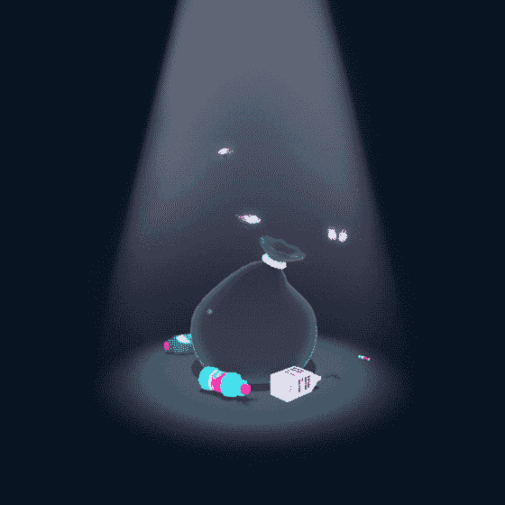

Pictured: “*Indiana Jones 5"*

和往常一样:每枚硬币旁边是我在 100 美元头寸中会分配多少。但是，我不是理财顾问，不知道您的具体投资需求。假设我在某个时候拥有所有这些硬币，现在拥有其中的大部分，并且当你读到这篇文章的时候可能会拥有其中的一些。不足以说明问题。#DYOR

💩💩💩💩💩

1.**比特币**([BTC](https://www.coinbase.com/price/bitcoin))——50 美元
11 月:️️⬇️ 16.2%

是的，一半，老实说应该更多。

king crypto 没有直接的 FTX 敞口，因为他们的资产负债表上有 14 亿美元的比特币负债，但没有比特币资产。据推测，SBF 公司在人们意识到他们真的完了之前就已经卖了他们想要的东西。

然而，负面 pin 效应可能会延伸到比特币。今年早些时候， [SBF 向 BlockFi 贷款 2.5 亿美元](https://twitter.com/sbf_ftx/status/1539268631095152642)，然后 FTX.us 暗示可能[完全收购它们](https://cryptobriefing.com/blockfi-could-be-acquired-by-ftx-us-for-only-15m-report/)。显然，那从未发生过，他们[上周](https://www.coindesk.com/policy/2022/11/28/ftx-fallout-continues-as-crypto-lender-blockfi-declares-bankruptcy/)断气了。

反过来，BlockFi 是[灰度比特币信托](https://grayscale.com/products/grayscale-bitcoin-trust/)的第二大持有人，该资产为更广泛的股票市场提供比特币敞口，但目前正乘坐[快速电梯前往地狱](https://twitter.com/nsquaredmacro/status/1600536152783601666)。FUD 的*变得如此之厚，以至于格雷德在推特上证实[比特币基地拥有他们资产的每一分钱](https://twitter.com/Grayscale/status/1593737739442200578)。有些人认为这不够透明，忘记了[如果是链上的，那就是透明的](https://news.bitcoin.com/onchain-analysis-verifies-the-number-of-btc-held-by-grayscales-bitcoin-trust/)。*

*声明一下，我不相信灰色 FUD(虽然我绝对不是一个买家)，我也不认为纽约州最近禁止工作证明采矿是一个坏兆头。如果这是一个受欢迎的想法，最近重新当选的州长凯西·霍楚尔不会等到她令人惊讶的激烈竞争的竞选活动后**才签署成为法律。***

*然而，矿业公司面临着一个问题，因为他们的清算造成了抛售压力。但这并不新鲜，因为这个 [2018 头条证明了](https://news.bitcoin.com/miner-goes-bankrupt-manufacturers-stuck-with-inventory-old-rigs-sold-for-scraps/):*

*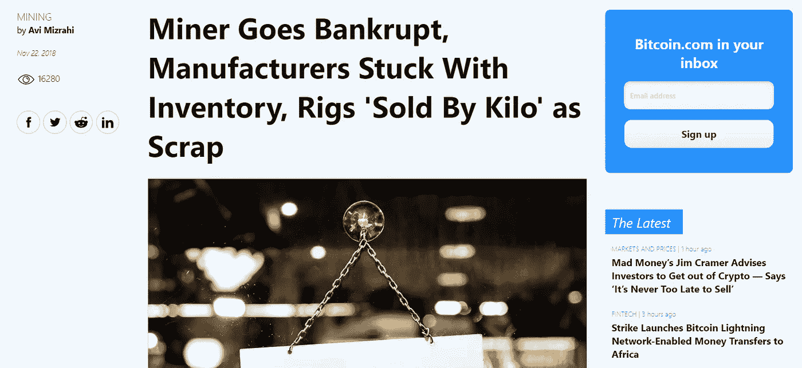*

*This story is old, but those two blurbs in the bottom-right corner are new — and bullish AF.*

*事实上，根据过去一个月写的大约 50 万篇文章，这是比特币正在触底的信号:*

*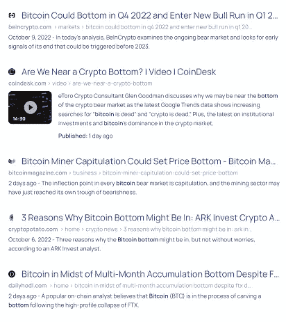*

*More bottoms than a Sir Mix-A-Lot video.*

*就像那些不停地问“我们到了吗？”，如果你非要怀疑这是不是底，其实不是底。如果不是，比特币的赢家是损失最小的:*

*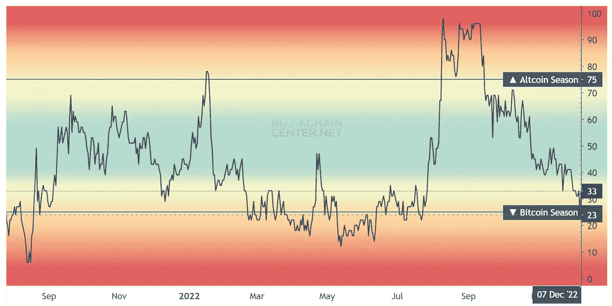*

*You know it’s crypto winter when this chart produces a slope you can ski down.*

*2.unis WAP([uni](https://www.coinbase.com/price/uniswap))——10 美元
十一月:️️⬇️ 15.9%*

*当如此多的投资者损失惨重的时候，谈论 FTX 灭亡的受益者有点不礼貌——对不起，[汤姆·布拉迪](https://www.coindesk.com/business/2022/11/09/nfl-legend-tom-brady-caught-in-ftx-fallout-risks-losing-complete-strategic-investment/)。。。*

*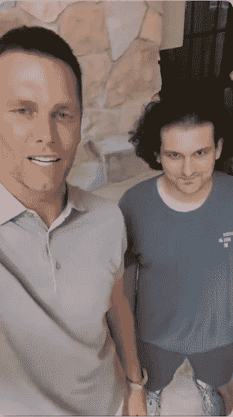*

*New theory: this is all an elaborate “Revenge of the Nerds”-style scam by the troll SBF to ruin the Golden Boy.*

*。。。但是最大的受益者是自动做市商 Uniswap。*

*可以理解的是，那些能够把钱取出来的 FTX 用户对再投资到另一个集中交易所，尤其是一个由一个人控制的交易所感到紧张:*

*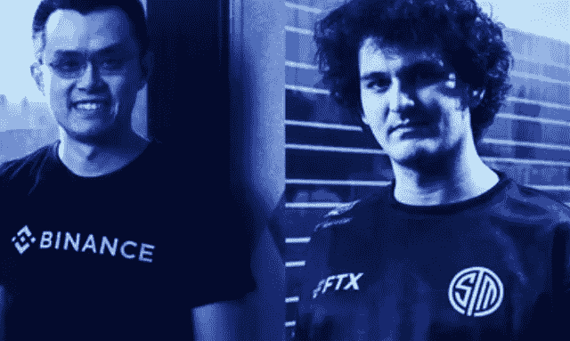*

*Some say the [CZ](https://markets.businessinsider.com/news/currencies/greatest-fraudsters-in-history-cz-binance-ceo-blasts-sam-bankman-2022-12) vs. SBF rivalry began during a spirited game at the Crypto Exchange Softball Tournament in 2018.*

*UNI 持有者不会将 Uniswap 的决策权交到一双手中，而是投票实施变革，因为他们拥有 [*治理令牌*](https://academy.shrimpy.io/lesson/what-are-governance-tokens) 。*

*Uniswap 不仅仅是以太坊上最大的 [*分散交易所*](https://www.coinbase.com/learn/crypto-basics/what-is-a-dex) ，它还在不断增长:在 11 月 8 日 FTX 成为 FUBAR 后的一周，Uniswap 的[交易量**翻了三倍**](https://decrypt.co/114665/uniswap-overtakes-coinbase-second-largest-exchange-trading-ethereum-today) **。根据 Dune Analytics 的数据，Uniswap 完成了 DEX 当周三分之二的业务。那是多少钱？***

*这么多:*

*但是购买比特币基地的 UNI 是一种在不牺牲自身流动性的情况下从系统中获利的方式。*

*说到这，比特币基地也从 FTX 的 DOA 中受益。如果国会监管要求每家交易所都像比特币基地那样做，那还不如坚持 O.G .(完全披露:在[去年夏天硬币从 50 多美元涨到近 100 美元](/coinmonks/top-10-cryptos-to-buy-on-coinbase-in-august-2022-8856d7ff4bc9)之后，我上个月买了一些 40 多美元的股票。)*

*3.链接 ( [链接](https://www.coinbase.com/price/chainlink))——9 美元
11 月:️️️️️⬇️ 2.3%*

*是的，你现在可以[入股林克](https://chain.link/economics/staking)，或者至少如果你早点进入的话可以:他们本月早些时候允许 2250 万林克入股，他们在[不到三个小时](https://twitter.com/chainlink/status/1600941172666540033)就卖光了。*

*但是就像大多数炒作的事件一样，那就是[买热情，卖热情:](https://cointelegraph.com/news/buy-the-rumor-sell-the-news-chainlink-link-price-drops-after-staking-launch)*

*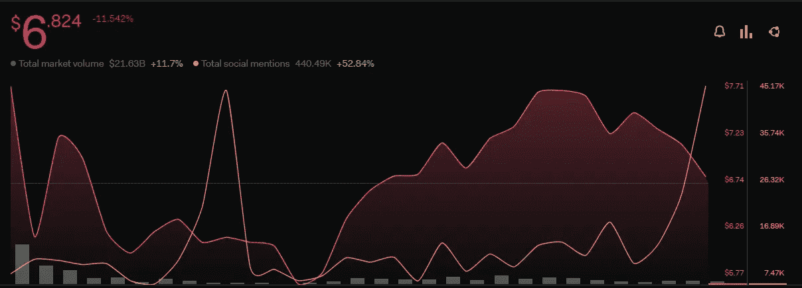*

*“Nobody goes there anymore. It’s too crowded.” — Yogi Berra*

*赌注奖励并不是一个全新的概念。然而，有**有**一个新颖的概念正在穿越空间拍摄: [*储备证明*](https://twitter.com/jacqmelinek/status/1591168560596135936) 。*

*Four SBFs is at least three too many.*

*Chainlink 处于有利位置。这是一个 *oracle 网络*，这意味着它获取离线数据，并将它们合并到智能合同中。因为它是去中心化的，所以它自动赢得了那些信任代码胜过信任人的人的信任。*

*我们只能说他们意识到了这一点:*

*Subtweeting? Wow, you guys. @ SBF next time.*

*4.以太坊([eth](https://www.coinbase.com/price/ethereum))——8 美元
11 月:⬇️ 17.7%*

*很明显，我对伊丽莎白·沃伦没什么好感，这从我对她的评论文章的反应中可以看出。但我至少可以给她这个:她在智力上是一致的。*

*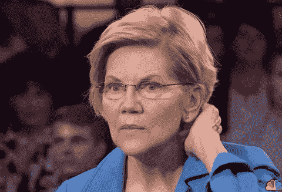*

*That’s not a compliment.*

*但是紧随真正的信徒之后的是突如其来的狂热者，这些人需要采取强硬的立场来否认他们以前的罪恶。(这绝不是党派诡计:约翰·麦凯恩在作为新参议员被指为基廷五人组之一后，从未遇到过他不喜欢的竞选资金改革法案。)*

*根据华盛顿邮报*的[这一令人惊讶的新闻行为](https://www.washingtonpost.com/business/2022/11/28/sam-bankman-fried-ftx-cftc/)，除了将数百万不义之财注入任何他认为能帮助他的华盛顿民选官员的金库，山姆·班克曼-弗里德显然还亲自培养监管者。**

*商品期货交易委员会主席罗斯丁·贝南就是其中之一。*

*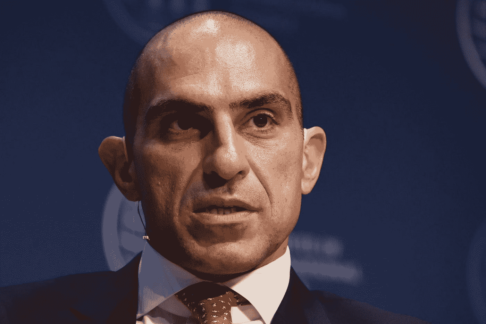*

*Before chairing the CFTC, Benham spent more than 30 years being [shot out of cannons at Mario](https://youtu.be/9e6cpI3lKvU?t=369).*

*SBF 还雇佣了一批了解情况的前 CFTC 员工，帮助监管机构将加密作为一种商品，而不是安全交易委员会主席加里眼中的证券詹斯勒。去年底，SBF 的第一个提议是，允许投资者通过直接向 FTX 提供抵押品来增加杠杆。无法想象为什么 FTX 想要更多的抵押品，你能吗？*

*因此，当本汉[11 月 30 日](https://fortune.com/crypto/2022/11/30/inaction-is-paralysis-cftc-chair-rostin-behnam-calls-for-regulation-in-the-wake-of-ftxs-collapse/)在普林斯顿大学的一次圆桌讨论会上发言时(这取代了原定的 SBF 主题演讲)，他敦促立法者加快行动可能并不令人惊讶。“我们没有等待的奢侈，”他说。“不作为就是麻痹。”*

*这和 ETH 有什么关系？在那次活动中，本汉姆表示，唯一应该成为商品的加密技术是比特币。我敢肯定，你会感到震惊，这与他在[10 月](https://fortune.com/crypto/2022/10/24/million-dollar-question-cftc-chair-regulating-crypto-sec/)所说的话来了个 180 度的大转弯，当时他支持以太作为一种商品。*

*如果 ETH 是一种证券，那就麻烦了。问[涟漪](https://finbold.com/ripple-v-sec-court-case-update-as-of-december-6-2022/)。*

*5.多边形**([matic](https://www.coinbase.com/price/polygon))——7 美元
11 月:⬆️ 3.35%***

***是的，它打印了一个月，即使在所有这一切之后。Polygon 继续疯狂地建设，所以他们得到了我更多的钱。***

***6.莱特币 11 月:⬆️ 44%***

***我总是讨厌在一个巨大的泵之后推荐硬币，但是如果我们计划未来，Litecoin 正在为自己开拓一个地方。它的名字就暗示了它的主要投资主题——更容易理解的比特币版本。它比橙色硬币更容易开采，而且由于交易费用更低，批量结算更快，因此[也更容易花费](https://coinmarketcap.com/alexandria/article/litecoin-vs-bitcoin)。***

***这就是为什么它经常出现在传统支付网络的密码列表中。上个月是 [MoneyGram](https://www.prnewswire.com/news-releases/moneygram-introduces-new-crypto-service-enabling-customers-to-buy-sell-and-hold-cryptocurrency-via-the-moneygram-app-301664682.html) 。***

***CoinStar? Those machines at the supermarket? I’ve got a couple coffee cans of coins buried in my yard somewhere.***

***投资者应该持有一些莱特币的另一个长期原因是作为比特币的对冲工具。虽然莱特币像比特币一样是工作证明，但它需要的电力要少得多。如果比特币禁令流行起来，莱特币可以被视为一种替代品，如果不是绿色的，至少更绿色。***

***但是由于其 [*减半*](https://academy.binance.com/en/glossary/halving) 事件，LTC 可能会在 2023 年凭借自身优势超过 BTC。正如莱特币基金会自己所说的:***

> ***从历史上看，就市场行为而言，莱特币减半似乎促成了两个值得注意的事件——一个是导致它的价格飙升，另一个是随后几年的加密牛市，导致比特币减半。***

***他们还制作了这张图表，用 BTC 表示 LTC，笑脸代表 Litecoin 的一半:***

***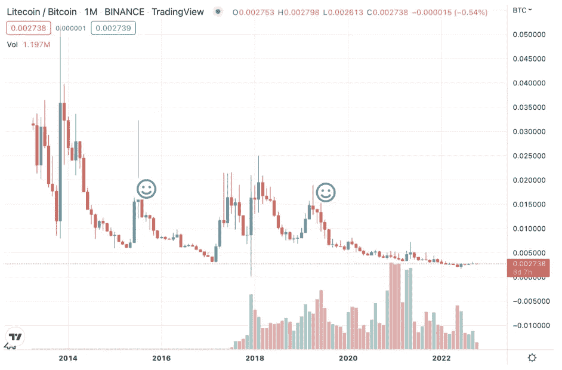***

***Past performance does not dictate future blah blah blah. (Litecoin Foundation/NASDAQ/TradingView)***

***7.**恒星流明**([xlm](https://www.coinbase.com/price/stellar))——4 美元
11 月:⬇️ 19.2%***

***[几个月前](/coinmonks/top-10-cryptos-to-buy-on-coinbase-in-october-2022-8b0400d755e1)，我发布了[这个视频](https://www.youtube.com/watch?v=8xzINLykprA)解释为什么国际汇款仍然如此耗时且昂贵，简单的答案是因为它需要一个复杂的会计平衡，而区块链将使其变得容易得多——事实上，它实际上**是**区块链的用例:***

***[3Blue1Brown](https://www.youtube.com/3Blue1Brown) is a great YouTube subscription if you want to get a 15-minute crash course into all the advanced math you learned in high school, except you want to actually understand it.***

***正如我当时所说，这对 Chainlink 来说是一个好消息，他们宣布与环球银行间金融电信协会建立探索性的合作伙伴关系，以验证这些交易(继续进行)。***

***但这一过程的另一个赢家是 Stellar Lumens，其代币 XLM 是仅有的两种被验证符合新 SWIFT 标准的加密货币之一，ISO 20022 是另一种。XLM 已经为 T2 打下了基础。***

***其他的密码也可能达到这个等级。但是，XLM 最终成为交易金融中心还有一个更黑暗的原因: [*中央银行数字货币*](https://www.investopedia.com/terms/c/central-bank-digital-currency-cbdc.asp) 。***

***对于世界上大多数宏观经济金融稳定无法保证的国家来说，CBD 可能是一个净利好，如果有[基础支撑它们](https://www.crypto-news-flash.com/will-stellar-lumens-be-the-base-layer-for-cbdcs-worldwide-35-of-central-banks-around-the-world-step-up/)，那么 XLM 万岁。但是对于任何对公民自由感兴趣的人来说，CBD 是可怕的。想象一个反乌托邦政府(就像你知道的[加拿大](https://www.wsj.com/articles/canadian-democracy-survive-justin-trudeau-freedom-convoy-peaceful-protest-ottawa-unacceptable-views-emergency-act-civil-liberties-11645472383))，它不仅有权力取消银行[的多管闲事的国家敌人](https://www.bnnbloomberg.ca/banks-freeze-millions-in-truck-convoy-funds-under-trudeau-edict-1.1727032)，而且有权力取消所有现金交易**期**。***

***世界上的伊丽莎白·沃伦斯和贾斯汀·特鲁多迟早会受到太大的诱惑，他们最终会努力实现 CBD cs——为了我们自己的利益，你知道，这样我们就不会成为下一个卢娜或萨姆·班克曼-弗里德的受害者。***

***我不想要那样的未来，但是如果 1984 年真的发生了，我想在 1983 年拥有一双靴子的制造者。***

******

***Getting exposure to gray scrubs and shiny riot helmets is also a bonus.***

***8.**曲线刀令牌**([crv](https://www.coinbase.com/price/curve-dao-token))——3 美元
11 月:⬇️ 24.2%***

***这一次我们要感谢灰度的朋友们:***

***Who, in turn, got their info from [Dune](https://dune.xyz), which is not just decentralized, but crowdsourced.***

***9.11 月份:⬇️ 21.4%***

***每个人都有关于卡尔达诺的笑话。但是当没人看的时候，他们得到了新的流量。喜欢，很多。***

***他们在那边建东西。就像，很多很多。***

***诚然，这大部分是在 2022 年[卡尔达诺峰会](https://summit.cardano.org/)的预备阶段，该峰会于 11 月 19 日至 21 日在 50 多个地点以虚拟方式举行。***

***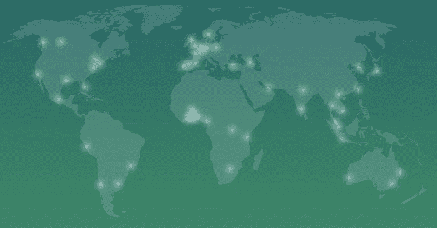***

***🎶 WHERE IN THE WORLD ARE THE SUMMITS OF CARDANO? 🎶***

***但 Cardano 有一个特点:几乎任何一个代币都可以在首尔、迪拜或迈阿密拥有自己的伍德斯托克音乐节。大多数大公司可能可以处理欧洲同时发生的十几起事件。***

***但是还有哪个硬币可以在非洲有十个约定？***

***I have never heard of this place and it has a larger metro area than Oklahoma City.***

***他们有一个充满活力的全球社区，并在 web3 将发挥最大作用的大陆上做着一些最出色的工作——也许不是巧合，那里的[人口正在激增](https://www.csmonitor.com/World/2022/1115/Fueled-by-rapid-growth-in-Africa-global-population-hits-8-billion)。***

***玩长线游戏。当你这么做的时候，预订 2.6%的 APY，就因为你在比特币基地拥有 ADA。***

***10.索拉纳 ( [索尔](https://www.coinbase.com/price/solana))——1 美元
11 月:⬇️ 56.5%***

***说到人们开玩笑的硬币。***

***在@ GiganticRebirth 因与道权的 1000 万美元 LUNA 赌注而放弃麦克风之前，SBF 可能拥有历史上最大的加密 Twitter flex:***

***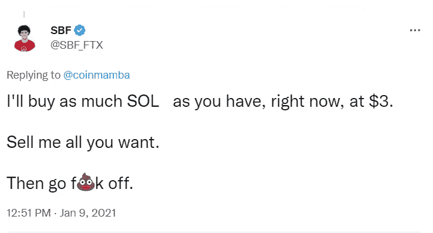***

***Coin Mamba [had the last laugh](https://twitter.com/coinmamba/status/1591109600820211712), though (this one’s unedited).***

***索拉纳是与 SBF 联系最紧密的蓝筹股链，因为 FTX 和阿拉米达在他们的许多项目中都采用了它，其中许多项目都失败了。从峰值到谷值，索尔在 FTX 咀嚼后出血超过 70%。***

***它已经度过了艰难的一年。***

***但是你看，不像 FTX，那里实际上有一个链条，有持续的项目。人们很难注意到这一点，因为大部分的[*【TVL】*](https://coinculture.com/au/learn/defi/what-is-total-value-locked-tvl/)已经[蒸发](https://thedefiant.io/ftx-fallouts-ugliest-turn-yet)并且交易已经被抛弃:***

***If I were moving $752 million per day, the adjective I’d use wouldn’t be “mere.”***

***我的意思是，当然，这个图表看起来死气沉沉，但 7.52 亿美元仍然是一个很大的压力。是的，SOL 从历史高点下跌了 95%，但它的一些第一层 邻居也看到了他们的房地产价格暴跌:附近的 Protocol(附近)从其峰值下跌了 93%，Avalanche ( [AVAX](https://www.coinbase.com/price/avalanche) )从其 ATH 下跌了 92%，VeChain (VET)下跌了 91%。***

***但是，正如《公主新娘》*中的奇迹麦克斯告诉我们的，基本死亡和完全死亡是有区别的:****

***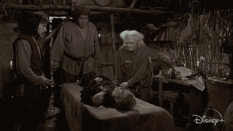***

***“I’ve seen worse.”***

***索拉纳的社区仍在努力工作:***

***This actually is just for 2022, but the point stands.***

***索拉纳能彻底大败吗？当然，这就是为什么我只尝试了一下。但是潜在的回报是巨大的。***

***但是任何密码都可以归零，甚至全部归零。传统智慧已经相信了这一点:***

***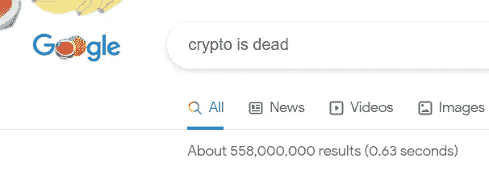***

***558 million people CAN be wrong. “September 11 was an inside job” gets [726 million hits](https://www.google.com/search?q=september+11+was+an+inside+job).***

***根据[一个“比特币讣告”库](https://99bitcoins.com/bitcoin-obituaries/)，比特币已经死亡(截至本文撰写之时)467 次。***

***但那是无稽之谈。FTX 死了，因为它没有建立在任何东西上，只是像郊狼一样保持着自己，因为没有人向下看。***

***Wile E. was also a [super-genius](https://www.youtube.com/watch?v=STeVTzWelns).***

***但是区块链协议保留了他们自己历史的完美的、不可改变的记录。它们并不比一本未读的书更“死”。这本书本身就有价值，它写得越长就越有价值。***

***现在，当所谓的“精明投资者”将其一笔勾销时，它可能最有价值:***

***crypto 会在 2023 年触底吗？不知道。但是如果你是为了长期的胜利——我也是——这是扣动扳机的最佳时机。***

******

***I mean, I say it every month.***

***[在 Twitter 上关注我](https://twitter.com/HODL4GoodTWEETS)。进入游戏。一如既往，***

******

***This isn’t just a big annoying delay. This is a Big Annoying Delay ‘23.***

> ***交易新手？尝试[加密交易机器人](/coinmonks/crypto-trading-bot-c2ffce8acb2a)或[复制交易](/coinmonks/top-10-crypto-copy-trading-platforms-for-beginners-d0c37c7d698c)***