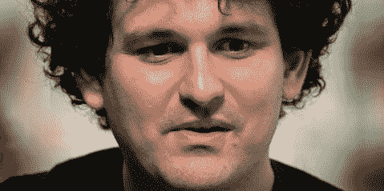

# FTX——阴谋论者突然出现了

> 原文：<https://medium.com/coinmonks/ftx-the-conspiracist-come-out-of-the-woodwork-da5fcc092bee?source=collection_archive---------32----------------------->

*(Photo: Jeenah Moon / Bloomberg via Getty Images)*

随着 FTX 的故事变得越来越离奇，越来越疯狂，越来越糟糕，大约有 100 万到 150 万账户持有人将再也见不到他们的资金，另一组离奇的故事引起了我的注意。这些都是在社交媒体的阴暗角落里讲述的离奇故事，他们现在声称已经发现了整个崩溃背后的黑暗力量，这现在可能成为历史上最大的欺诈。

当然，阴谋论者一直都存在，他们经常被误导，但却意志坚定，不受奥卡姆剃刀逻辑的影响。但社交媒体为他们提供了一个高效的新武器。他们似乎能在任何地方播下怀疑的种子，尤其是在公众要求“真相”的地方。

这是简单的版本，我的版本。我们很快就会抓到阴谋者。

2018 年初的某个时候，一个聪明、雄心勃勃、技术成熟的年轻人注意到，美国交易所和日本交易所的加密价格之间存在价差。因此，他在一个交易所买入，然后在另一个交易所卖出，获得几个百分点的无风险利润。如果你能在一天内交易多次，每次交易的几个百分点可以很快积累成一大笔钱。

如果你增加杠杆，借钱交易，它可以，也确实，在很短的时间内为山姆·班克曼·弗里德产生数十亿美元。就几年。

这是一种古老的策略，叫做套利，是最老练的交易者使用的黑暗艺术。每次交易的回报通常只有 0 . 5 %,而且只持续有限的时间，直到机会消失。这引出了两个明显的问题。为什么套利价差如此之大？为什么高盛和他们的同类没有狼吞虎咽呢？

这两个问题的答案在于，2018 年的加密市场都很小，大公司完全忽略了它们。此外，在不同的新兴和不成熟市场上的交易尚未正常化为可靠的全球价格。因此，如果你持续不懈地观察，套利很容易被发现。SBF 不仅做到了这一点，他还得到了风的支持。那是大牛市的几年。他不仅在价格差异上赢了，而且他还看到他的资产价值飙升。很快他就身价数百亿。

这里没有任何错误或非法或阴谋。我想很多读者都希望自己有那么聪明。

然后接下来发生了一系列事情。

首先，SBF 决定建立一个名为 FTX 的交易所，于 2019 年推出，是让他致富的贸易公司 Alameda 的姐妹公司。此时，SBF 已经因他的点石成金而闻名，人们争相在他的交易所开户。

其次，SBF 请来了一小群大学朋友来管理他日益壮大的王国。麻省理工学院毕业生兼前女友卡罗琳·埃里森被任命为阿拉米达的首席执行官，而 SBF 则专注于 FTX。他们一起出去玩，住在一起。有性和一夫多妻制，有毒品，还有，呃，办公室里的非正统风险管理。至少在 2020/2021 年，没有明显违法的事情发生。他们只是有一个永无止境的兄弟会聚会，由无止境的金钱注入各处。

第三，SBF 和埃里森通过家庭关系与多种民主和自由事业联系在一起。父母在这些圈子里很有名，他们是顶尖的学者或受人尊敬的社会活动家。因此，SBF/埃里森向他信仰的众多自由主义事业捐款。他们也为他们最喜欢的政客的金库捐款。

也没有什么不合法的，甚至是特别值得注意的。这也发生在政治的右翼。各种政治信仰的富人都花钱来提升他们的世界观。

第四(这是最大的一个)，2022 年初，密码世界其他角落的一系列灾难(Terra Luna、Celsius、Three Arrows Capital 等)导致整个密码市场的价格暴跌。突然，阿拉米达和 FTX 盯着一个他们从未见过的东西。

熊市。

这意味着与许多相关机构的贷款和其他金融纠纷开始沉入水底，危及整个 SBF 帝国(超过 100 家公司)。所以，很简单，SBF 开始从他的 FTX 账户持有者那里“借钱”来支撑阿拉米达不断增加的亏损。

换句话说，就是偷窃。

他继续四处撒钱，与政客、名人和监管者交往，即使他肯定知道这一切都在展开。这就是症结所在——没人知道他一直在偷东西，直到几周前才被发现。它被忽视了很长一段时间，也许长达一年。得到支持的项目和政治家继续接受他的钱，对资金的来源一无所知。

这就是他们阴谋者像弗兰肯斯坦的怪物一样复活的地方。索罗斯、佩洛西、拜登、扎克伯格、泽伦斯基、摩萨德、詹斯勒、深州、民主党全国委员会、银行业工业联合体。所有这些都是各种阴谋论的主角。他们*肯定*已经知道了，你没看见吗？阅读社交媒体上以如此自鸣得意的确定性呈现的阴谋，就像是错误信息和不受质疑的逻辑的诱惑中的一课。

相信阴谋集团在汉普顿和华尔街镀金的董事会会议室密谋征服我们，比满足于简单的管理不善和盗窃的无聊故事要令人兴奋得多。

在过去的一周里，我和朋友们为此发生了几次口角。有人指责我幼稚，甚至更糟。但不是。上面的年表是最有可能的，最简单的，也是最明显的。思考一些流传的理论，就好比想象数百名阴谋家的合作和沉默。从水门事件可以清楚地看出，阴谋不会比几个人做得更好，因为即使是总统也无法控制来自少数人的泄密。

一如既往(谢谢奥卡姆国王)，解释的最短路径通常是正确的。

Steven Boykey Sidley 是约翰尼斯堡大学 JBS 的实践教授。他是《超越比特币:去中心化金融和银行的终结》一书的合著者。

*这个故事最初发表在《特立独行》日报上*

> 交易新手？试试[密码交易机器人](/coinmonks/crypto-trading-bot-c2ffce8acb2a)或[复制交易](/coinmonks/top-10-crypto-copy-trading-platforms-for-beginners-d0c37c7d698c)