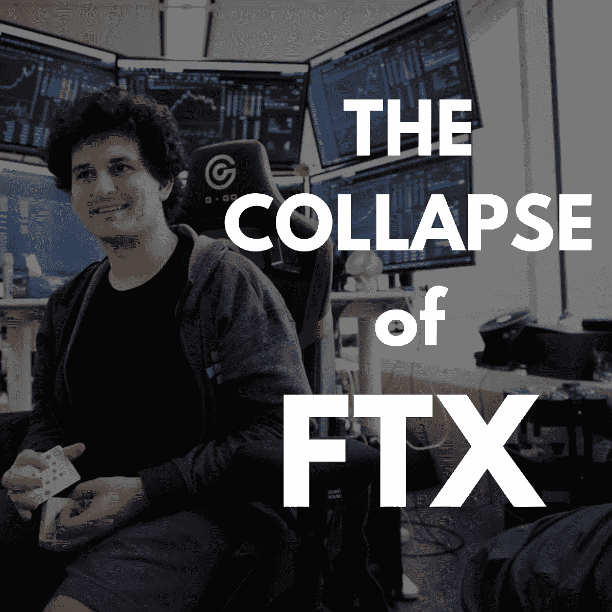
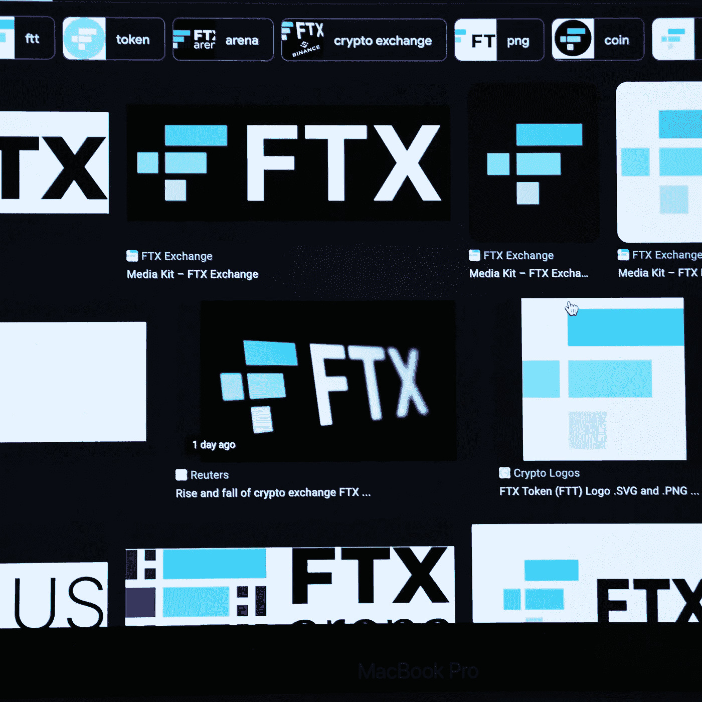

# FTX:崛起、衰落和重生？

> 原文：<https://medium.com/coinmonks/ftx-the-rise-the-fall-and-the-rebirth-b21c639bdb87?source=collection_archive---------11----------------------->

*FTX and its founder, Sam Bankman-Fried, are now having their tough days.*

FTX 的破产案现在是密码市场的焦点。密码投资者和交易者可能已经看到许多与此事件相关的头条新闻。为什么这么重要？

嗯，这就像一个'名人'的事情时，互联网爆炸与风暴的信息和辉煌的见解背后的人 FTX，萨姆班克曼-弗雷德。多年来，他一直是密码行业最有影响力的人之一。然而，他前途无量的密码“孩子”崩溃了！

他表示，密码冬天甚至没有困扰他的公司。此外，他还提出了许多监管密码行业的想法，为密码交易者创造一个更健康、更坚实的空间。最突出的是，他在 2022 年 11 月 7 日说 FTX“很好”。当 FTX 面临破产时，情况似乎并不那么“好”，四天后该公司申请了 Bankmanruptcy。

这种事情是怎么发生的？本文将带您了解主要事件，并解读密码明星 FTX 及其创始人萨姆·班克曼·弗里德(也称 SBF)的垮台。

# FTX 的信誉从何而来？

*When were the glorious days of FTX? — Image Source: The New York Times*

密码行业是一个新的行业，所以如何评估密码的价值或如何挑选一个有利可图的硬币仍然很大程度上是基于本能和声誉。是的，你没看错，我们提到了声誉。FTX 和 SBF 如何利用媒体来提高 FTX 的知名度，这确实是个例子。

萨姆·班克曼·弗雷德的合作伙伴包括一个强大但即将离婚的汤姆·布拉迪和吉赛尔·邦辰。此外，他还与安东尼·斯卡拉穆奇共同主持了《密码巴哈马》，比尔·克林顿和托尼·布莱尔出席了会议。

滋养名声的因素之一是在公共场合露面的频率。SBF 非常清楚这一点。秘密报纸上满是他的脸和他的交换，FTX。甚至有一个令人难忘的广告，在整个超级碗中展示了拉里·戴维，传达了投资密码的信息，即使你并没有真正得到它！

 [## 加密期货和期权:交易者屈服的 3 个错误

### 错误就像甜蜜的陷阱或伪装成无害的东西。然而，一旦你犯了错误，你…

medium.com](/coinmonks/crypto-futures-and-options-3-mistakes-traders-are-succumb-to-2866c2a03f75) 

当山姆是乔·拜登总统竞选和 2022 年中期选举的主要捐赠者时，他也活跃在政治领域。

然而，所有的活动似乎都涵盖了他的贸易公司 Alameda Research 的实际财务状况。公司业绩的泄露令许多投资者担忧，迫使他们决定将资金全部撤出 FTX。一个王国的崛起现在面临崩溃！

# FTX 为何未能保持实力？

*How will the future of Sam Bankman-Fried be? — Image Source: Forbes*

FTX 的垮台是密码行业最令人震惊的事件之一。仍然有许多未知的事情。然而，在整个故事中解读它可以帮助我们得出一些有价值的见解，甚至是一些高度准确的预测。

自 2017 年由赵昌鹏(俗称 CZ)推出以来，币安现在是最大的加密交易所。同样在 2017 年，萨姆·班克曼-弗里德(Sam Bankman-Fried)创立了阿拉米达研究公司(Alameda Research)，这是一家专注于数字资产的量化交易公司。然后，他在 2019 年推出了 FTX 交易所。尽管 SBF 退出了阿拉米达研究公司的运营，但这两家公司仍然保持着密切的联系。

 [## 2022 年投资的十大加密货币—第一部分

### 选择一种有利可图的加密货币进行投资反映了你对市场趋势的把握程度以及你的…

medium.com](/@libraryoftrader/top-10-cryptocurrencies-for-your-investment-in-2022-part-i-f5aaa33b3bcf) 

事情进展顺利，FTX 的估值为 320 亿美元，而阿拉米达一年的利润约为 10 亿美元。再加上通过商业广告的积极活动和与许多著名人物的握手，为山姆·班克曼-弗里德创造了漂亮的服装。

在那之前，事情都很顺利，甚至有光明的未来在等着我们。下跌的信号出现在 Ian Allison 于 11 月 2 日在 CoinDesk 发表的泄密文章中。

它揭示了这样一个事实，即阿拉米达价值 146 亿美元的资产都在 FTT，这是 FTX 的象征。持有 FTX 时，持有者无需支付费用，这是一项很有吸引力的额外福利。然而，伊恩·艾利森(Ian Allison)的泄露指出，代币都是谎言，让人们相信没有价值的东西。

CZ 币安在他的推文中分享了币安将在 11 月 6 日采取行动清算其 FTT 控股公司。币安收到了 20 亿美元的代币，其中一些是 FTX 代币，但由于最近的披露，CZ 决定摆脱 FTT。

 [## 2022 年投资的十大加密货币—第二部分

### 在之前的博客中，我们根据对以下领域的研究，向您介绍了 5 种最值得投资的加密货币

medium.com](/coinmonks/top-10-cryptocurrencies-for-your-investment-in-2022-part-ii-da391c6e5d52) 

尽管萨姆·班克曼-弗里德和阿拉米达的首席执行官卡罗琳·埃利森做出了种种努力，但投资者并不相信 FTX 和阿拉米达目前的表现或未来。一切都是为了“这很好”这个迷因的火焰而建立起来的，因为 SBF 宣布 FTX 正在进行战略交易，而 FTT 的价值在几天后跌至不到 5 美元。

CZ 中国英语学习网币安说有一封非约束性的信要买 FTX，但是他退出了对 FTX 的救助，这使得 FTX 和萨姆·班克曼-弗里德的处境更加糟糕。当事情展开时，CZ 和许多投资者分享了一个共同的声明，他们对 FTX 的内部事情及其实际表现知之甚少。

# FTX 崩溃的影响是什么？

山姆·班克曼-弗里德和他的加密交易所 FTX 在三天内从监管者的宠儿变成了贱民！梦想在现实的严酷考验下破灭了。

币安表示将购买 FTX，但在 2022 年 11 月 11 日退出救援。然后，SBF 的数十亿美元蒸发了。

围绕这一事件仍是一个谜，比如发生了什么，为什么发生得这么快，或者对 FTX 客户的影响。然而，我们相信有些事情即将发生。FTX 已经在美国启动了银行破产程序，可能面临 80 亿美元的资金缺口。

然而，这还不是结束。重生仍有希望，因为破产法第 11 章允许破产的公司继续运营，只要它们能够偿还债权人。

# 你怎么想呢?

事情变得如此之快，从前途无量的帝国到崩溃的帝国。FTX 和萨姆·班克曼·弗里德是密码业的明星。即使是在辉煌的日子里，或者是在崩溃的时候，他们仍然很出名。许多事情还没有完全展开，未来可能还有反弹的机会。谁知道 FTX 会失败？所以，对于这个交易所的未来可能也是如此！在我们的评论区分享你的想法。

更深入的金融市场和交易知识**👇**

 [## 如何停止过度交易:你应该知道的 3 个简单提示

### 太极端的东西不好。过度交易和微观管理是交易者容易犯的常见但代价高昂的错误…

medium.com](/coinmonks/how-to-stop-overtrading-3-simple-tips-you-should-know-1343303b8268)  [## NFTs 的未来:幻想还是乐观？

### 非专利技术已经上升到投资者和投资者最值得考虑的投资项目

medium.com](/coinmonks/the-future-of-nfts-illusions-or-optimism-a95f7520786e)  [## 2022 年更新的被动收入最佳的 15 家非正规金融机构

### 什么是 NFT 硬币？

medium.com](/@libraryoftrader/top-15-best-nfts-with-passive-income-updated-in-2022-8368cd5971eb)  [## 印度股票市场:你知道什么？—第一部分

### 那些不了解印度股票市场的人可能已经错过了许多从这样的股票市场获利的机会

medium.com](/@libraryoftrader/the-indian-stock-market-what-do-you-know-part-i-966c439b917b)  [## 印度股票市场:你知道什么？第二部分

### 在之前关于印度股票市场概况的文章中，我们分享了两家印度股票交易所(BSE…

medium.com](/@libraryoftrader/the-indian-stock-market-what-do-you-know-part-ii-6c1a66cf0fa3) 

**你也能找到我们👇**

*   交易者博客库:【https://libraryoftrader.net/blogs 
*   https://www.facebook.com/libraryoftrader:[脸书](https://www.facebook.com/libraryoftrader)
*   推特:[https://twitter.com/libraryoftrader](https://twitter.com/libraryoftrader)
*   领英:[https://www.linkedin.com/company/library-of-trader/](https://www.linkedin.com/company/library-of-trader/)
*   https://www.reddit.com/user/Library_Of_Trader
*   https://www.quora.com/profile/Library-of-Trader
*   https://www.tiktok.com/@libraryoftrader.net

> 交易新手？试试[密码交易机器人](/coinmonks/crypto-trading-bot-c2ffce8acb2a)或者[复制交易](/coinmonks/top-10-crypto-copy-trading-platforms-for-beginners-d0c37c7d698c)