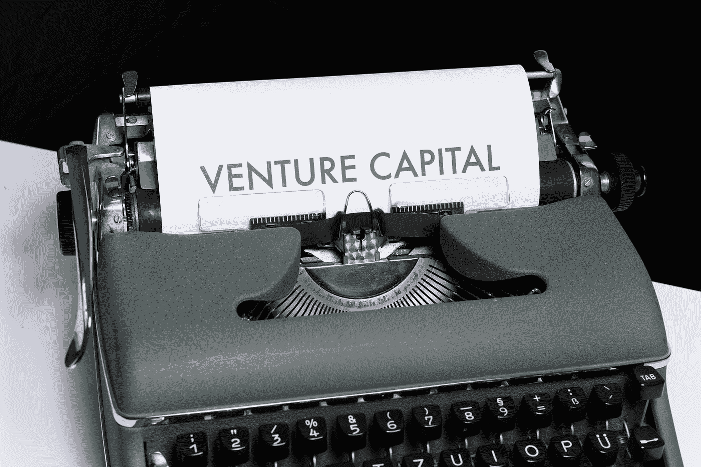

# FTX:精明的投资者并不总是那么精明

> 原文：<https://medium.com/coinmonks/ftx-the-smart-money-isnt-always-so-smart-2fbb47667a1f?source=collection_archive---------12----------------------->

Photo by [Markus Winkler](https://unsplash.com/@markuswinkler?utm_source=medium&utm_medium=referral) on [Unsplash](https://unsplash.com?utm_source=medium&utm_medium=referral)

在三年的时间里，投资于 FTX 的风险资本总计超过 18 亿美元，贝莱德(BlackRock)、老虎环球(Tiger Global)和红杉资本(Sequoia)等知名公司在 FTX 大举投资。

> 从顶级交易者那里复制交易机器人。免费试用。