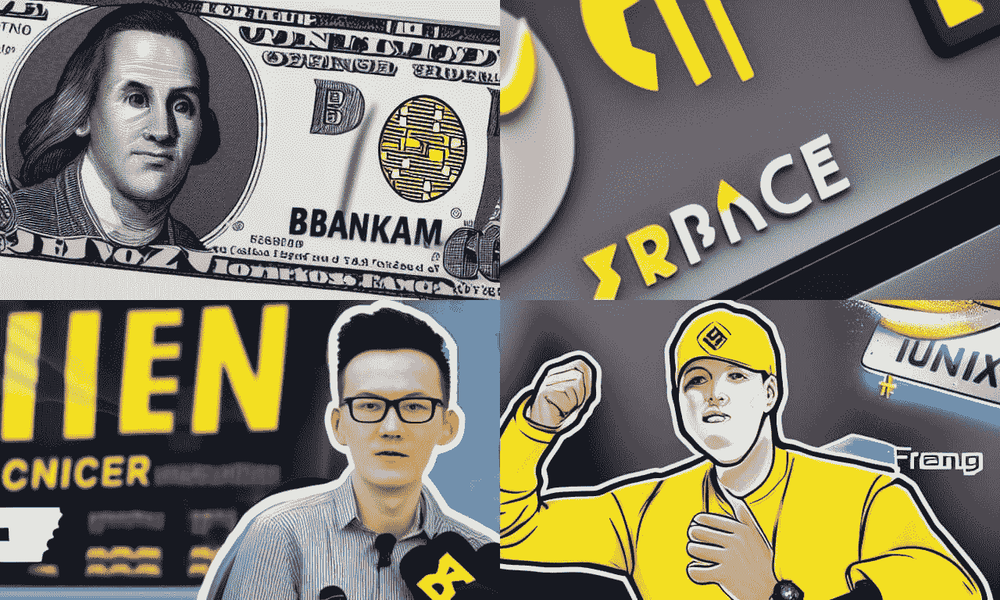
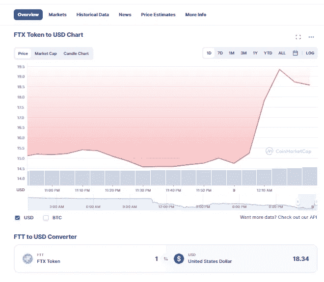
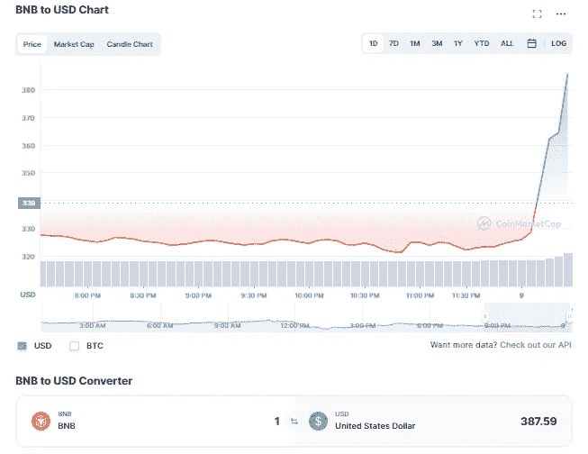
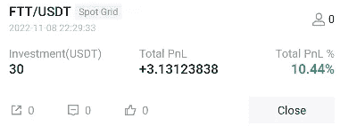
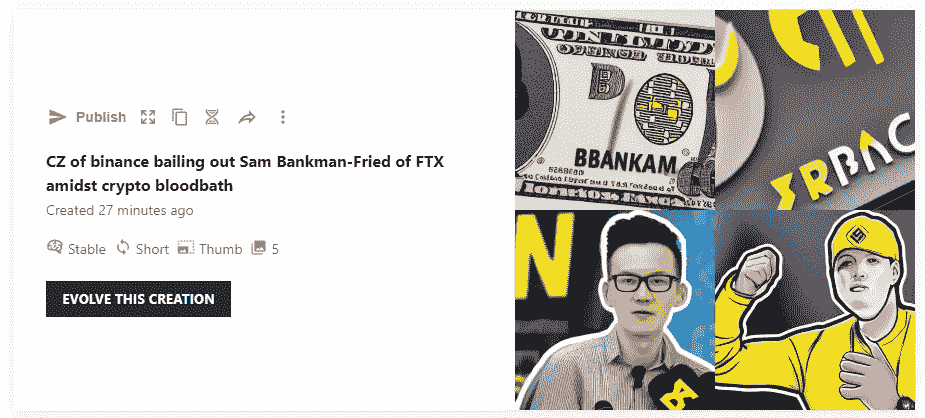

# FTX vs 币安:一个有趣的转折

> 原文：<https://medium.com/coinmonks/ftx-vs-binance-an-interesting-twist-of-events-c3bb8655dde1?source=collection_archive---------16----------------------->

Image generated from NightCafe Creator

这一天从 FTX 据称停止提款的令人沮丧的消息开始，链上数据显示，最后一笔从 FTX 发出的交易发生在以太坊东部时间早上 6:37。索拉纳和创的戒断似乎也停止了。FTT 股价跌至历史最低点，整个加密市场陷入瘫痪。

然而，在这场秘密的大屠杀中，FTX 的惨败刚刚发生了有趣的变化，币安宣布将收购 FTX！

市场立即做出了积极的反应，FTT 从 14 美元飙升至 19 美元，BNB 从 323 美元升至 385 美元，重新夺回了加密货币排行榜前三名的位置！

Image taken from coinmarketcap

Image taken from coinmarketcap

就在 Twitter 上发布影响市场的公告之前，我在[的火币](https://www.huobi.com/en-us/topic/double-invite/register/?invite_code=5t5jb)上启动了一个 FTT 电网交易机器人，这让我在几分钟内获得了 10%的投资回报率！

这就是加密货币的波动性，它带来了许多交易机会，也带来了漏洞和陷阱——对我来说，这是对一个未知领域的有趣尝试，既令人害怕又令人兴奋！但话说回来，只投资你能承受损失的钱，这样你就能享受涨势，度过低谷。

# 对长期的影响

这种合并对整个加密货币行业来说通常是一个好消息，因为 FTX 将能够避免完全破产，这可能会引发一系列我们已经太熟悉的不幸事件，而不是由于 Terra Luna 的垮台。既然隧道的尽头似乎出现了曙光，那么说牛市即将来临是否有把握？或者这是对加密货币去中心化的威胁，因为它变得更加集中，单个实体拥有几乎等同于否决权的权力？只有时间能证明一切。与此同时，投资者朋友们请保持安全！

你对这条新闻有什么看法？欢迎在下面留下你的评论！如果你喜欢读这篇文章，请在下面留下你的掌声，并在 Medium 上关注我。干杯！

 [## 16 个免费的被动收入应用程序，无需任何投资即可在互联网上赚钱！

### 这些免费应用程序允许您使用现有的设备和资源赚钱，而无需…

medium.com](/data-driven-fiction/16-free-passive-income-apps-to-earn-money-on-the-internet-without-any-investment-57d5ae907876)  [## 我是如何使用这个应用程序获得 1 BNB 的！

### 这里是我的故事，我如何免费使用这个应用程序赚了 1 BNB，而不必在第一次投资任何钱…

medium.com](/illumination/how-i-earned-1-free-bnb-using-this-app-974d22a5680f)  [## 我的 6 个 2022 年最佳加密交易机器人

### 如果配置正确，交易机器人可以成为可靠的被动收入来源。这里是我的 6 个表现最好的机器人…

medium.com](/coinmonks/my-6-top-performing-crypto-trading-bots-of-2022-9d856f632b7) 

Image generated from NightCafe Creator

上面的图片是使用[*night cafe Creator*](https://creator.nightcafe.studio/create)*生成的，这是一个文本到图像的人工智能平台，我计划在未来的帖子中介绍它。这张有趣的拼贴画是由人工智能在不到一分钟的时间内创作出来的！*

> 交易新手？尝试[加密交易机器人](/coinmonks/crypto-trading-bot-c2ffce8acb2a)或[复制交易](/coinmonks/top-10-crypto-copy-trading-platforms-for-beginners-d0c37c7d698c)