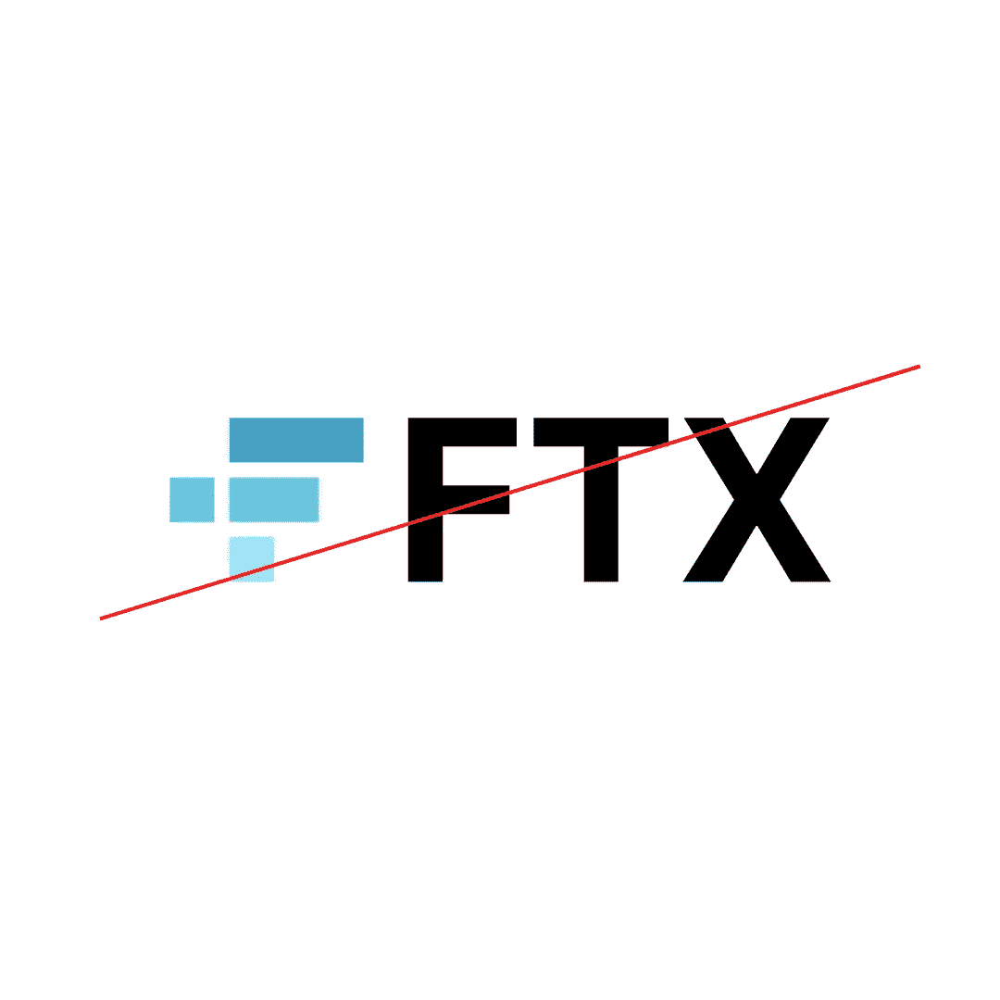

# FTX 不是秘密的

> 原文：<https://medium.com/coinmonks/ftx-was-not-crypto-319bac03b58e?source=collection_archive---------34----------------------->

11 月 11 日，FTX 宣布破产。

FTX was not crypto

2022 年密码行业最大的悲剧是 FTX 密码交易所的破产。对于那些不知道 FTX 是世界上最大的加密货币交易所之一的人来说。他们主要在美国运营，2022 年开始在欧洲运营。截至 2021 年，他们在其平台上拥有 120 万注册用户。

FTX 交易所犯了一些严重的错误和糟糕的管理决策。他们高估了自己，没有衡量当时的风险。他们通过 Alameda Research(相关公司和他们的做市商，最终给他们钱)建立了不盈利的头寸(LUNA crash)。他们最终(未经证实)拿了人们的钱，为了他们的利益进行交易。这并没有很好的结局，因为他们没有足够的资金来支付所有的费用。

FTX 瀑布意味着大部分用户无法获得他们的资本，他们的钱已经没有了。数额不小。据报道，FTX 本月申请破产，此前一笔挤兑存款让该公司欠下 80 亿美元，没人知道这些资金在哪里。

悲剧是巨大的，但为什么我说 FTX 不是密码呢？

**因为事实并非如此。**

**让我解释一下。**

FTX 的衰落使工业倒退了 1-2 年。人们再次对投资加密货币失去了信任。许多 FTX 用户可能拿不回任何钱，无论是他们的加密货币还是法币。使用其他集中式交易所的其他人已经放弃了交易所，并将他们的加密货币转移到冷库或链上。监管机构正密切关注每日的发展，以便采取相应的行动。

2014 年，MTGOX exchange 失败。他们损失了 84 万比特币。今天的价值是 140 亿美元。但比特币从这一事件中恢复过来，变得更加强劲*。

历史往往会重演。我确实认为这个市场最终会生存下来。我非常看好宏观经济，因为基本面依然如故。什么都没变。

我们不需要像 FTX 那样的集中交易所，但我们需要分散化。它证实了使用分散协议的人不需要担心任何破产。这就是为什么是分散的。此外，网上交易(在区块链)可以对资金流动透明。整个 FTX 没有显示出来，因为它是由 FTX 和阿拉米达研究所控制的。

我想以这样一句话来结束这篇文章:从这个案例中，我了解到在这个领域中一切皆有可能。无论从现在到未来发生什么，我都不会被打动。唯一可以肯定的是，区块链还活着，而 FTX 已经死了。

*这里我只指比特币，因为整个市场在某种程度上取决于它的表现。

如果你喜欢阅读并学到了一些东西——关注更多！

你可以在推特上找到我——[https://twitter.com/pinadefi](https://twitter.com/pinadefi)

https://pinadefi.substack.com/[子栈](https://pinadefi.substack.com/)

出版 0x—【https://www.publish0x.com/@Pina-DeFi 

> 交易新手？尝试[加密交易机器人](/coinmonks/crypto-trading-bot-c2ffce8acb2a)或[复制交易](/coinmonks/top-10-crypto-copy-trading-platforms-for-beginners-d0c37c7d698c)