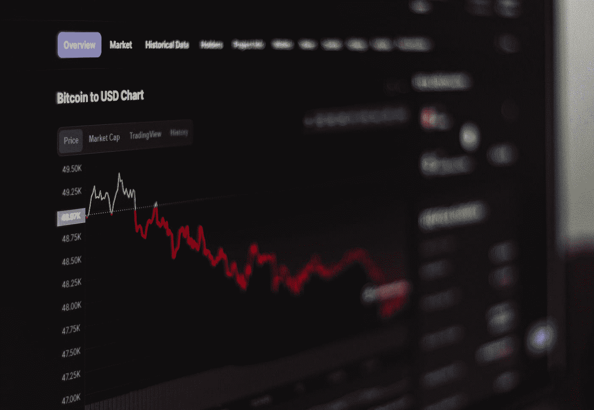

# FTX 的破产:它是如何发生的，它如何震动了加密市场，为什么它可能是一件好事

> 原文：<https://medium.com/coinmonks/ftxs-bankruptcy-how-it-happened-how-it-shook-the-crypto-market-and-why-it-might-be-a-good-thing-26d1abecd420?source=collection_archive---------3----------------------->

Photo by [Behnam Norouzi](https://unsplash.com/@behy_studio?utm_source=medium&utm_medium=referral) on [Unsplash](https://unsplash.com?utm_source=medium&utm_medium=referral)

FTX 交易所破产了，币安接管了它，加密市场陷入混乱。我们滔滔不绝地讲述这个故事。这是怎么发生的——这意味着什么？

多么动荡的日子。据称是第二大密码交易所的 FTX 已经资不抵债，只有最大的……