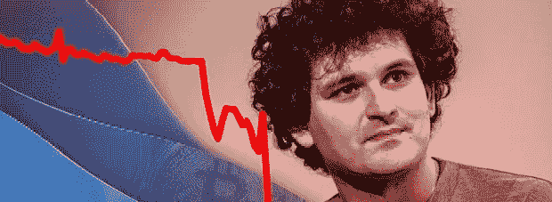

# FTX 十亿美元的崩溃:接下来会发生什么？

> 原文：<https://medium.com/coinmonks/ftxs-billion-dollar-collapse-what-happens-next-6a020517b5e3?source=collection_archive---------12----------------------->

FTX(前)首席执行官、美国最大的政治捐助者之一萨姆·班克曼-弗里德(Sam Bankman-Fried)眼看自己的帝国在数小时内土崩瓦解。让我们回顾一下密码史上最相关的事件之一及其含义。

**FTX“密码之王”山姆·班克曼·弗里德的倒台**

本月初，关于阿拉米达(FTX 的主要投资分支)破产的强烈谣言正在流传，因为他们在[可疑的资产负债表被泄露](https://bgqde.clicks.mlsend.com/te/cl/eyJ2Ijoie1wiYVwiOjQ1NTI1LFwibFwiOjcxODYxNDc0NjQzOTM2OTI1LFwiclwiOjcxODYxNDc2Mjg0OTU4NDc4fSIsInMiOiIzNTJhOGU4NTcyZTg1YmEyIn0)。该公司 80 亿美元债务的大部分抵押品来自 FTT。

几天后，SBF 激怒了币安的首席执行官 CZ，声称他将不能去美国与美国立法者交谈。随后，CZ 从 FTX 撤出了 5 亿美元，并公开证实，他将清算全部持股。他还称 FTT 为“月神 2 号”。

这一声明来自最相关的加密玩家之一和最大的加密交易所的首席执行官，立即在市场上引起了 FUD(恐惧、不确定和怀疑)，一场巨大的“银行挤兑”开始了:成千上万的用户试图从 FTX 撤回他们的资产。由于流动性问题，他们最终不得不暂停提款和转账。是的，你在今年之前已经看过了。同样的事情也发生在 Celsius 和 Voyager 身上，这两家公司是 SBF 本人试图挽救的——正如我们在六月份的[这篇文章](https://bgqde.clicks.mlsend.com/te/cl/eyJ2Ijoie1wiYVwiOjQ1NTI1LFwibFwiOjcxODYxNDc0NjUxMjc2OTU4LFwiclwiOjcxODYxNDc2Mjg0OTU4NDc4fSIsInMiOiI4M2NmZjNmOTkzNDkxZjI1In0)中所报道的。

FTX 的代币 FTT 从 22 美元涨到了 2 美元，老实说，它没有存在的理由和实际用途。山姆的财产，估计有 140 亿美元，就这样消失了。由于这种混乱的局面，整个市场都下跌了。

SBF 不得不跑回 CZ 谈判收购 FTX 的交易，后者在履行尽职调查程序后同意这么做。FTT 甚至排练了复出后，新闻，但事情是，FTX 可以没有 FTT 令牌存在。交易没有继续。

以下是吸取的经验教训:

1)没有信任，就没有交易。

2)你的声誉是你的主要资产。

3)不要相信美德信号。永远不会。

4)不是你的钥匙，也不是你的硬币:这里有一个完美的例子。成千上万的投资者失去了他们的资产，可能是永远失去了。

crypto 消失了吗？下一步是什么？

不，加密不会死。这是我见过的最离奇的事件，这个故事还有很多未解之谜。重新赢得客户的信任，并努力解决监管问题以提高业务安全性，现在已成为交易所的首要问题。

不用说，缺乏透明度和中央集权是 FTX 的问题。也存在于其他几种加密货币中。一些交易所正在准备他们的储备证明。交易所现在正与其竞争对手合作，支持我们的同行开展 PoR，以提高透明度，加速行业健康发展。

我们先退一步，等情况更明朗了，再分析哪些机会出现了。经历过这一年的人会变得更强。

值得注意的一点是:所有这些最近涉及 FTX、Celsius、Voyager 和 BlockFi 的丑闻都来自中央集权的公司，这些公司利用加密叙事为自己谋利。如果是在 DeFi 环境中，这可能不会发生。

砌块还在继续生产。cryptos 的去中心化本质继续存在，并将继续有其价值。

[*乔·罗伯特*](https://joerobert.com/) *现任罗伯特风险投资公司首席执行官，拥有超过 20 年的资产管理经验。自创办以来，乔已经为投资者和合伙人创造了可预见的两位数回报。Joe 已经投资了股权和代币的种子轮，以及比特币、以太坊和其他顶级加密货币的投资组合。*

*如果您是合格投资者，并想了解更多关于我们产品的信息，请联系我们。*

> 交易新手？尝试[加密交易机器人](/coinmonks/crypto-trading-bot-c2ffce8acb2a)或[复制交易](/coinmonks/top-10-crypto-copy-trading-platforms-for-beginners-d0c37c7d698c)