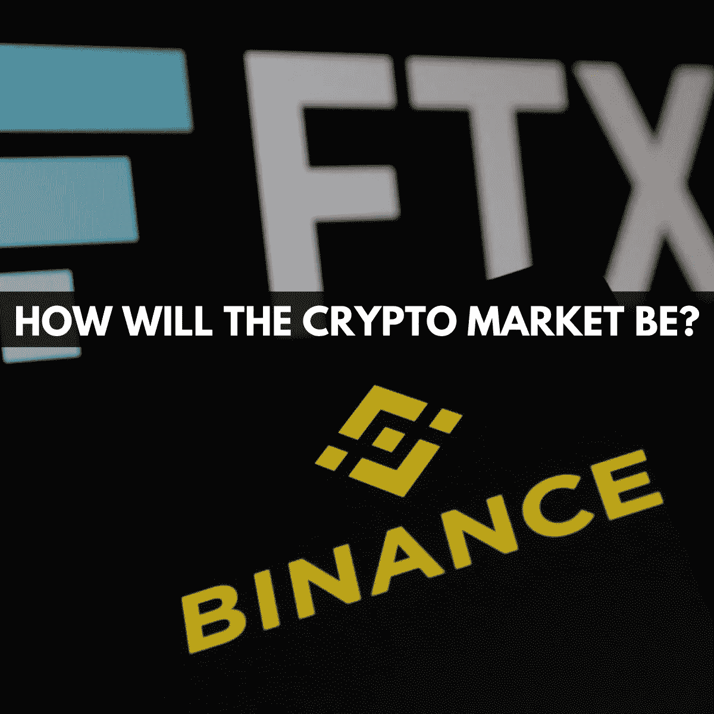

# FTX 的崩溃，币安的领先地位，以及密码市场

> 原文：<https://medium.com/coinmonks/ftxs-collapse-binance-s-leading-position-and-the-crypto-market-1bcdd56e85e7?source=collection_archive---------30----------------------->

*Binance walks out of FTX, putting the crypto market on edge!*

币安现在正式退出对 FTX 的救助，而 FTX 已经面临严重的偿付能力问题。本周早些时候，CZ 暴露了 FTX 的问题，并宣布他将在市场上抛售 5 亿美元的 FTX 股票。

2022 年 11 月 8 日，有消息称，币安购买 FTX 的协议不具约束力。然而，由于这是一项试探性的协议，币安可以随时退出。当时的预测对 FTX 来说并不太乐观，现在这是真的。随着币安退出 FTX 交易。

 [## 如果你从 1000 美元开始，你能从加密交易中赚多少钱？

### 当我们不确定你可以通过交易加密货币赚多少钱时，不要生气！如果有人能…

medium.com](/@libraryoftrader/how-much-money-can-you-earn-from-crypto-trading-if-you-start-with-1000-2afee1c5d79a) 

值得注意的事实是，现金并没有得到 FTX 在美国经营的许可。因此，币安在拥有 FTX 时无法进入市场。没有任何利益可以说服 CZ 购买 FTX。然而，交易的失败可能会使加密市场处于边缘。

# 为什么币安退出了 FTX 交易？

*Binance now has no reason to buy FTX. — Image Source: NBC News*

索拉纳和 FTX 资助的创业公司是币安 BNB 连锁公司的竞争对手。因此，如果 FTX 失败了，币安可以因此赢得 FTX 的客户，不管他们是否达成任何协议。

从市场份额和平台的角度来看，FTX 并没有显示出任何独特的价值，也没有给币安带来任何好处。因为市场上有许多与 FTX 质量相当甚至更好的竞争对手。

另一个原因是，这项不具约束力的协议让 SBF 有了一点喘息的空间，可以在华尔街找到其他买家。然而，由于 CZ 的不断挑刺，币安成功的可能性很小。

 [## 什么是加密交易？以及你可能会问的其他问题

### 首次接触加密货币时，你需要一本入门指南。在这篇博客中，你将…

medium.com](/@libraryoftrader/what-is-crypto-trading-and-other-questions-you-might-ask-64f169e881e0) 

# 未来我们能期待什么？

*FTX collapse and the Effects on the Crypto Market — Image Source: The Guardian*

币安退出 FTX 交易的官方声明给 FTX 判了死刑。其 FTT 股票的交易价格低于 4 美元，自 2022 年 11 月 7 日以来下跌了约 80%。这个品牌遇到了麻烦，很难重新赢得消费者的信任。FTX 的崩溃将在不久的将来导致一些发展和变化。

 [## 为什么要知道斐波纳契时区，你应该知道什么？

### 斐波纳契时间带是交易者和投资者用来准确预测市场趋势的工具之一…

medium.com](/@libraryoftrader/why-and-what-should-you-know-about-a-fibonacci-time-zone-532b5b838035) 

# 交易所整合阶段的时间

当 FTX 崩溃时，币安可以继续前进，巩固其领先地位。尽管市场上有许多交易所，但它们规模太小，或者无法抵御赢得用户信任的挑战。在几家大公司的竞争中，外汇市场将变得更加“沉默”。

# 更多分散交易和借贷的机会

诸如 Terraform Labs、Three Arrows Capital、Celsius Network 和 Alameda Research 等破产事件的不断变化，引发了人们对集中贷款业务的质疑。因此，焦点现在属于分散贷款，这为 DeFi 分散融资带来了长期机遇和创新。

# 监管将会更加严格

由于密码市场的许多丑闻，需要在监管行为、金融许可和投资者保护方面有更全面和详细的规定。此外，2023 年将加强对集中交易所和 DeFi 的监管。

# 不再有野蛮无序的增长

在不久的将来，资产管理机构将实施一套严格的风险控制系统，并完成审计，以维持一个健康、透明和开放的工作空间和财务资产负债表。会出现金融机构积极寻求合规牌照，整体行业向更良性的方向发展的趋势。

# 在你走之前

好的一面和坏的一面总是一起出现。这里重要的是你能不能看到它。希望这篇文章能让你对密码市场的这一历史事件有一个有价值的了解。

更深入的金融市场和交易知识**👇**

 [## 如何停止过度交易:你应该知道的 3 个简单提示

### 太极端的东西不好。过度交易和微观管理是交易者容易犯的常见但代价高昂的错误…

medium.com](/coinmonks/how-to-stop-overtrading-3-simple-tips-you-should-know-1343303b8268)  [## 如何度过难熬的密码寒冬？

### 加密市场就像过山车。它用许多巨大的胜利吸引和愉悦人们，尽管他们可能会遭受…

medium.com](/@libraryoftrader/how-to-get-through-the-tough-cryptos-winter-4b047aba4196)  [## 定量和定性分析:主要区别是什么？

### 对许多人来说，交易或投资可能是一种游戏，但这不是一种完全靠运气就能赢的游戏。它需要…

medium.com](/coinmonks/quantitative-and-qualitative-analysis-what-are-the-main-differences-1e50ec1db209)  [## 3 投资股票，为潜在的经济衰退做准备

### 世界正面临通货膨胀和经济崩溃。美联储已经将利率提高了五倍…

medium.com](/@libraryoftrader/3-stocks-to-invest-to-prepare-for-the-potential-economic-downturn-416628a5fa20) 

**你也能找到我们👇**

*   交易者博客库:【https://libraryoftrader.net/blogs 
*   https://www.facebook.com/libraryoftrader:[脸书](https://www.facebook.com/libraryoftrader)
*   推特:[https://twitter.com/libraryoftrader](https://twitter.com/libraryoftrader)
*   领英:[https://www.linkedin.com/company/library-of-trader/](https://www.linkedin.com/company/library-of-trader/)
*   https://www.reddit.com/user/Library_Of_Trader
*   quora:[https://www.quora.com/profile/Library-of-Trader](https://www.quora.com/profile/Library-of-Trader)
*   https://www.tiktok.com/@libraryoftrader.net[Tiktok](https://www.tiktok.com/@libraryoftrader.net)

> 交易新手？试试[密码交易机器人](/coinmonks/crypto-trading-bot-c2ffce8acb2a)或[复制交易](/coinmonks/top-10-crypto-copy-trading-platforms-for-beginners-d0c37c7d698c)