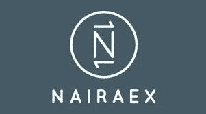

# 全面审查:NairaEx 合法吗？

> 原文：<https://medium.com/coinmonks/full-review-is-nairaex-legit-d9455475b0e5?source=collection_archive---------31----------------------->

NairaEx 是一个在线交易平台，允许用户买卖比特币和其他加密货币。这个平台提供了一个易于使用的加密交换服务，所有尼日利亚人都可以使用。它还具有法定货币转换功能，可以同时使用法定货币和加密货币进行交易。NairaEx 是较新的交易所之一，但它已经成为一个可靠和用户友好的平台。让我们仔细看看这个平台上的特性。NairaEx 最初是一个专门交易比特币的交易所，但随着时间的推移，它已经发展到包括更多的加密货币；比特币、以太坊、莱特币和比特币现金。完美货币是该平台上唯一支持的电子货币，而奈拉是该平台上唯一的本币。该平台具有简单的用户界面；其布局便于使用和导航。
交易是免费的，因为该平台不向用户收取交易费用。然而，这并不意味着该平台可以完全免费使用。费用与费率一起计算；这意味着与其他主要交易所相比，该平台的买入价会略高。

创建帐户后，必须通过验证过程才能购买加密货币，该过程分为两个阶段。首先，你必须出示政府颁发的身份证，然后你进行自拍验证。24 小时后，如果所有文件相符，您的帐户将得到验证。NairaEx 作为一个平台不会存储你的加密资产，在 NairaEx 上购买加密之前，你必须在其他地方打开钱包。此外，该平台为其交易者提供了一个联盟计划，每个交易者都有一个独特的链接，当一个新的交易者加入并使用他们的链接进行交易时，就会获得一定比例的报酬。NairaEx 对某些加密货币有最低交易金额。以比特币为例，BTC 的最低交易金额为 3 万奈拉。你不能在平台上交易低于 30，000 奈拉的 BTC。

> 交易新手？试试[密码交易机器人](/coinmonks/crypto-trading-bot-c2ffce8acb2a)或者[复制交易](/coinmonks/top-10-crypto-copy-trading-platforms-for-beginners-d0c37c7d698c)

这个平台的一个主要缺点是它没有移动应用程序；从而限制了它的灵活性并使用户暴露于克隆网站上的骗局。另一个主要障碍是交易时间。NairaEx 的交易时间可能会更长。在确认之前可能需要几分钟到一个小时。

## 如何使用 NairaEx

让我们快速浏览一下流程。

*   访问[nairaex.com](http://nairaex.com)并注册一个账户。
*   提交所需文件以验证您的身份。
*   向您的帐户注入资金后，继续购买或出售受支持的加密货币。

简单地；

*   NairaEx 有一个简单的界面。
*   所有尼日利亚人都可以使用它，并支持即时资助。
*   奈拉是平台上唯一被接受的菲亚特。
*   NairaEx 没有移动应用。

加密货币市场的交易非常复杂，并且伴随着风险，因此在做出任何投资决定之前关注每个细节至关重要。在 NairaEx 上购买硬币后，你可能会寻找一个更好的地方以更好的价格出售你的购买，Dart Africa 是最好的平台。它有一个[移动应用](https://play.google.com/store/apps/details?id=com.dartafrica&gl=US)，在平台上为 naira 出售加密货币是免费的。