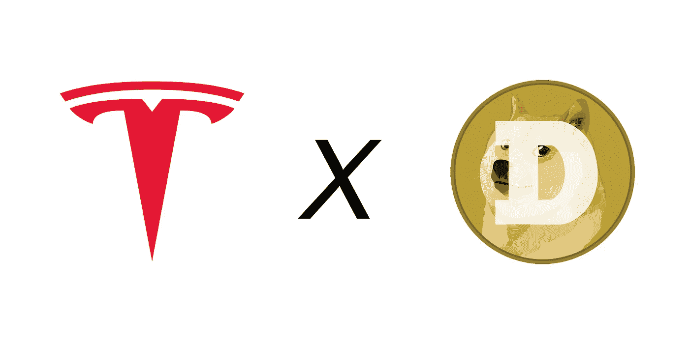
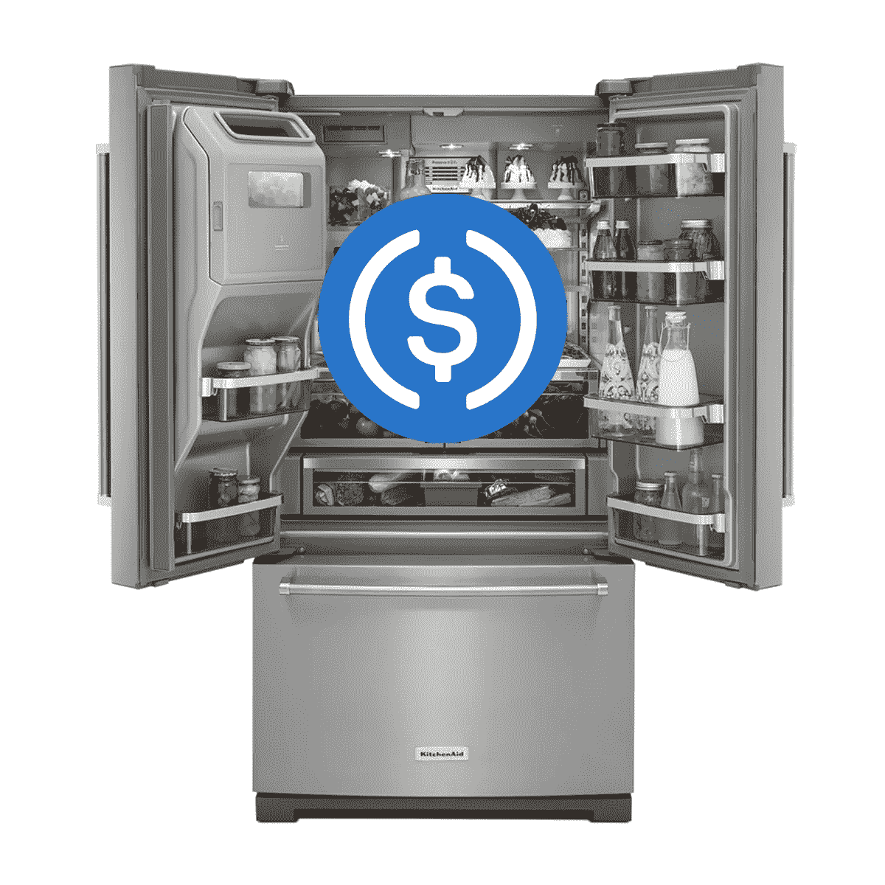
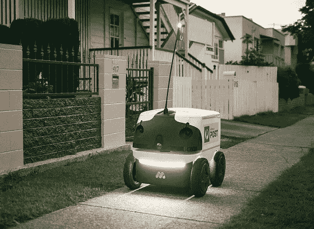
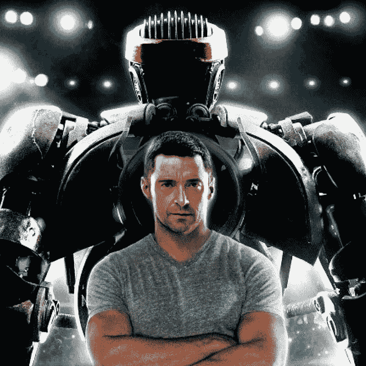
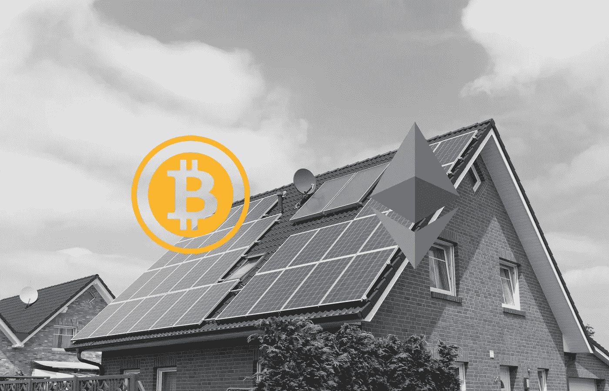

# 有趣的未来加密链接

> 原文：<https://medium.com/coinmonks/fun-future-crypto-interlinks-26821bc05117?source=collection_archive---------20----------------------->

快乐假期的人们，希望你们都和家人一起享用了一顿美味的火鸡大餐，而不是在一夜之间陷入家庭纠纷。不管怎样，记得[黑莓](https://external-content.duckduckgo.com/iu/?u=https%3A%2F%2Fwww.cellularcountry.com%2Fimages%2FBlackberry_9650_Bold_Smartphone_for_Verizon_-_Black_5367_01.jpg&f=1&nofb=1&ipt=35f9d36707ed3ca9a9c63b70089ab00a13b2a30d3d1759bd8c46dc7bfe4e8db7&ipo=images)吗？是的，就像每个工作的人都需要的那种，因为这是继[寻呼机](https://external-content.duckduckgo.com/iu/?u=http%3A%2F%2Fecx.images-amazon.com%2Fimages%2FI%2F81OKa6qS0NL._SL1500_.jpg&f=1&nofb=1&ipt=663618fc95a6824bd6bf438761f562bb68769baee9c44d1702db9a90c9d28ee2&ipo=images)之后的下一个东西，它们可以处理公司的电子邮件？对于其他人来说，这很酷，我们都有诺基亚 3310，并在它上面竞争我们的 Snakes 分数+在课堂上互相发短信，而不看屏幕？你还记得那是 20 年前的事吗？(没错，这里是千禧一代)。与此同时，触摸屏技术的发展与电信技术相结合，然后，嘣！我们在 2006-2007 年(16 年前)有过智能手机。

好吧，你明白我的意思了。让我们快进，回到今天。我们的武库中有:

*   智能手机
*   可靠的互联网
*   传统经济中支付服务和商品的在线平台
*   电动汽车
*   智能电器
*   电子竞技锦标赛
*   加密货币
*   私人宇宙飞船等..

那么，如果我们沿着 16 年前的轨迹走下去，我们能想象未来 16 年的情况会是怎样吗？好了，既然我已经完成了我的黑色星期五购物，让我们今天玩得开心一点，想象一下我们到目前为止所拥有的一些可能的相互联系的未来。

> 声明:我绝不是理财规划师或顾问，也没有接受过理财规划师或顾问的培训。我也不与本文中提到的品牌和公司合作。本文所有内容仅为娱乐目的而写。

# **EV(电动车)+加密货币**

随着每个人都在竞相制造电动汽车，如果你可以在汽车上存储加密货币，并随时随地支付充电费用，会怎么样？如果你有房子，你可以很容易地安装充电站，但在出租建筑或公寓中，私人安装的充电站可以很容易地区分它正在为哪辆车充电，并为此向当事人收费。这样，你和你的邻居就能和睦相处了！不偷能量！耶！

# **冰箱+马桶**

如果你的冰箱能记住你经常使用的品牌，并跟踪你的冰箱库存，会怎么样？它可以自动检测您是否用完了鸡蛋，并且由于自动续订，它会找到最近的供应商的最便宜的交易，并在您下班回家时为您送货上门。毕竟上面那句话写的东西都不是新的。但是这种交易只有在使用法定货币或零汽油费的稳定货币的情况下才可能公平。

# 信使机器人

在大都市工作，我们太经常依赖自行车信使从市中心到住宅区快速发送需要盖章和签名的文件。自从疫情以来，工人们已经从中央商务区分散开来，搬到了比以往任何时候都更远离工作的地方。信使机器人，不管它们能飞还是能穿越。陆地，肯定会被公司用来覆盖人类信使无法到达的太长的距离，以及联邦快递无法到达的太短/太快的距离。如果搭配多站地图，它甚至可以交付已签署的合同并完成工作！

# **机器人体育**

机器人正在被迅速开发和研究，我们迟早会看到一个完整的外骨骼可以完全模仿人类的身体。因此，就像电影《铁甲钢拳》(Real Steel)中休·杰克曼(Hugh Jackman)控制一个机器人进行拳击比赛一样，将它与电子竞技选手的反应时间结合起来，加上足够多的高中体育辍学者，我们将看到一个更快、更疯狂的竞技机器人体育及相关职业的全新时代。

# 清洁电力转售市场

随着政府补贴安装太阳能电池板，人们也开始通过超额用电获得被动收入。但是，对于那些因无法获得官方证书而无法重新接入电网的建筑来说，会发生什么呢？像 [Gencell](https://www.gencellenergy.com/) 这样的私营公司购买你的清洁电力来帮助制造氢燃料或为他们当地的电动汽车充电站供电是完全有意义的。

# 火星探险

绿色氢目前被称为未来的燃料，最终将取代柴油。随着电动汽车覆盖国内距离，运输卡车和飞机将慢慢使用液态氢作为他们的燃料选择，但最好是从可再生能源中产生的绿色氢。

也就是说，在豪华太空旅馆和外太空旅行度假之前。我们应该看到 [Starlink](https://www.spacex.com/human-spaceflight/mars/) 到达火星，加班加点运输建筑材料，在火星上建造太空营。但在此之前，我们可能会看到高速互联网接入世界的每一个角落，我们将在太空中安装大量的私人卫星。

无论这些故事是否会成为现实，我个人都很想知道未来 16 年世界将走向何方。也许我们都知道这个世界正面临着许多危险的问题，但凭借我们今天拥有的技术，我们可以比以前更快更快地解决 R&D 问题。

你的预测是什么？在下面的评论中分享你的一些想法吧！

> 交易新手？试试[加密交易机器人](/coinmonks/crypto-trading-bot-c2ffce8acb2a)或者[复制交易](/coinmonks/top-10-crypto-copy-trading-platforms-for-beginners-d0c37c7d698c)