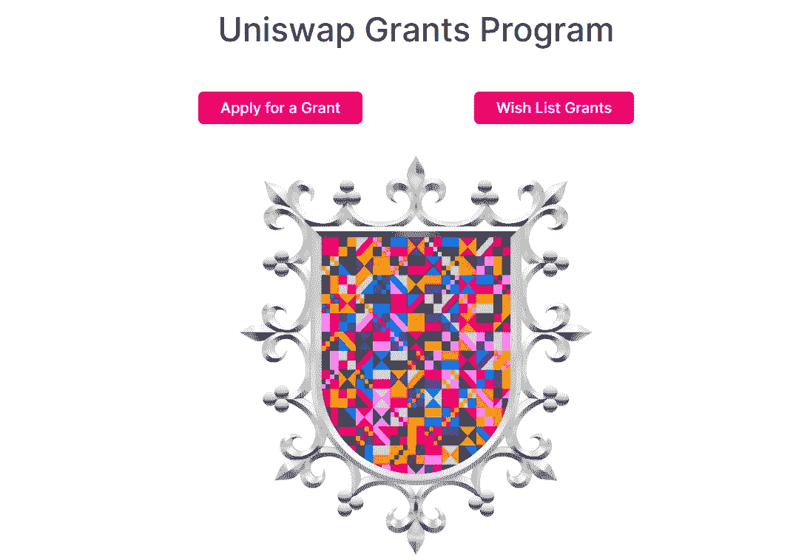

# 早期 Web3 项目的筹资技巧:生态系统赠款

> 原文：<https://medium.com/coinmonks/fund-raising-hack-for-early-web3-projects-ecosystem-grants-b1dae02182e5?source=collection_archive---------10----------------------->

*Sauce:* [https://www.unigrants.org/](https://www.unigrants.org/)

组建一个团队、开发你的想法、测试项目与市场的契合度是一项艰巨的任务，但与筹集资金相比则不然。融资是最具挑战性和最伤脑筋的阶段，因为投资者越来越厌恶风险(继 FTX 和阿拉米达帝国崩溃之后)。

> 交易新手？在[最佳加密交易](/coinmonks/crypto-exchange-dd2f9d6f3769)上尝试[加密交易机器人](/coinmonks/crypto-trading-bot-c2ffce8acb2a)或[复制交易](/coinmonks/top-10-crypto-copy-trading-platforms-for-beginners-d0c37c7d698c)

此外，资金对你的 Web3 项目和它所解决的问题一样重要，因为它们影响项目的发展。许多智能合同和项目每天都在 Web3 中推出，但只有少数通过了开发阶段。项目成功的这种差异是由于资金短缺和来自开发者、创作者、营销者、其他团队成员和目标受众的未满足的期望。

为了避免上述情况，许多新兴创业公司必须在种子投资轮和产品发布前利用生态系统资助和加速器计划。

种子投资者希望你在他们投资之前有一些商业记录。生态系统对进入、投资和入职项目的要求较低——最低投资也很低！

很多情况下，你只需要你的代码，一个商业和盈利模式，一个详细的产品描述，一个用户获取策略，就可以申请资助。

请注意，这些要求并不严格，而是因生态系统而异。

下面，我综合了不同生态系统中的(积极的)资助和加速器项目，请继续阅读，找出答案！

# 赠款:

[**Uniswap 赠款**](https://www.unigrants.org/) **:** 一项侧重于 Uniswap 生态系统的赠款。在瑞士联邦理工学院，补助金最高可达 50，000 美元，另外还有 25，000 美元可用于显示超常增长的项目。他们是在滚动的基础上被授予的，但是申请全年开放。

[**Aave 资助**](https://aavegrants.org/) **:** 是对 Aave 协议社区提出的资助想法的资助。Aave 赠款提供高达 10，000 美元的资金，以滚动方式发放。授予的资助金额取决于项目及其背后的团队。

[**Aurora Grants**](https://aurora.dev/grants)**:**成立的目的是帮助 Aurora 和 NEAR 生态系统的发展和发展。(Aurora 是 NEAR 上的 EVM 兼容网络)。

Web3 基金会资助: 该资助项目主要关注在波尔卡多特区块链建造的项目。赠款是一次性支付的，每个项目从 2 500 美元到 100 000 美元不等。

# 启动加速器

**a16z Crypto 创业学校:**每年春天，a16z 都会举办为期十二周的创业加速器。他们还向每家有资格/参与的公司投资 50 万美元，以换取 7%的股权和其他权利。附:申请已经关闭，但你可以在这里观看 2020 年的免费视频:[https://a16z.com/crypto-startup-school/](https://a16z.com/crypto-startup-school/)。

[**meta rise accelerator**](https://www.metarise.club/for-startups#web3)与 web3 网络和协议生态系统合作，提供高达 25 万美元的种子资金。资金可以来自可转换票据、现金、股票或三者的组合。

[**LongHash VC 加速器**](https://longhash.vc/accelerator/) 是亚洲首个也是领先的 web3 加速计划。该项目拥有 9 个团队、60 多个项目和 1 . 5 亿美元的融资记录。

[**Adaverse**](https://www.adaverse.co) 是由 EMURGO 和 Everest Ventures 集团支持的 Cardano 生态系统加速器。

[**cathe on Gaming**](https://catheongaming.com/accelerator)这是一个 GameFi 加速器计划，支持区块链博彩和元宇宙项目，为最多五个符合条件的博彩项目提供总额为 50，000 美元的资助。下一批将于 2023 年在 Q1 开始。

# 授权聚合器

Web3grants 是我见过的最大的授权聚合器。它包括来自阿尔格兰德、塞洛、币安十世、FTX、波尔卡多特、波利贡、尼尔等地的赠款。

[**use web 3**](https://www.useweb3.xyz/grants)**从 Compound、Aave、Chainlink、Balancer、The Graph 等聚合有关 grants 的信息。**

**[**Llamao Grants**](https://wiki.defillama.com/wiki/LlamaoGrants)**:**是一个公共产品，显示了跨加密的生态系统授权信息。DeFi Llama 于 2021 年推出。**

**就是这样！**

**感谢你阅读到目前为止，我希望你学到了一两个策略。现在你读完了；是时候开始实施了。如果你遇到任何困难或者想谈谈你的项目…**

**请在下面留言或通过邮件联系我。**

> **加入 Coinmonks [电报频道](https://t.me/coincodecap)和 [Youtube 频道](https://www.youtube.com/c/coinmonks/videos)了解加密交易和投资**

# **另外，阅读**

*   **[OKEx vs KuCoin](https://coincodecap.com/okex-kucoin) | [摄氏替代品](https://coincodecap.com/celsius-alternatives) | [如何购买 VeChain](https://coincodecap.com/buy-vechain)**
*   **[ProfitFarmers 点评](https://coincodecap.com/profitfarmers-review) | [如何使用 Cornix Trading Bot](https://coincodecap.com/cornix-trading-bot)**
*   **[如何匿名购买比特币](https://coincodecap.com/buy-bitcoin-anonymously) | [比特币现金钱包](https://coincodecap.com/bitcoin-cash-wallets)**
*   **[瓦济里克斯 NFT 评论](https://coincodecap.com/wazirx-nft-review)|[Bitsgap vs Pionex](https://coincodecap.com/bitsgap-vs-pionex)|[Tangem 评论](https://coincodecap.com/tangem-wallet-review)**
*   **[如何使用 Solidity 在以太坊上创建 DApp？](https://coincodecap.com/create-a-dapp-on-ethereum-using-solidity)**