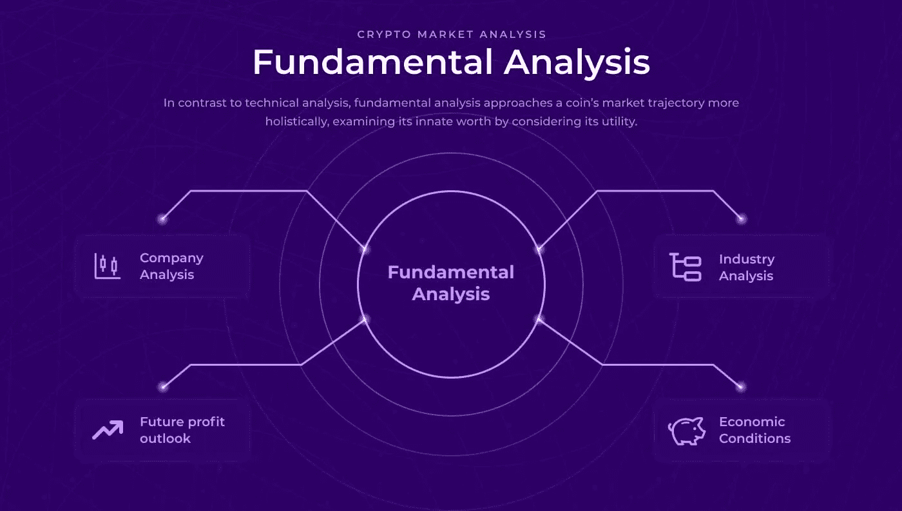
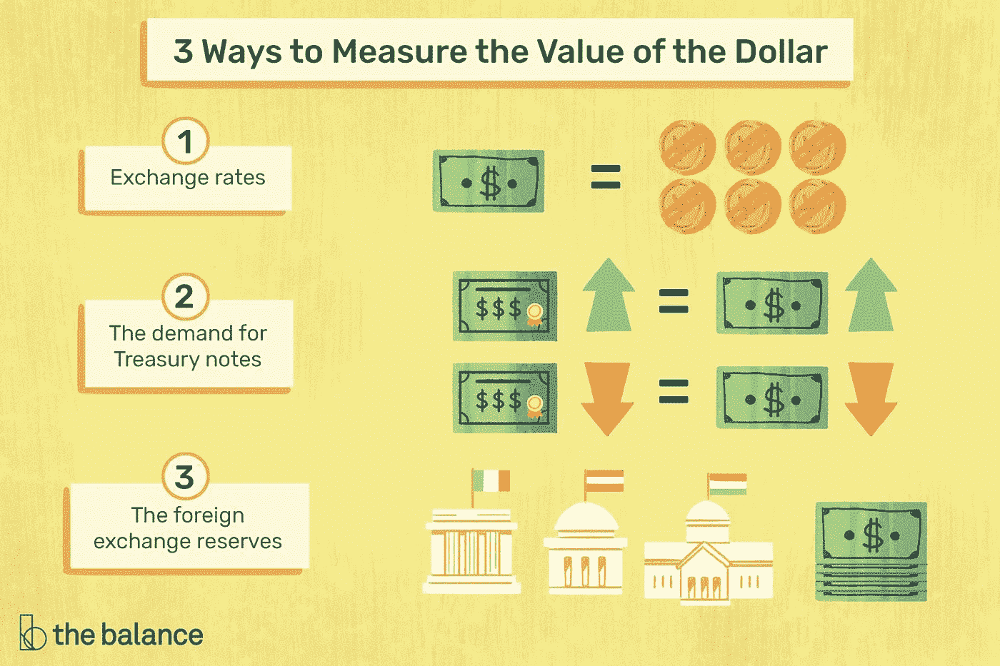
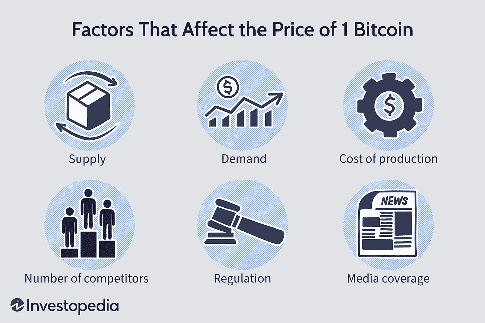

# 加密货币的基本分析

> 原文：<https://medium.com/coinmonks/fundamental-analysis-of-cryptocurrencies-92160b2fdf34?source=collection_archive---------26----------------------->

## 订阅我的媒介账号:[https://aryanbajaj13.medium.com/subscribe](https://aryanbajaj13.medium.com/subscribe)

## 这是加密货币系列的第五篇文章…保持联系，了解更多信息！

基本面分析是一种通用的、观点驱动的经济和模式预测模型的混合，用来预测一项资产的股票价格会随时间波动多高或多低。基本面分析是金融分析的一个领域，它跟踪任何给定证券的风险和回报。

这种类型的分析通常确定资产最有可能从这里走向哪里，什么因素会影响它的未来行为，以及它可能会走多远。换句话说，它试图回答“这些资产未来将走向何方”的问题像“收益报告”或“公司 CEO 变更”这样的词可能会让你想起什么。所以，如果你想知道这一理论与区块链和加密货币有什么关系，是时候继续阅读了！

# 基本面分析？

基本面分析是一种通过分析证券的财务数据来评估投资和识别交易机会的方法。这些数据可以包括:

*一家公司的财务报表
*行业趋势
*政治因素

基本面分析通常与技术分析一起使用，技术分析通过查看证券的价格历史来识别模式并预测未来的价格走势。当这两种方法结合起来时，可以提供一个全面的安全观，可以帮助交易者对他们的投资做出明智的决定。

# 基本面分析预测的类型

关于加密货币，可以做出不同类型的基本面分析预测。一些分析师认为，基于与基础区块链技术相关的新闻或事件，货币将会升值。其他人可能认为一种货币会根据全球经济状况升值或贬值。

一些分析师认为技术分析比基本面分析更能预测价格走势。然而，在对加密货币进行预测时，没有放之四海而皆准的答案。做自己的研究并提出自己的投资策略是很重要的。

# 确定法定货币的公允价值

谈到货币估值，有两大阵营:原教旨主义者和技术分析师。前者认为一种货币的基本经济状况是最重要的因素，而后者则关注图表模式和价格势头。

基本面分析是许多外汇交易者选择的方法，因为它允许你根据经济指标识别潜在的机会。

首先，让我们从一个定义开始:法定货币是任何没有实物商品支持的法定货币。最常见的例子是美元、欧元和日元。

法定货币价值的关键驱动因素之一是通货膨胀。这就是商品和服务价格随时间推移而上涨的速度。中央银行使用各种工具试图控制通货膨胀，但它仍然会对货币价值产生很大影响。

例如，假设美国的通货膨胀率为每年 2%。这意味着，平均而言，今年的价格将比去年高出 2%。

法定货币不具有内在价值，也没有商品作为支撑。相反，它的价值是由供求关系决定的，由发行政府的信誉支撑。与代表性不足的货币相比，它减轻了危机的严重性，因为政府能够印刷更多的货币。

# 确定加密货币的公允价值

说到加密货币，没有可靠的方法来确定它们的公允价值。加密货币没有任何实物资产或商品的支持，其价格不受任何央行或政府的影响。相反，加密货币在分散的交易所交易，其价格由供需决定。

但是，这并不意味着没有办法估算加密货币的公允价值。有几种方法可以用来估计加密货币的公允价值，我们将在本文中讨论。

1)第一种方法是查看基础区块链基础设施的价格。例如，如果你想估算比特币的公允价值，你可以看看比特币区块链的价格。这种方法很有用，因为它考虑了底层技术的发展和采用，这对于确定加密货币的长期前景至关重要。

2)第二种方法是看其他类似加密货币的资产价格。例如，黄金经常被比作比特币，因为两者都被视为价值仓库。看一下黄金的价格，就能大致了解投资者愿意为比特币支付多少钱。

上述方法是有助于确定加密货币公允价值的几种方法。

# 结论

基本面分析是评估资产以确定其内在价值的过程。这种方法可以用来评估任何资产，包括加密货币。在对加密货币进行基本分析时，您需要考虑几个关键因素。这些包括项目的性质、项目背后的团队、项目的象征经济学等等。通过考虑所有这些因素，您可以估计出加密货币的内在价值，并利用这些信息做出明智的投资决策。

## 这是加密货币系列的第五篇文章…保持联系，了解更多信息！

# 关于作者

我最近完成了 BBA(商业分析)从基督大学，拉瓦萨，浦那校区。

网站—[acumenfinalysis.com](http://acumenfinalysis.com/)(看看这个)

# 联系人:

如果你对我下一篇文章的内容有任何问题或建议，请写信给 aryanbajaj104@gmail.com。

如果你想了解我最新的文章和项目，[在 Medium](https://aryanbajaj13.medium.com/) 上关注我。

# 订阅我的媒介账号:【https://aryanbajaj13.medium.com/subscribe 

# 通过以下方式与我联系:

[领英](https://www.linkedin.com/in/aryan-bajaj-b62364191)

> 加入 Coinmonks [电报频道](https://t.me/coincodecap)和 [Youtube 频道](https://www.youtube.com/c/coinmonks/videos)了解加密交易和投资

# 另外，阅读

*   [block fi vs Celsius](/coinmonks/blockfi-vs-celsius-vs-hodlnaut-8a1cc8c26630)|[Hodlnaut 审核](/coinmonks/hodlnaut-review-best-way-to-hodl-is-to-earn-interest-on-your-bitcoin-6658a8c19edf) | [KuCoin 审核](https://coincodecap.com/kucoin-review)
*   [Bitsgap 审查](/coinmonks/bitsgap-review-a-crypto-trading-bot-that-makes-easy-money-a5d88a336df2) | [Quadency 审查](/coinmonks/quadency-review-a-crypto-trading-automation-platform-3068eaa374e1) | [Bitbns 审查](/coinmonks/bitbns-review-38256a07e161)
*   [加密复制交易平台](/coinmonks/top-10-crypto-copy-trading-platforms-for-beginners-d0c37c7d698c) | [Coinmama 评论](/coinmonks/coinmama-review-ace5641bde6e)
*   [印度加密交易所](/coinmonks/bitcoin-exchange-in-india-7f1fe79715c9) | [比特币储蓄账户](/coinmonks/bitcoin-savings-account-e65b13f92451)
*   [OKEx vs KuCoin](https://coincodecap.com/okex-kucoin) | [摄氏替代品](https://coincodecap.com/celsius-alternatives) | [如何购买 VeChain](https://coincodecap.com/buy-vechain)