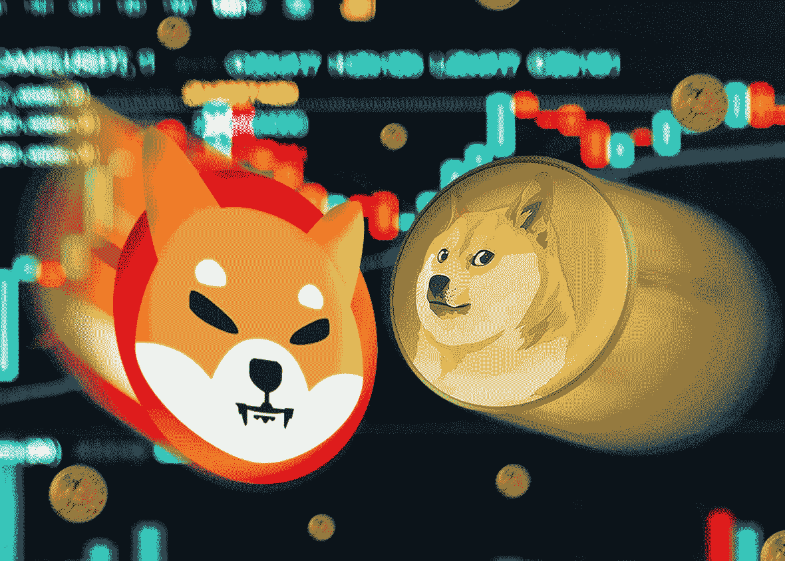
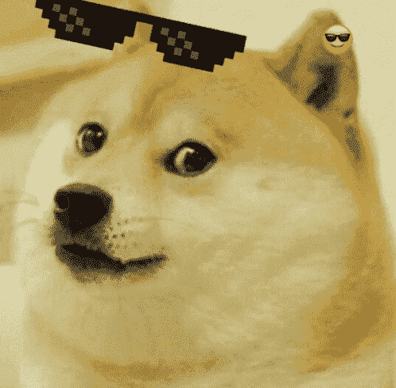
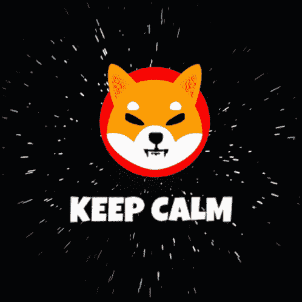

# 有趣的，愚蠢的，最奇怪的密码。将会爆炸的顶级迷因硬币

> 原文：<https://medium.com/coinmonks/funny-silly-and-weirdest-cryptos-top-meme-coins-that-will-explode-774ddac346de?source=collection_archive---------25----------------------->

当你想到迷因硬币时，最有可能想到的是以狗为主题的硬币。他们在社交媒体平台上获得了额外的人气，但这并不像看上去那么简单。我们已经列出了即将爆发的[最佳迷因币](http://sevenb.io/currencies?utm_source=medium&utm_medium=article&utm_campaign=memecoins)名单。

# Dogecoin

当然，我们从这个开始我们的最佳迷因硬币列表。尽管最初只是一个笑话， [Dogecoin](http://sevenb.io/currencies/dogecoin?utm_source=medium&utm_medium=article&utm_campaign=memecoins) 已经成为最受欢迎的迷因币之一。创作者杰克逊·帕尔默和比利·马库斯获得了代币，作为对比特币仿冒品和充斥加密市场的诈骗替代币的讽刺。结果，这个代币出人意料地火了起来，并在网上引起了巨大轰动。今天，这个代币被认为是最早的迷因硬币。

投资 Dogecoin 是一个明智的决定，因为它的价值正在上升。到 2030 年，其价值有望达到 0.98 美元。因此，现在投资是一个好主意，因为你很快就会看到一些不错的回报。

# 柴犬

Dogecoin 的潜在竞争对手，[柴犬](http://sevenb.io/currencies/shiba-inu?utm_source=medium&utm_medium=article&utm_campaign=memecoins)，出现在 2020 年，被称为“Dogecoin 黑仔”象征着日本猎犬，柴犬，它有一个庞大的支持者群体，称为柴犬军。

作为柴犬生态系统的一部分，还有另外两个标志，它们被风趣地称为 Leash(皮带)和 Bone(骨头)。在整个网络中有类似的狗主题的术语，保持了加密货币的非传统方法。截至去年 10 月，meme coin 的市值达到 410 亿美元，是其最初规模的 10 倍。尽管基于以太坊的加密货币“柴犬”缺乏实用性，但它在未来可能会被证明是有用的。

# 硬币

ApeCoin (APE) 由 Bored Ape 游艇俱乐部(BAYC)推出，这是一个不可替代的 token (NFT)系列。与大多数其他代币不同，ApeCoin 的 10 亿代币总供应量是永久固定的。不增不减。ApeCoin 的合约界面中没有铸造功能，这阻止了供应量的增加。同样，接口不暴露任何燃烧能力，这防止了总供应量减少。

鉴于 ApeCoin 已经引起了如此多的媒体关注，这枚硬币可能会成为 2022 年最好的替代硬币之一。而且，猿价预测似乎非常乐观。

# 结论

迷因币的趋势肯定是在上升。一定要找到一个有大量社区的迷因加密币，然后你就安全了。简而言之，迷因币只是一种从广大人群中大肆宣传的方式。Dogecoin 的爆发是因为 Crypto Twitter 开始谈论它，主要是因为 Elon Musk 的推文。因此，这些顶级迷因币在密码市场上有很大的潜力。

交易 APE 最安全可靠的方法是使用密码交换。用 7b 选择你的[最佳迷因币](http://sevenb.io/currencies?utm_source=medium&utm_medium=article&utm_campaign=memecoins)，安全和[匿名密码交换](http://sevenb.io/?utm_source=medium&utm_medium=article&utm_campaign=memecoins)，享受[低密码交易费](http://sevenb.io/?utm_source=medium&utm_medium=article&utm_campaign=memecoins)。

> 交易新手？尝试[加密交易机器人](/coinmonks/crypto-trading-bot-c2ffce8acb2a)或[复制交易](/coinmonks/top-10-crypto-copy-trading-platforms-for-beginners-d0c37c7d698c)