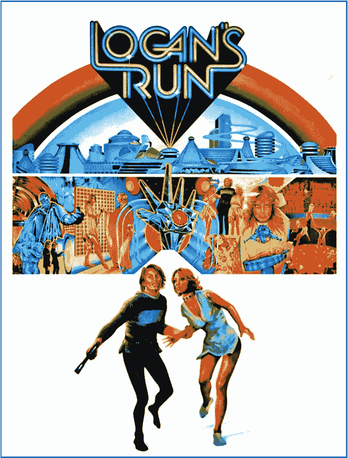
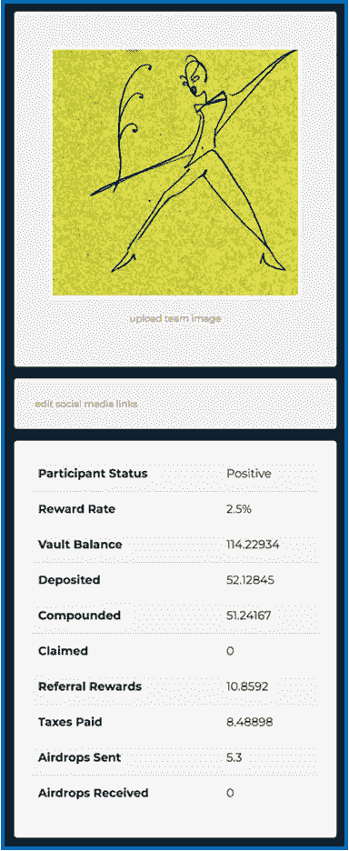
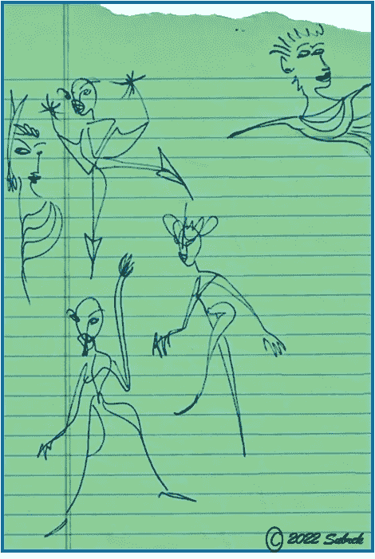

# 浮利欧令人满意的“洛根的运行”功能

> 原文：<https://medium.com/coinmonks/furios-satisfying-logan-s-run-feature-ca0a4baea1b1?source=collection_archive---------2----------------------->

## 即使在一个完美的世界里，你也不能永远停留…

Turning 30 wasn’t so rough — imagine what it was like for Logan & Jessica in the 23rd Century! Poster borrowed from [RottenTomatoes](https://www.rottentomatoes.com/m/logans_run).

> 了解浮利欧的**最大支出** …

还记得 ***洛根的跑路*** 吗？距离这部电影在 1976 年上映已经有 46 年了。

这部科幻动作片——有着电影长度的邪恶与善良的追逐场景，来自*每个人* ( *性感的意外情侣麦克尔·约克&珍妮·艾加特，杀人不眨眼的法拉·福塞特，+彼得·乌斯蒂诺夫* ) &非常可信的激光束/全息特效——是有史以来最伟大的电影！那年夏天。

> 前提是:在未来的 300 年里，幸存的人类生活在一个圆顶下，生活在一个看似田园般的社会里。然而，在资源有限的情况下，那些活得最长的人——**&受益最多**——到了一定年龄就被‘淘汰’了。

这听起来是一个苛刻的规定，也许是在 2322 年。

> **然而，在 DeFi 加密空间的这个角落，为了持续的财务可持续性，最好鼓励那些早期投资者离开巢穴。那些获得奖励最多的人需要继续前进——洛根运行规则——为下一个投资者腾出空间。**

**[**富里奥投资项目**](https://app.furio.io?ref=0xDd00AD7742a7e3244cA26053707F39Eec9d68900) **正是这么做的，&相当成功。它创造了一种强制可持续发展的形式，当人们达到允许的全部金额(27，778 美元)时，他们就会被赶下平台。当毛皮代币的上限数量在协议中被复合 3.6 倍时，其总计为 100，000 美元毛皮代币。目前每件毛皮 5.53 美元，这远远超过了 50 万美元…****

> **赚了 50 多万美元后被项目淘汰听起来不像是惩罚…😇**

**如何从这里到达那里——请继续阅读…**

## **快速回顾:**

**Furio Furvault 是一种低风险、高回报的投资合约，其运作方式类似于高收益存单。**

***<<*[*FURIO 白皮书—读我*](https://furio.io/whitepaper) *！>T47***

**它是这样工作的:在存入合同后，我在最初的 28 天里获得了 1.75%的每日投资回报。**

****这是一种开始** : *这四周的项目就是开始。在此期间收回我的一些资金会损害我未来获得更高回报率的机会。***

**然而，在那段时间里，日复一日，我的回报率达到了 2.5%，这让我加入了在这个平台上获得最高利率的投资者的“俱乐部”。无数其他组件惩罚贪婪的&奖励那些没有拿太多的人。这是基于激励的，我喜欢。**

****我对浮利欧的介绍在这里:****

** [## 发现浮利欧的基本原理

### 值得滴竞争对手…

medium.com](/@jebalukas/discovering-furios-fundamentals-6724b1728a7c) 

**复利是关键:**每次我复利——将我的回报再投资到合同中——我账户上的本地代币$FUR 的金额就会增加。这种情况一直持续到我达到最大支付额。

## 最大支出是多少？

我将用我最近对 Furio 的投资作为例子。我称之为 ***洛根的运行特性*** 是这样工作的:

我帐户中的最高支付额是 100，000 美元毛皮代币。一旦我有了那个，就没有必要继续复利，因为它除了浪费汽油费对我没有任何作用。然后我就完成了这个投资项目的赚钱&只能领取奖励了。听起来没那么可怕…

让我们先到达那里…我投资 500 美元开始，28 天每天复利。第 29 天是快乐的一天，因为我努力工作才到达那里:首先是买了辆菲亚特，然后花了一年时间寻找一个安全的地方投资。通过观看、阅读和理解这个项目，我学会了信任浮利欧...

> 从那以后，我每天都有 2.5%的回报。如果我愿意，我可以开始兑现，从 2.5%的日回报率中收回。然而，目标是达到最大支出。

同样，为了达到**最大支出**，我需要将我的 Furvault 余额增加到 27，778 $FUR，或者通过复利、存入更多$FUR，或者通过基于团队的推荐。Furio 通过提供 3.6 倍于我的复合 Furvault 余额来奖励我，所以当我的 Furvault 达到 27，778 时，我最终将能够获得总共 100，000 美元的 FUR (3.6x 27，778 = 100，000)。按照今天 5.53 美元/件的价格，这可是一大笔钱。

## 在我迈向最高赔付的路上:

My Furio Stats Page: It’s where I go (daily) to feel good…

**以上是我个人的** [**Furio 统计表**](https://app.furio.io/?ref=0x024ee915c2BF9d12F98b750119051A752e18CAa0) **。**仔细阅读其中的细节将有助于理解如何获得该协议提供的**最大支付额**。

我的每日**报酬率**是 2.5% &将保持这个百分比，直到我开始提款。那太好了，因为我是长线投资。

我最初的投资只有 52.12 美元，也就是当时的 500 美元。以上是我目前**的**金库余额**114.22 $ FUR**。因此，在我投资的 37 天里，我的代币数量增加了一倍多。

> 慢一秒钟:从那以后，100 美元的毛皮价格已经有所调整——下降了一点。所以我很想知道投资进展如何:
> 
> 37 天前我才付了 500 美元。今天我增加的$毛皮代币价值$623。太好了。

再次从我上面的统计表:我已经**存入** 52.12 美元皮毛&复合 51.24 美元皮毛；因此，通过很少的努力，我在一个多月的时间里将我的毛皮资产翻了一番。

> 仅供参考……我是一个严肃的、连续的复合者——每天复合两次或更多次可以使这些数字有很大的不同……

我**声称**目前没有什么&不会，直到我达到 27，778 代币的最高支付额**。然后，我会开始每周用我之前创造的被动收入奖励自己一到两次。**

继续，上面的**推荐奖励**，也有助于我获得最高奖金。原因如下:

*当我成功投资 DeFi 协议时——不一定是我的全部投资回报，只是现在——我会写下我的经历。如果你喜欢信息&决定投资它，那是我的目标&我很激动。* ***投资也有助于其持续性。***

*通过推荐链接投资该项目将为我提供一点补偿，&是让我知道这些对话是有益的一种极好的方式。如果您决定使用我的* [*Furio 推荐*](https://app.furio.io?ref=0x2c38B81a649ff4bF4F515Cef7216d52834B30d63) *链接，我将不胜荣幸。*

> 我的推荐奖励是 10.85 美元。因为我喜欢这个项目&我非常有信心向朋友推荐 Furio，从我的统计中可以看到，我得到了$ Furio 代币的小额补偿。Thx！

很好，到目前为止，这些**奖励**比**纳税**线的 8.48 美元略多一点。

最后，**收到的空投物品**将计入 27，778 美元毛皮代币的最高支付数。在投资 Furio 的 37 天里，我已经**向那些选择成为我伙伴的了不起的人们发送了价值 5.3 美元的空投物资**…我将定期检查从上面收到的任何个人**空投物资…😅**

## 达到 27，778 美元

日常复利是一件美好的事情。以我的投资为例，我现在有 114 美元的财富，并且会不断增加，直到达到 27，778 美元的神奇数字。正如我们所知:在这一点上，我不能添加任何更多的令牌，但我仍然可以复合的数额(3.6 倍)，直到我有我的 100，000 美元毛皮令牌。那是正式的穷途末路&我必须开始花那笔钱。我等不及了。

根据每日复利计算器，如果我继续像现在这样前进，我应该在 8 个月内——2023 年 6 月初——达到我的 27，778 美元毛皮帽，然后在我的最高支付额 100，000 美元毛皮上。请回来查看…

## 注意:

不要忘了入境税和出境税&基本的鲸鱼税，这些税会惩罚那些吃得太多的人。当我们达到最大支出时，我们会被这些税收所累，这对我们之后的人来说很重要。** 

## **更多钱包…**

**当我最终自然地被复仇女神终结的时候，那将是悲伤的一天…**

**不过，老实说，我肯定会面带微笑，不会那么悲伤。原因如下:**

**当然，也有办法扩展与浮利欧的友谊&扩展投资。打开多个钱包是延续关系的方式，我认为这是现存的最好的定义赌注协议。**

> **我有四个 Furio 钱包地址，每一个都累积了$ Furio 代币，但是利率不同。这样，当一个账户结束时，我还有其他的钱包在理财空间里。**

## **洛根的跑步还在继续…**

**这部科幻冒险电影圆满结束，每个人都超越了穹顶的限制。我想没有必要再终止任何人了..**

**300 年前的今天，在本世纪也是如此:我最近读到，Furio 正在创造一个后洛根时代的功能，允许长期投资者继续投资&与协议互动，即使他们已经筋疲力尽。**

**我有点感兴趣。然而，我刚刚开始这项投资的繁荣&我还没有到那一步。我会对**更感兴趣，下一个**是什么？在我达到我的**最高支付额**…一路上微笑着…**

****

## **投资于 [Furio](https://app.furio.io/?ref=0x024ee915c2BF9d12F98b750119051A752e18CAa0)**

**参与者可以从该平台的交换页面购买 100 美元的皮毛.要向 Furvault 存款，您需要通过使用其他人的推荐链接或手动将他们的钱包地址添加到好友推荐系统来加入他们的团队。**

****我敢肯定，他们很高兴收到它；不过，我打赌他们得到了很多。然而……****

***通过推荐链接投资该项目将为我提供一点补偿，&是让我知道这些对话是有益的一种极好的方式。如果你决定使用我下面的推荐链接，我会很荣幸。***

*****很荣幸成为你的好友……*****

## **我的 [Furio](https://app.furio.io/?ref=0x024ee915c2BF9d12F98b750119051A752e18CAa0) 好友地址是:**

**[0x 024 ee 915 C2 BF 9d 12 f 98 b 750119051 a 752 e 18 CAA 0](https://app.furio.io/?ref=0x024ee915c2BF9d12F98b750119051A752e18CAa0)**

****谢谢你走到这一步。**我希望你能在这篇关于我们生活的疯狂密码世界的评论文章中找到一些有价值的东西。我不是理财顾问，所以请不要考虑这个理财建议；我只是喜欢研究密码…**

****

****Shameless Plug…****

**我的朋友在任何东西上画画——信封、收据&任何有表面的东西。下面的例子…**

****