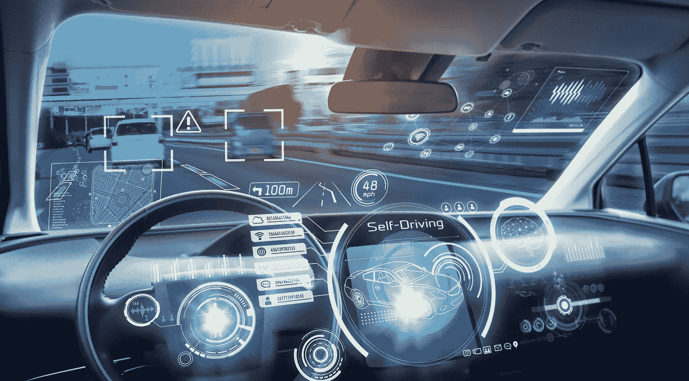

# 区块链自动驾驶汽车的未来

> 原文：<https://medium.com/coinmonks/future-of-autonomous-cars-with-blockchain-2606dc7bc89d?source=collection_archive---------19----------------------->

Image: Unsplash/iStock

当科技巨头谷歌正在测试自动驾驶汽车时，世界各地久负盛名的汽车制造商正在通过 5G、近程传感器和 360 度摄像头来确保车辆的安全。这些是我对未来我们将如何驾驶、通勤、停车和充电的一些想法:

1.  这些出租车将无人驾驶，并拥有自己的区块链账户。通勤者将能够使用他们的区块链钱包直接向出租车支付。使用智能合同，通勤者将能够在他们想要通勤的汽车票价上获得最佳交易。
2.  自动驾驶汽车将是电动的，能够在自动无线充电站为自己充电。他们还可以预订充电槽，在无线停车位上导航，并使用他们的区块链账户支付充电费用。
3.  由于各种传感器和支持 5 G 的 Wi-Fi，道路事故的数量将会减少。大多数与保险相关的索赔将使用智能合同自动结算到各自的区块链钱包，不需要冗长的检查和索赔结算。
4.  自动驾驶汽车的制造将根据汽车的实际使用情况和维修情况进行控制。区块链钱包将能够在不暴露通勤者身份的情况下提供汽车使用数据。这将导致更可持续的汽车制造。
5.  电动汽车的供应链将走向区块链。汽车的每一个零件都可以追溯到源头，只有有问题的零件才会被召回。将优先选择供应优质零件的制造商，并采取更好的质量控制措施。

我对自动驾驶汽车的未来以及它将带来的安全性、便利性和可持续性感到非常兴奋。

> 交易新手？试试[加密交易机器人](/coinmonks/crypto-trading-bot-c2ffce8acb2a)或者[复制交易](/coinmonks/top-10-crypto-copy-trading-platforms-for-beginners-d0c37c7d698c)