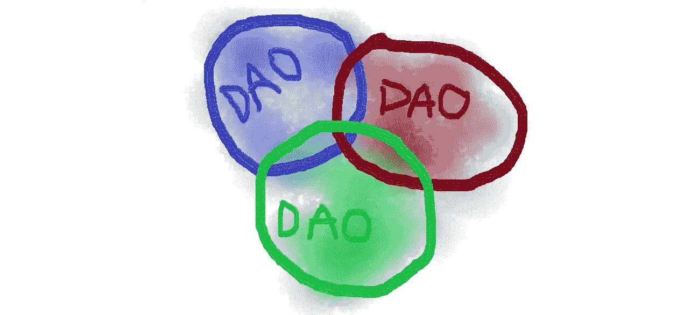

# 道-2-道互动的未来

> 原文：<https://medium.com/coinmonks/future-of-dao-2-dao-interactions-ba8bbd585ed7?source=collection_archive---------3----------------------->

区块链技术允许在两个互不认识的人之间建立可信的通信。一个基于区块链的互联网服务能够建立一个平台，在这个平台上，在没有中间人的情况下，在全球范围内进行人员协调和价值转移不需要信任。最近区块链技术的快速发展以及智能合同允许建立一种新型的组织，这种组织是没有共同管理的一级组织，所有参与者都被激励向一个方向努力。它被称为去中心化自治组织或 DAO。

我相信 2022 年可以被称为一个道年。现在有如此多的 Dao，它们每天都在诞生。Dao 涵盖不同的领域:从金融融资和投资到教育和科学研究。

Dao 不断探索如何在成员之间建立互动和管理社区的新方法。一些 Dao 在快速扩大规模后挣扎着维持自己的生存，另一些 Dao 则成功地实现了财务可持续和完全分散。一些 Dao 已经设法解决了这些挑战。

每个道要解决的下一个挑战是如何与另一个道交流和互动。今天，我们知道公司在不同的法律实体之间不断地互动。下一步是道-2-道互动，一个人将向另一个人要求产品和服务。

从事传统的工作，一个人会学习和理解什么是好的，什么是不好的。当一个人换工作时，他的技能和经验被转移到一个新的公司。

今天，一些贡献者同时为不止一个 DAO 工作。在这里，我们可以发现 DAOs 和人本身的直接利益。现在，贡献者可以在一个 DAO 中学习高效的框架，同时在另一个 DAO 中实现这些方法和技术。我认为这将提高每个人的能力水平和产品质量。一个人本身可以获得很多经验和技能，并在短时间内实践。

另一种复杂的方式是两个不同的 Dao 如何一起工作，从对方订购产品或服务。一个道的贡献者必须与谁联系另一个道？其中一个想法是，两个 Dao 的核心团队必须就合同条款达成一致，并要求各自的社区通过使用他们的治理工具来投票。与组织业务的传统方式相似，我们可以假设当两个 DAO 在同一个项目中一起工作时会出现某些子结构(子 DAO)。这个子刀甚至可以在一段时间后分离成一个单独的刀。

值得一提的是，有必要建立一个清晰的沟通渠道和激励机制，使道的每个成员在面临另一个道关于产品或服务交付的新机会或请求时，都有兴趣采取行动(或至少向正确的人传递信息)。

毕竟每一次道-2 道互动的背后都是人与人之间的关系。正确的激励制度可以迫使人们按照正确的利益行事，因此令牌工程学科可能会直接影响 Dao 之间的关系。

> 交易新手？试试[加密交易机器人](/coinmonks/crypto-trading-bot-c2ffce8acb2a)或者[复制交易](/coinmonks/top-10-crypto-copy-trading-platforms-for-beginners-d0c37c7d698c)