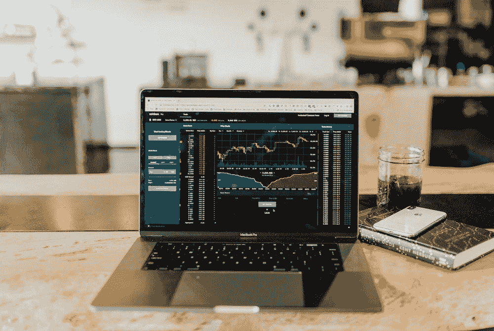
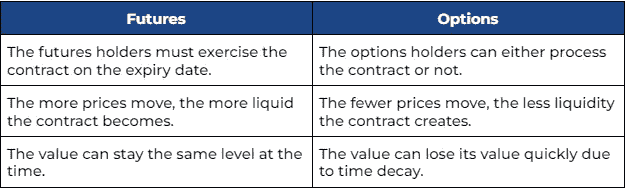
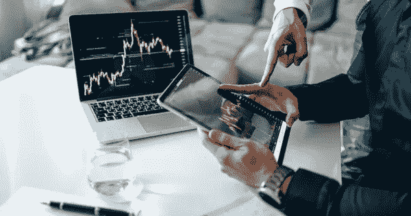
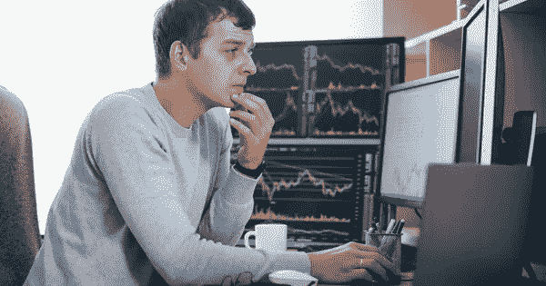

# 期货和期权:差异和交易技巧

> 原文：<https://medium.com/coinmonks/futures-and-options-differences-trading-tips-230ce7f0db73?source=collection_archive---------23----------------------->

当你阅读这篇文章时，你可能会对期货和期权感到困惑。是时候通过强有力的解释来消除你的困惑了。这个博客涵盖了区分这两种工具的关键方面。此外，你还将学习如何在 ***进行期货和期权交易的交易技巧*** *，这样你就可以自信地进行交易并获利。*

# F&O 贸易概述

期货和期权是两种流行的工具。然而，你不应该仅仅因为许多人以前交易过这些顶级“趋势”的东西，就跟踪它们。让自己具备坚实基础的基本知识总是至关重要的。

# 什么是期货？

[**期货**](https://www.investopedia.com/terms/f/futurescontract.asp) 是一种衍生金融合约，迫使当事人在预先设定的未来日期和价格购买或出售资产。这意味着无论当前市场趋势如何，你都必须在预定的价格和到期日买卖标的资产。

期货合约的基础资产可以是实物商品和金融工具。有关资产数量的信息包含在期货合同中，因此期货交易所的交易变得更加顺畅。像期权一样，期货可以是一种对冲工具，也可以用于交易投机。

# 什么是选项？

[**期权**](https://libraryoftrader.net/options-trading) 是为买方提供购买或出售标的权利而非义务的衍生合约。

期权合同还包括预定的价格和到期日。然而，买方不必处理合同中的相同条款。期权投资者根据当前的市场条件决定他们是买入、卖出还是持有他们的交易。

许多投资者喜欢使用期权来支持他们的投资，尤其是当市场朝着不利的方向发展时。换句话说，由于期权的对冲和杠杆作用，它可以帮助交易者和投资者降低风险，增加利润。

# 更详细地理解 F&O 的意思

# 期货的类型

我们根据核心特征将期货合约分为两类，无论它涉及金融还是实物产品。

*   **金融期货**包括股票期货、货币期货、指数期货、利率期货等。
*   **实物期货**指商品、能源、金属期货等。

***选项类型***

*   [**看涨期权**](https://libraryoftrader.net/options-trading) 使持有者有权在预定的价格和日期购买标的资产。看涨期权的价值将随着证券价格的上涨而增加。

[**看跌期权**](https://libraryoftrader.net/options-trading) 让持有者有权在买卖双方之前约定的日期和价格卖出标的。

# 你应该知道的交易 F&O 的常用术语

在交易任何工具之前，你应该让自己熟悉一些 F&O 交易中的常用术语。本节将带你了解期权和期货中常用的术语。

*   **基础证券**可以是股票、债券、利率、指数、商品等。
*   **执行价格**是期权合约所有者在到期日之前买入或卖出标的证券的预定价格。
*   **溢价**是期权合约的价格。
*   **到期日**是合同所有者行使期权或合同失效的设定日期。

# 期货和期权:主要区别是什么？

期货和期权都是衍生合约。然而，它们的主要区别是帮助你决定哪种工具更适合你的交易目标和风险承受能力。

# 权利与义务

你可以马上看出这一不同点——期权提供权利，而期货提供购买和出售基础资产的义务。因此，期货需要交易的承诺，而期权提供了更大的灵活性来执行合约。

# 合同到期日

承诺意味着期货的持有者必须在预定的日期购买或出售基础资产。同时，如果期权持有者发现交易形势不利，他们可以决定在到期日不执行合约。

# 前期成本

虽然你有一些期权合约的预付款，但你不必在期货合约上花费任何前期成本。当期货合约到期时，将处理付款。然而，你需要有保证金——交易价值的百分比，才能拥有期货合约。所以，它会放大你的得失。

另一方面，为期权支付溢价是常态。期权交易没有退款政策。这意味着无论你决定不买或不卖期权，你都不会拿回你的溢价。

# 潜在风险

期权交易比期货交易风险小。无论如何，当你必须处理期货合约时，你可以选择不执行合约。然而，你必须小心期权合约中的**时间衰减。这意味着期权合约的价值将在到期时缩水。**

****关键要点:****

****

****新手如何交易期货和期权****

****

***How to Learn F&O Trading***

**投资者利用 [**期货**](/@libraryoftrader/the-ultimate-guide-of-futures-trading-for-beginners-cb66fe68498b) 和 [**期权**](/@libraryoftrader/easy-but-powerful-ways-to-limit-risk-when-trading-options-75e888ed6dc3) 作为对冲风险和投机交易的工具。这里有一些 [**F & O 交易提示**](/@libraryoftrader/are-there-any-secrets-behind-profitable-futures-trades-dc46d5decc95) **s** 让你的交易过程变得轻松，盈利最大化。**

** [## 交易期权时限制风险的简单而有效的方法

### 风险和回报是一个硬币的两面，这是我们难得达成的共识。它暗示我们只能赢…

medium.com](/@libraryoftrader/easy-but-powerful-ways-to-limit-risk-when-trading-options-75e888ed6dc3)  [## 新手期货交易终极指南

### 介绍

medium.com](/@libraryoftrader/the-ultimate-guide-of-futures-trading-for-beginners-cb66fe68498b) 

# 利用 F&O 对冲不仅仅是贸易

许多经验丰富的交易者把期货和期权作为抵御风险的盾牌。此外，你可以把它作为应对动荡市场的备用计划。这意味着你的风险是有限的，这样你就不必在昂贵的损失中尝到苦乐参半的滋味。

F&O 的一个迷人之处是保证金交易。例如，你可以只花 3 美元以 10 美元的价格购买 Nifty。它显示了将你的资本杠杆化 3 倍的力量。利润倍增可能伴随着高潜在风险。它还要求你有足够的现金在不利情况下完成[**【MTM】**](https://taxfoundation.org/tax-basics/mark-to-market-mtm/)保证金的支付。

 [## 期货交易赚钱的背后有什么秘密吗？

### 当一些事情听起来很机密时，它会引发人们去了解。一些发现可能会让你满足于…

medium.com](/@libraryoftrader/are-there-any-secrets-behind-profitable-futures-trades-dc46d5decc95) 

为了平衡风险和回报，使用期货和期权作为对冲工具是明智的。例如，如果你有 110 美元的 Reliance 和 130 美元的 CMP，你可以在 130.5 美元卖出期货合同，锁定 20.5 美元的利润。不管当前价格如何变动，这就像是对你利润的保险。

# 发展正确的贸易结构

期货或期权合约中有一些标准要素，如执行价格、溢价、到期日和潜在风险。在买卖期货或期权之前，你应该考虑每个组成部分，以获得最佳的风险和回报比。

例如，你应该考虑合同的罢工。深度[**【OTM】**](https://www.investopedia.com/terms/o/outofthemoney.asp#:~:text=Out%20of%20the%20money%20is,above%20the%20put's%20strike%20price.)**期权可能一文不值，而深度[**【ITM】**](https://www.investopedia.com/terms/i/inthemoney.asp#:~:text=What%20Is%20%22in%20the%20Money,price%20of%20the%20underlying%20asset.)期权可能不会增加任何价值。**

# **更好地管理你的交易**

** [## 新手期货交易终极指南

### 介绍

medium.com](/@libraryoftrader/the-ultimate-guide-of-futures-trading-for-beginners-cb66fe68498b) 

在像期货和期权这样的杠杆交易中，执行止损是至关重要的。你应该密切关注价格走势，以预见未来的趋势。因此，有可能采取及时的行动以获得最小的风险和最高的利润。

杠杆可能是“一场噩梦，但穿起来像白日梦”。越能盈利，越能吃亏。所以，不要让令人兴奋的潜在增长率引导你！跟踪数据库，洞察市场模式，赚取更高利润

# 在你的风险范围内

交易的时候，抱着赚取更高利润的愿望去冒险并不是必然的。然而，你应该在完全安全的情况下探索下一个级别的风险或利润。我们的意思是，你应该留在你的风险范围内，以保证潜在的损失不会超出你的风险承受能力。

# 谁应该投资期货和期权？

*Should I Choose Futures or Options?*

任何人都可以投资期货和期权，如果他们有足够强大的金融支持和有效策略的知识。 [**交易不是赌博**](/@libraryoftrader/traders-dictionary-what-is-a-greenshoe-option-940b1630b4fa) ( [链接交易就像赌博？然而，你应该为高风险交易做好财务和心理准备。](/@libraryoftrader/traders-dictionary-what-is-a-greenshoe-option-940b1630b4fa)

你还需要学习期权交易的基础知识**和 [**期货交易**](https://libraryoftrader.net/futures-and-options) ，以减少潜在损失，提高盈利能力。只有知识和经验才能在期权和期货交易的动荡环境中保持盈利。**

** [## 改变我交易生活的前 5 本期货交易书！

### 看书太慢，跟不上期货市场。然而，我在博客中提到的书改变了我的…

medium.com](/@libraryoftrader/top-5-futures-trading-books-that-actually-changed-my-trading-life-67839db4de6) 

# 期货和期权哪个更好？

很难说是期货还是期权能带来更高的利润。结果很大程度上取决于交易者的知识和经验。因此，毫不含糊地说，期货和期权都可以盈利。这里重要的事情包括你的交易目标和风险承受能力。这些因素可以帮助你 [**找到完美匹配的乐器**](/@libraryoftrader/how-can-i-choose-the-most-suitable-trading-type-3b270863be2d) 。

 [## 怎样才能选择最合适的交易类型？

### 对于新手来说，学习交易应该是第二重要的技能。学习选择交易类型应该是…

medium.com](/@libraryoftrader/how-can-i-choose-the-most-suitable-trading-type-3b270863be2d) 

# 简单地

这篇文章主要为你提供期货和期权交易的基本知识。 [**期货和期权如何交易**](https://libraryoftrader.net/product/rapid-setups-pack-futures-masterclass) ，这两种工具的主要区别，一些小技巧等。是你能得到的。希望它能建立你的交易信心，并为增加你的交易账户打下坚实的基础。

> *交易新手？试试* [*密码交易机器人*](/coinmonks/crypto-trading-bot-c2ffce8acb2a) *或* [*复制交易*](/coinmonks/top-10-crypto-copy-trading-platforms-for-beginners-d0c37c7d698c) *上* [*最好的密码交易*](/coinmonks/crypto-exchange-dd2f9d6f3769)

> 加入 Coinmonks [电报频道](https://t.me/coincodecap)和 [Youtube 频道](https://www.youtube.com/c/coinmonks/videos)获取每日[加密新闻](http://coincodecap.com/)

# 另外，阅读

*   [免费加密信号](/coinmonks/free-crypto-signals-48b25e61a8da) | [加密交易机器人](/coinmonks/crypto-trading-bot-c2ffce8acb2a)
*   [杠杆代币的终极指南](/coinmonks/leveraged-token-3f5257808b22)
*   [16 款最佳折叠电动自行车](/coinmonks/top-17-folding-electric-bikes-5e296f0918cb)
*   [28 款最佳电动自行车点评](/coinmonks/the-28-best-electric-bikes-review-and-buying-guide-in-2023-7bb3146cb403)
*   前三名[币安期货交易机器人](/coinmonks/top-3-binance-futures-trading-bots-e6031f84b3f9)******